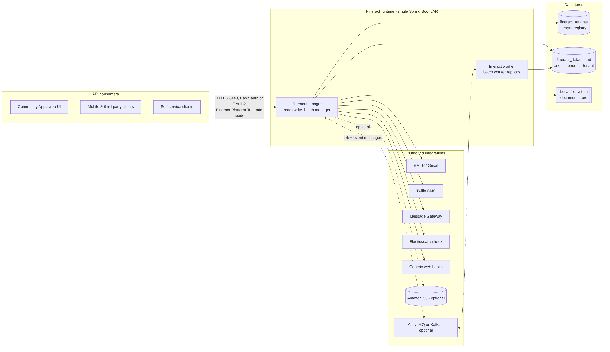
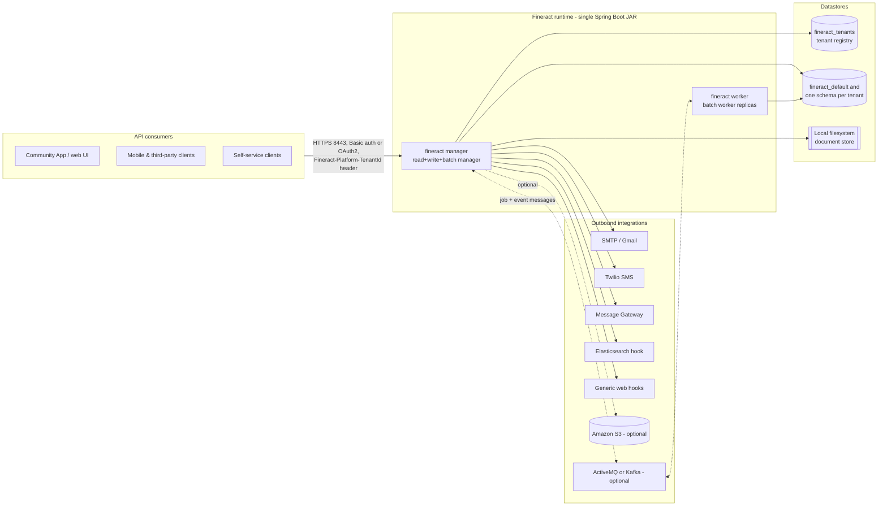
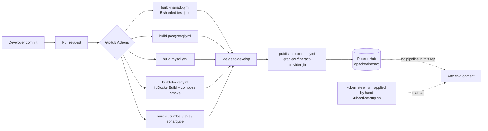

# Current State — Apache Fineract (COG-GTM/fineract-Core-Banking)

Derived by reading this repository at branch `develop`. Every claim below cites `file:line`.
Statements that could not be read directly from the repository are prefixed **Inference:** and are
not evidence.

---

## 1. Runtime context

Mermaid source

| Fact | Evidence |
| --- | --- |
| Single Spring Boot application, self-contained JAR, main class `org.apache.fineract.ServerApplication` | `fineract-provider/build.gradle:285` |
| Spring Boot 3.5.6 | `buildSrc/src/main/groovy/org.apache.fineract.dependencies.gradle:28` |
| Java 21 toolchain | `build.gradle:395`; README requirement `README.md:34` |
| 32 Gradle modules in one repository | `settings.gradle` (32 `include` statements) |
| 4,855 Java source files under `src/main/java`; 169 files declaring JAX-RS `@Path` resources | counted across `*/src/main/java` |
| Served on port 8443 with TLS on, context path `/fineract-provider` | `fineract-provider/src/main/resources/application.properties:382-383,386` |
| Deployable also as a WAR to external Tomcat ≥ 10 (not recommended by the project) | `README.md:36`, module `fineract-war/` |

## 2. Multi-tenancy and datastores

| Fact | Evidence |
| --- | --- |
| Database-per-tenant: a tenant registry database (`fineract_tenants`) plus one database per tenant (`fineract_default` by default) | `application.properties:406` (registry JDBC URL), `:51` (`fineract.tenant.name=fineract_default`), `README.md:60-62` |
| Tenant selected per request by the `Fineract-Platform-TenantId` HTTP header | `fineract-provider/src/main/java/org/apache/fineract/infrastructure/hooks/processor/WebHookService.java:36` |
| Tenant connection details are read from the registry at runtime | `fineract-core/src/main/java/org/apache/fineract/infrastructure/core/service/tenant/JdbcTenantDetailsService.java` |
| Default engine is MariaDB (driver `org.mariadb.jdbc.Driver`) | `application.properties:405-406`, `config/docker/env/fineract-mariadb.env:21-22` |
| PostgreSQL is a first-class alternative, already exercised in CI and Compose | `config/docker/env/fineract-postgresql.env:21-22`, `.github/workflows/build-postgresql.yml`, `docker-compose-postgresql.yml:25-26` |
| Tenant read-only replica endpoints are already a configuration concept | `application.properties:56-61` |
| HikariCP pool, default max 10 connections per instance | `application.properties:410`, `config/docker/env/fineract-common.env:24` |
| Schema managed by Liquibase: 237 changelog XML files (222 tenant, 14 tenant-store) applied at startup | `application.properties:433-434`, `fineract-provider/src/main/resources/db/changelog/` |
| Liquibase tenant upgrades are deliberately single-threaded because of a known Liquibase thread-safety issue | `application.properties:157-160` |
| JPA provider is EclipseLink with compile-time static weaving | `build.gradle:95`, `STATIC_WEAVING.md`, `static-weaving.gradle` |

### SQL portability

| Fact | Evidence |
| --- | --- |
| 204 non-test Java files use `JdbcTemplate` — hand-written SQL is pervasive, not incidental | `grep -rl JdbcTemplate --include=*.java` excluding `/test/` → 204 |
| The codebase already abstracts dialect differences: 310 references to `DatabaseTypeResolver` / `DatabaseSpecificSQLGenerator`, and 55 explicit `isMySQL()` / `isPostgreSQL()` branches | grep across `*.java` |
| **Zero** JPA `nativeQuery = true` usages beyond a single occurrence, and a single `createNativeQuery` call | grep `nativeQuery *= *true` → 1; `createNativeQuery` → 1 |
| **Zero** stored procedures, functions or callable statements in the repository | grep `CREATE PROCEDURE`/`CREATE FUNCTION`/`callableStatement`/`@Procedure` across `*.java`, `*.sql`, `*.xml` → 0 matches |
| Reports are SQL stored as data (`stretchy` reports) and executed at runtime, not stored procedures | `fineract-provider/src/main/java/org/apache/fineract/infrastructure/dataqueries/service/ReadReportingServiceImpl.java` |
| Application-level SQL-injection pattern validation is configured for report/ad-hoc query text | `application.properties:226-319` |

## 3. Batch, scheduling and messaging

| Fact | Evidence |
| --- | --- |
| **Zero** Spring `@Scheduled` annotations in the codebase — scheduling is Quartz-driven, configured per tenant in the database | grep `@Scheduled` → 0 matches; `fineract-provider/src/main/java/org/apache/fineract/infrastructure/jobs/service/JobRegisterServiceImpl.java:320-326` |
| Quartz `SchedulerFactoryBean` is constructed programmatically, thread count configurable | `JobRegisterServiceImpl.java:320-326` |
| Spring Batch drives Close-of-Business (COB); job launcher configured explicitly, Spring Batch auto-start disabled and schema never auto-created | `fineract-provider/src/main/java/org/apache/fineract/infrastructure/jobs/ScheduledJobRunnerConfig.java:92-93`, `application.properties:467-469` |
| Instance role is a runtime switch: read / write / batch-manager / batch-worker | `application.properties:67-70` |
| Compose ships a manager+worker topology: manager with `FINERACT_MODE_BATCH_WORKER_ENABLED=false`, workers replicated ×2 | `config/docker/env/fineract-manager.env:21-22`, `docker-compose-postgresql-kafka.yml:50-53` |
| Partitioned `LOAN_COB` job with configurable chunk/partition size and its own thread pool | `application.properties:88-95` |
| Remote job messaging: Spring events by default; JMS (ActiveMQ) and Kafka both available and **disabled by default** | `application.properties:97-110` |
| External business events (Avro) are **disabled by default**; JMS and Kafka producers both available | `application.properties:124-152`, module `fineract-avro-schemas/` |
| ActiveMQ client 6.1.6, Spring Kafka, Quartz are compiled-in dependencies | `fineract-provider/dependencies.gradle:149,71-72,159`; `buildSrc/src/main/groovy/org.apache.fineract.dependencies.gradle:191` |

## 4. Outbound integrations

| Integration | Default | Evidence |
| --- | --- | --- |
| SMTP e-mail (report mailing, e-mail campaigns, Gmail-backed sender) | enabled by feature | `.../infrastructure/core/service/GmailBackedPlatformEmailService.java`, `.../reportmailingjob/service/ReportMailingJobEmailServiceImpl.java` |
| Twilio SMS hook | on demand | `.../infrastructure/hooks/processor/TwilioHookProcessor.java:44` |
| Message Gateway / generic web hooks / Elasticsearch hook | on demand | `.../hooks/processor/` (`MessageGatewayHookProcessor.java`, `WebHookProcessor.java`, `ElasticSearchHookProcessor.java`) |
| Outbound HTTP is OkHttp + Retrofit for hooks and the generated clients; **zero** `WebClient` usages anywhere, and `RestTemplate` appears in exactly four main-code classes, all of them SMS-gateway paths, each instantiating its own un-pooled client | `fineract-provider/dependencies.gradle:93-94,117`; `.../infrastructure/sms/scheduler/SmsMessageScheduledJobServiceImpl.java:62`, `.../campaigns/sms/service/SmsCampaignDropdownReadPlatformServiceImpl.java:58`, `.../campaigns/jobs/sendmessagetosmsgateway/SendMessageToSmsGatewayTasklet.java:64`, `.../campaigns/jobs/getdeliveryreportsfromsmsgateway/GetDeliveryReportsFromSmsGatewayTasklet.java:52` |
| TLS verification for outbound calls is **disabled by default** (`insecure-http-client=true`) | `application.properties:221` |
| Amazon S3 (AWS SDK v2) for document content and for report export — both **disabled by default** | `application.properties:188-194,202-203`, `.../infrastructure/core/config/ContentS3Config.java:42-43`, `.../dataqueries/service/export/S3DatatableReportExportServiceImpl.java:42` |
| CloudWatch metrics export exists but is **disabled by default** | `application.properties:362-367` |
| OpenTelemetry OTLP export and Prometheus scrape endpoint exist, both **disabled by default**; actuator exposes `health,info,prometheus` | `application.properties:347,354-358` |

## 5. Stateful local disk

| Fact | Evidence |
| --- | --- |
| Document/content store defaults to the **local filesystem**, rooted at `${user.home}/.fineract` | `application.properties:186-187` |
| In the container the root folder is `/tmp` and `user.home` is forced to `/tmp` | `config/docker/env/fineract-common.env:57`, `fineract-provider/build.gradle:288` |
| S3 content storage is the alternative and is off by default | `application.properties:188-189` |
| Kubernetes MariaDB uses a `hostPath` PersistentVolume at `/mnt/data` with `ReadWriteMany` | `kubernetes/fineractmysql-deployment.yml:27-33` |

**Consequence:** with the shipped defaults, uploaded client documents live on the container's own
`/tmp`. Any second replica, restart or rescheduling loses or hides them.

## 6. Security posture as configured

| Fact | Evidence |
| --- | --- |
| HTTP Basic auth on by default; OAuth2 and 2FA off by default | `application.properties:24-26` |
| CORS allows any origin, method and header, with credentials | `application.properties:30-35` |
| Actuator CORS allows any origin | `application.properties:341-343` |
| HSTS off by default | `application.properties:27` |
| TLS keystore is committed in the repository and its password is the compiled-in default | `fineract-provider/src/main/resources/keystore.jks` (2,254 bytes), `application.properties:390-391` |
| Tenant/datasource credentials are committed as literal values in the Compose env files (MariaDB and PostgreSQL variants) | `config/docker/env/fineract-common.env:30-31,51-52`, `config/docker/env/fineract-postgresql.env:23-24` |
| A committed AWS credentials file is bind-mounted into the container at `/etc/aws/credentials` | `config/docker/aws/etc/credentials:20-23`, `config/docker/compose/fineract.yml:25` |
| Tenant database master password / encryption default is compiled in (`AES/CBC/PKCS5Padding`) | `application.properties:53-54,206` |
| Kubernetes reads DB credentials from a Kubernetes `Secret`, generated at deploy time by a shell script | `kubernetes/fineract-server-deployment.yml:94-117`, `kubernetes/kubectl-startup.sh:24` |

Credential **values** are deliberately not reproduced here. They are in version control and must be
treated as compromised — see `migration-plan.md` WS0.

## 7. Hosting model and release path

Mermaid source

| Fact | Evidence |
| --- | --- |
| Container image is built with Jib (no Dockerfile), base `azul/zulu-openjdk-alpine:21`, runs as `nobody:nogroup`, exposes 8080 and 8443, `user.home` forced to `/tmp` | `fineract-provider/build.gradle:264-296` (base image `:266`, target image name `:276`, args `:287-292`, user `:295`) |
| Jib is configured with `allowInsecureRegistries = true` | `fineract-provider/build.gradle:298` |
| 19 GitHub Actions workflows: unit/integration tests sharded ×5 per engine (MariaDB, MySQL, PostgreSQL), Cucumber, e2e, Sonar, API and Liquibase backward-compatibility, Docker build | `.github/workflows/` |
| CI provisions LocalStack and exercises the S3 report-export path | `.github/workflows/build-mariadb.yml:38-43,82-86` |
| Release publishing pushes `apache/fineract` to Docker Hub on pushes to `develop` and on `1.*` tags, multi-arch `linux/amd64,linux/arm64`, tagged with the ref name plus the short and long commit hashes | `.github/workflows/publish-dockerhub.yml:2-7,39-48` |
| **Zero** deployment workflows: no workflow in `.github/workflows/` deploys to any environment — no `kubectl`, `helm`, `terraform` or cloud-deploy step exists | grep across `.github/workflows/` |
| Kubernetes manifests are applied manually by shell script | `kubernetes/kubectl-startup.sh:24-39` |
| Kubernetes exposes the app directly with a `type: LoadBalancer` Service on 8443 | `kubernetes/fineract-server-deployment.yml:34`, and again for the community app `kubernetes/fineract-mifoscommunity-deployment.yml:73` |
| Deployment strategy is `Recreate` (downtime on every release) for both app and database | `kubernetes/fineract-server-deployment.yml:50`, `kubernetes/fineractmysql-deployment.yml:81` |
| Liveness/readiness probes hit `/fineract-provider/actuator/health/{liveness,readiness}` over HTTPS | `kubernetes/fineract-server-deployment.yml:71-86`, enabled by `application.properties:335-337` |
| App pod is capped at 1 vCPU / 2 GiB with `-Xmx1G`, while the README asks for 16 GB RAM / 8 cores | `kubernetes/fineract-server-deployment.yml:64-70,122-123` vs `README.md:32` |

## 8. Contradictions between artefacts

These are current-state findings, not defects to fix in this package.

| # | Contradiction | Evidence |
| --- | --- | --- |
| C1 | README requires `MariaDB >= 11.5.2`; the Kubernetes manifest and the Compose file both pin `mariadb:11.4`; CI runs `mariadb:11.5.2` | `README.md:33` vs `kubernetes/fineractmysql-deployment.yml:89` and `config/docker/compose/mariadb.yml:21` vs `.github/workflows/build-mariadb.yml:20` |
| C2 | Three different image identities for one artefact: Compose runs the locally built `fineract:latest`, Jib's in-repo default target is the unqualified `fineract` with tags `<version>` and `latest`, and CI overrides the target to `apache/fineract` with tags `<ref-name>,<short-sha>,<long-sha>`. Kubernetes then pulls `apache/fineract:latest` — **a tag this repository's pipeline never publishes** | `config/docker/compose/fineract.yml:21`, `fineract-provider/build.gradle:276-280`, `.github/workflows/publish-dockerhub.yml:39-48`, `kubernetes/fineract-server-deployment.yml:63` |
| C3 | The shipped Compose stack runs with `SPRING_PROFILES_ACTIVE=test,diagnostics` and a JDWP remote-debug agent listening on `*:5000`, and `docker-compose.yml` publishes port 5000 to the host | `config/docker/env/fineract-common.env:58,60`, `docker-compose.yml:31-32` |
| C4 | Kubernetes probes use the HTTPS actuator endpoints, but the Compose health check only checks that TCP 8443 accepts a connection — the container can be "healthy" before the app is ready | `kubernetes/fineract-server-deployment.yml:71-86` vs `config/docker/compose/fineract.yml:29` |
| C5 | The MariaDB Kubernetes Deployment is a `Deployment` with a `hostPath` `ReadWriteMany` PV and a headless Service — it is a stateful workload modelled as stateless | `kubernetes/fineractmysql-deployment.yml:21-33,65,70-81` |
| C6 | Outbound HTTP TLS verification is disabled by default (`fineract.insecure-http-client=true`) while inbound TLS is mandatory | `application.properties:221` vs `:386` |

## 9. Zero-count negatives (load-bearing for the migration)

| Negative | Why it matters |
| --- | --- |
| No `@Scheduled` methods | All scheduling is Quartz-in-database; the migration must carry Quartz state, not cron definitions |
| No stored procedures or database functions | An engine change is a data + SQL-dialect exercise only, with no procedural code to port |
| Effectively no JPA native queries (1 of each construct) | ORM-level portability is already good; the risk sits in the 204 `JdbcTemplate` files |
| No deployment pipeline of any kind in this repo | There is nothing to "migrate" on the CD side — it must be built |
| No Dockerfile | Image build is Jib-only; base image control is a Gradle change, not a Dockerfile change |
| No Helm chart, no Kustomize, no Terraform, no CloudFormation | There is no existing IaC to convert |
| No `WebClient` anywhere; `RestTemplate` confined to four SMS-gateway classes | Outbound HTTP behaviour is concentrated in OkHttp/Retrofit, the hook processors and the SMS gateway — a small, enumerable egress surface for network policy |

## 10. Inferences

- **Inference:** the repository is a fork of `apache/fineract` (README badges and Docker Hub target
  both point at `apache/fineract`, `README.md:3-5`, `.github/workflows/publish-dockerhub.yml:47`);
  which environment, if any, is actually running from this fork is not visible in the repository.
- **Inference:** the `kubernetes/` manifests read as a demo/local topology (hostPath volume,
  `LoadBalancer` on the app port, script-generated secret) rather than a production deployment; the
  repository contains no production manifest to compare against.
- **Inference:** because no workflow deploys anything, production releases today are performed
  outside this repository (manually, or from another repository) — this is question P-1 in
  `open-questions.md`.
