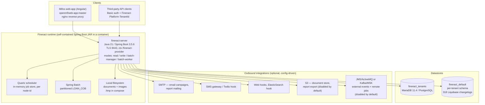
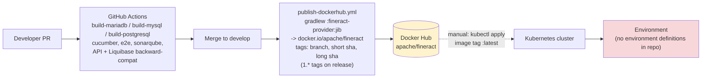
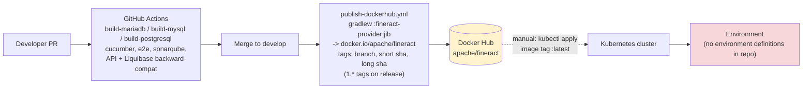

# Current State — Apache Fineract (COG-GTM/fineract-Core-Banking)

Derived from the `develop` branch at commit `8c187f9d1`. Every claim below cites the file and line
it was read from. Anything not read directly from this repository is prefixed **Inference:**.

Mermaid source — context diagram

## 1. Runtime and framework inventory

| Fact | Value | Evidence |
| --- | --- | --- |
| Language / toolchain | Java 21 | `build.gradle:395` (`JavaLanguageVersion.of(21)`), `README.md:34` |
| Framework | Spring Boot 3.5.6 | `build.gradle:113` |
| Build | Gradle multi-module, 32 `include` entries | `settings.gradle` (32 lines beginning `include`) |
| Packaging (primary) | Self-contained Spring Boot JAR, containerised by Jib | `fineract-provider/build.gradle:264-296`, `README.md:36` |
| Packaging (secondary) | Deployable WAR `fineract-provider.war` for external Tomcat ≥ 10 | `fineract-war/build.gradle:21,27`, `README.md:36` |
| Base image | `azul/zulu-openjdk-alpine:21` | `fineract-provider/build.gradle:266` |
| Container user | `nobody:nogroup` | `fineract-provider/build.gradle:295` |
| Exposed ports | 8080/tcp, 8443/tcp; server port 8443, context `/fineract-provider` | `fineract-provider/build.gradle:293`, `application.properties:382-383` |
| ORM | EclipseLink JPA with compile-time static weaving | `STATIC_WEAVING.md`, `static-weaving.gradle` |

**EOL status.** Java 21 is an LTS release and Spring Boot 3.5.x is a current supported line, so this
is not a runtime-EOL migration. **Inference:** support-window dates come from vendor lifecycle pages,
not from this repository.

## 2. Datastores

| Fact | Value | Evidence |
| --- | --- | --- |
| Supported engines | MariaDB ≥ 11.5.2 or PostgreSQL ≥ 18.0 | `README.md:33` |
| Default engine in config | MariaDB via `org.mariadb.jdbc.Driver` | `application.properties:405-406` |
| Multi-tenancy | Database-per-tenant: a `fineract_tenants` registry DB plus one DB per tenant, selected by the `Fineract-Platform-TenantId` header | `application.properties:44-53,406`, `kubernetes/fineractmysql-configmap.yml:29-30` |
| Connection pool | HikariCP, max pool 10, `TRANSACTION_REPEATABLE_READ` | `application.properties:409-415` |
| Read replica support | Optional read-only host/port/credentials per tenant | `application.properties:56-62` |
| Schema management | Liquibase, runs on application start (`spring.liquibase.enabled` default `true`), master changelog `db/changelog/db.changelog-master.xml` | `application.properties:433-434` |
| Migration volume | 318 Liquibase changelog XML files across modules | `find . -path "*db/changelog*" -name "*.xml" \| wc -l` = 318 |
| Tenant upgrade concurrency | Deliberately single-threaded because of an open Liquibase thread-safety issue | `application.properties:157-160` |
| Both drivers shipped in the image | `mariadb-java-client` and `postgresql` added to the Jib container classpath | `fineract-provider/build.gradle:300-303` |

## 3. Data access style (the negatives matter)

| Pattern | Count | Evidence |
| --- | --- | --- |
| Files using `JdbcTemplate` (non-test) | 204 | `grep -rl JdbcTemplate --include=*.java` excluding `/test/` |
| `createNativeQuery` call sites (non-test) | 1 | `grep -rn createNativeQuery --include=*.java` |
| `@Query(nativeQuery = true)` | 1 | `grep -rn "nativeQuery *= *true" --include=*.java` |
| Stored procedures / `CallableStatement` | **0** | `grep -rni "CREATE PROCEDURE\|StoredProcedure\|callableStatement"` over `*.java`, `*.sql`, `*.xml` |
| `@Scheduled` annotations (non-test) | **0** | `grep -rn "@Scheduled" --include=*.java` — all scheduling goes through Quartz/Spring Batch |
| `WebClient` usages | **0** | `grep -rn WebClient --include=*.java` |
| `RestTemplate` references | 15 | `grep -rn RestTemplate --include=*.java` |
| Files using OkHttp | 22 | `grep -rln okhttp3 --include=*.java` |

The zero stored-procedure count is the load-bearing fact for a MariaDB → PostgreSQL move: schema and
data conversion is in scope, but there is no procedural database code to port. The 204 files that use
`JdbcTemplate` are the SQL-dialect surface that has to be regression-tested — and the project already
runs its full test suite against MariaDB, MySQL and PostgreSQL
(`.github/workflows/build-mariadb.yml`, `build-mysql.yml`, `build-postgresql.yml`).

## 4. Scheduling and batch

| Fact | Value | Evidence |
| --- | --- | --- |
| Scheduler | Quartz, one scheduler created programmatically per tenant/group | `JobRegisterServiceImpl.java:319-331` |
| Job store | **Default (in-memory `RAMJobStore`)** — only `PROP_THREAD_COUNT` is set and no `org.quartz.jobStore` property exists anywhere in the repo | `JobRegisterServiceImpl.java:325-327`; `grep -rn jobStore` over `*.java`/`*.properties` returns 0 non-test matches |
| Job-to-node binding | A job runs only on the node whose `fineract.node-id` matches the job's stored `node_id` (or `0` = any) | `JobRegisterServiceImpl.java:172,206-212,223-230`, `application.properties:22` |
| Close-of-business | Spring Batch partitioned job `LOAN_COB`, chunk 100 / partition 100, 5 threads, retry 5 | `application.properties:88-95`, `fineract.job.loan-cob-enabled` at `:81` |
| Manager / worker split | Four independent mode switches: read, write, batch-manager, batch-worker | `application.properties:67-70`; compose profiles at `config/docker/env/fineract-manager.env:20-26` and `fineract-worker.env:20-24` |
| Remote job dispatch | Spring events (default on), JMS/ActiveMQ (off), or Kafka (off) | `application.properties:97-122` |
| Spring Batch schema init | `NEVER`; auto-run of batch jobs disabled | `application.properties:467-469` |

## 5. Messaging and eventing

| Fact | Value | Evidence |
| --- | --- | --- |
| External events | Avro-encoded business events, **disabled by default** | `application.properties:124-128` |
| Producers available | JMS (`tcp://127.0.0.1:61616` default) or Kafka (`localhost:9092` default) | `application.properties:129-152` |
| Kafka-on-AWS profile exists | Compose profile targeting Amazon MSK with `SASL_SSL` + `AWS_MSK_IAM` | `docker-compose-postgresql-kafka-msk.yml:27-59`, `config/docker/env/kafka-client-msk.env:23-33` |
| MSK bootstrap endpoints committed | Three `b-N-public.democluster1.….eu-central-1.amazonaws.com:9198` **public** broker endpoints are hard-coded | `config/docker/env/kafka-client-msk.env:23,31` |

## 6. Outbound integrations

| Integration | How | Evidence |
| --- | --- | --- |
| SMTP e-mail (campaigns, report mailing) | Jakarta Mail / `JavaMailSender`, 7 files | `GmailBackedPlatformEmailService.java`, `EmailCampaignWritePlatformCommandHandlerImpl.java`, `ReportMailingJobEmailServiceImpl.java` |
| SMS | External message-gateway host/port/endpoint plus tenant app key | `ExternalServicesPropertiesReadPlatformServiceImpl.java:136-142` |
| Hooks (outbound) | Web hook, Twilio, ElasticSearch, message gateway | `fineract-provider/src/main/java/org/apache/fineract/infrastructure/hooks/processor/` |
| Object storage | S3 for document content and for report export, **both disabled by default** | `application.properties:188-194,202-203` |
| Metrics | Prometheus scrape endpoint and CloudWatch export, both off by default; actuator exposure limited to `health,info,prometheus` | `application.properties:347,358,362-367` |
| Tracing | OTLP export off by default, `OTEL_SERVICE_NAME` set per compose service | `application.properties:349,354-356`, `config/docker/env/fineract-common.env:59` |
| AWS SDK config | Region, endpoint override, static keys, instance profile or shared-profile file | `application.properties:372-378` |

Credentials for S3, SMTP and the SMS gateway are **read from a database table at runtime**, not from
configuration files (`ExternalServicesPropertiesReadPlatformServiceImpl.java:54-94,154`).

## 7. Stateful local disk

| Fact | Value | Evidence |
| --- | --- | --- |
| Document/image store default | Local filesystem at `${user.home}/.fineract` | `application.properties:186-187` |
| Compose override | `/tmp` inside the container | `config/docker/env/fineract-common.env:57` |
| Command dead-letter queue (opt-in) | File path `/tmp/fineract-command-audit` | `application.properties:617-618` |
| Kubernetes | The `fineract-server` pod mounts **no** volume for content — only the MariaDB pod has a PVC | `kubernetes/fineract-server-deployment.yml` (no `volumeMounts`), `kubernetes/fineractmysql-deployment.yml:119-130` |

Uploaded client documents therefore live on ephemeral container storage unless S3 is enabled.

## 8. Hosting model as committed

### Docker Compose (development)

| Fact | Evidence |
| --- | --- |
| Default stack = MariaDB 11.4 + one Fineract container | `docker-compose.yml:19-39`, `config/docker/compose/mariadb.yml:20-21` |
| Ports published: 8443 (API) and **5000 (JDWP debugger)** | `docker-compose.yml:31-32`, `config/docker/env/fineract-common.env:60` (`-agentlib:jdwp=…address=*:5000`) |
| Compose runs with `SPRING_PROFILES_ACTIVE=test,diagnostics` | `config/docker/env/fineract-common.env:58` |
| Database password committed in the env file | `config/docker/env/fineract-common.env:31` and `:51` (value not reproduced here) |
| Nine compose variants: MariaDB, MySQL, PostgreSQL, PostgreSQL+ActiveMQ, PostgreSQL+Kafka, PostgreSQL+MSK, custom, development, web-app | repository root listing |
| Manager/worker topology exists in the Kafka variants: 1 manager + 2 worker replicas | `docker-compose-postgresql-kafka.yml:33-63` |

### Kubernetes (the only committed deployment target)

| Fact | Evidence |
| --- | --- |
| Three manifests applied by a shell script; no Helm chart, no Kustomize, no IaC of any kind in the repo | `kubernetes/kubectl-startup.sh:25-45` |
| App exposed by a `Service` of `type: LoadBalancer` directly on 8443 — no Ingress, no WAF | `kubernetes/fineract-server-deployment.yml:26-34` |
| Deployment strategy `Recreate` — every release is a full outage | `kubernetes/fineract-server-deployment.yml:49-50` |
| Image `apache/fineract:latest` (mutable tag, public Docker Hub) | `kubernetes/fineract-server-deployment.yml:63` |
| Single replica (no `replicas:` field ⇒ 1) | `kubernetes/fineract-server-deployment.yml:44-50` |
| Probes: liveness/readiness on `/fineract-provider/actuator/health/{liveness,readiness}` over HTTPS | `kubernetes/fineract-server-deployment.yml:71-86` |
| Resources: 200m/1Gi request, 1000m/2Gi limit, `-Xmx1G` | `kubernetes/fineract-server-deployment.yml:64-70,122-123` |
| Database runs **in-cluster** as `mariadb:11.4` with a `hostPath` PersistentVolume at `/mnt/data` | `kubernetes/fineractmysql-deployment.yml:20-47,89` |
| DB secret is generated ad hoc by a shell script (`root` + 16 random chars) and never rotated | `kubernetes/kubectl-startup.sh:24` |
| Init SQL grants `ALL ON *.*` to `root@'%'` | `kubernetes/fineractmysql-configmap.yml:32-33` |
| Web UI `openmf/web-app:master` (mutable tag) behind nginx with `proxy_ssl_verify off` | `kubernetes/fineract-mifoscommunity-deployment.yml:48,102`, service at `:68,73` |

## 9. Release flow as committed

Mermaid source — release flow

| Fact | Evidence |
| --- | --- |
| 19 GitHub Actions workflows: build per database engine, cucumber, e2e, docs, Sonar, API and Liquibase backward-compatibility, commit checks, Dockerhub publish | `.github/workflows/` |
| Image published on push to `develop` and on `1.*` tags, using Jib and Docker Hub credentials | `.github/workflows/publish-dockerhub.yml:2-7,43-48` |
| Multi-arch build `linux/amd64,linux/arm64` | `.github/workflows/publish-dockerhub.yml:46` |
| **There is no deployment pipeline.** No workflow references `kubectl`, `helm`, `argo`, or any deploy step | `grep -rn "deploy\|kubectl\|helm\|argo\|harness" .github/workflows` returns only test-artifact paths and job names |
| Promotion to an environment is therefore manual `kubectl apply` | `kubernetes/kubectl-startup.sh:25-45` |

## 10. Authentication, session and secrets model

| Fact | Value | Evidence |
| --- | --- | --- |
| Default auth | HTTP Basic, stateless, tenant selected by header | `application.properties:24`, `README.md:73-78` |
| OAuth2 | Present but disabled by default; example client registration points at `http://localhost:3000/callback` | `application.properties:25,37-42` |
| Two-factor | Disabled by default | `application.properties:26` |
| HSTS | Disabled by default | `application.properties:27` |
| CORS | `allowed-origin-patterns=*` with `allow-credentials=true`; actuator CORS `allowed-origins=*` | `application.properties:31,35,341` |
| TLS | Enabled, but with a bundled self-signed keystore `classpath:keystore.jks` and a default keystore password | `application.properties:386-391` |
| Outbound TLS verification | `fineract.insecure-http-client` defaults to **`true`** | `application.properties:221`; compose sets it explicitly at `config/docker/env/fineract-common.env:56` |
| Runtime secrets | Env vars in compose; Kubernetes `Secret` created by shell script; external-service credentials in the tenant database | `config/docker/env/*.env`, `kubernetes/kubectl-startup.sh:24`, `ExternalServicesPropertiesReadPlatformServiceImpl.java:54-94` |
| Committed AWS credentials file | `config/docker/aws/etc/credentials` contains **localstack placeholder values** (10-character key and secret), not live credentials; it is bind-mounted into the container | `config/docker/compose/fineract.yml:25`, `config/docker/env/aws.env:26-29` |

## 11. Contradictions and defects found between artefacts

These are recorded as current-state facts. Fixing them is out of scope for this docs-only package;
the migration plan references them as cutover blockers.

| # | Finding | Evidence |
| --- | --- | --- |
| C1 | Three different image coordinates for the same artefact: CI publishes `apache/fineract` with immutable sha tags, Kubernetes pulls `apache/fineract:latest`, Compose expects a locally built `fineract:latest`. Nothing guarantees the cluster runs the tested build. | `.github/workflows/publish-dockerhub.yml:47`, `kubernetes/fineract-server-deployment.yml:63`, `config/docker/compose/fineract.yml:21` |
| C2 | `kafka-client-msk.env:33` sets `FINERACT_EXTERNAL_EVENTS_KAFKA_PRODUCER_EXTRA_PROPERTIES:` with a colon rather than `=`. In an `env_file` this line is not a valid assignment, so the MSK IAM producer properties are silently not applied while the neighbouring admin/consumer lines (`:32`, and `:24-26`) are. | `config/docker/env/kafka-client-msk.env:24-26,32-33` |
| C3 | The Kubernetes MariaDB `PersistentVolume` uses `hostPath: /mnt/data` with `accessModes: ReadWriteMany` and `storageClassName: manual` — a single-node/minikube construct. It cannot be scheduled safely on a multi-node managed cluster. | `kubernetes/fineractmysql-deployment.yml:26-47` |
| C4 | The workload's only ingress path is a `type: LoadBalancer` Service publishing 8443 with the application's bundled self-signed certificate; the UI proxy then disables certificate verification (`proxy_ssl_verify off`). | `kubernetes/fineract-server-deployment.yml:26-34`, `kubernetes/fineract-mifoscommunity-deployment.yml:48` |
| C5 | Compose publishes a JDWP debug agent on port 5000 with `address=*:5000`, and runs the `test,diagnostics` Spring profiles. Fine for a laptop; a hard blocker if this compose file is ever the basis of a deployed environment. | `docker-compose.yml:32`, `config/docker/env/fineract-common.env:58,60` |
| C6 | Real-looking MSK **public** broker endpoints for a named cluster in `eu-central-1` are committed. Public MSK access contradicts private-networking baselines. | `config/docker/env/kafka-client-msk.env:23,31` |
| C7 | The Quartz scheduler is created with only a thread count, i.e. the default in-memory job store. With `Recreate` deployments and node-bound jobs, an in-flight COB run is lost on restart and there is no cluster-wide job lock. | `JobRegisterServiceImpl.java:319-331`, `kubernetes/fineract-server-deployment.yml:49-50` |
| C8 | The README documents a 16 GB / 8-core minimum while the Kubernetes manifest caps the pod at 1 vCPU / 2 GiB with `-Xmx1G`. | `README.md:32`, `kubernetes/fineract-server-deployment.yml:64-70,122-123` |
| C9 | The `fineractmysql` Service is headless (`clusterIP: None`) but its selector `tier: fineractmysql` sits under the same `app: fineract-server` label as the API deployment, and the API's init container waits on the hostname `fineractmysql` — naming that says MySQL for what is actually MariaDB 11.4. | `kubernetes/fineractmysql-deployment.yml:51-65,89`, `kubernetes/fineract-server-deployment.yml:57-60` |
| C10 | Documents uploaded through the API are written to container-local storage (`/tmp` in compose, `${user.home}/.fineract` by default) and the app pod has no volume; S3 content storage is off by default. Any restart loses uploaded documents. | `application.properties:186-188`, `config/docker/env/fineract-common.env:57`, `kubernetes/fineract-server-deployment.yml` |

## 12. What this repository cannot tell us

Listed in full, with owners, in [open-questions.md](open-questions.md). In summary: which artefact is
actually deployed today, on what infrastructure, with which database engine and volumes, under what
RTO/RPO, and who operates it.
