# Current-State Architecture — Apache Fineract (COG-GTM/fineract-Core-Banking)

**Method.** Everything below was derived by reading the source tree, Gradle build files, Spring
configuration, Liquibase changelogs, Docker/Compose/Kubernetes descriptors and GitHub Actions
workflows on branch `develop` (HEAD `8c187f9d1`). Every factual claim carries a `file:line`
citation. Statements that go beyond what the repo literally says are prefixed **[INFERENCE]**.

There is no Jenkinsfile, no Terraform/CloudFormation/CDK, and no environment-specific IaC in this
repository — the only deployment descriptors present are `docker-compose*.yml`, `config/docker/**`
and `kubernetes/*.yml`. **[INFERENCE]** the production deployment pipeline and infrastructure are
maintained outside this repo; see `open-questions.md`.

---

## 1. System context

```mermaid
graph TB
    subgraph Clients
      WebApp["Mifos web-app / community-app<br/>(docker-compose-web-app.yml:23)"]
      ThirdParty["3rd-party / self-service clients<br/>REST + Basic Auth or OAuth2 JWT"]
    end

    subgraph FineractPlatform["Fineract platform (single Spring Boot 3.5.6 deployable, Java 21)"]
      Manager["fineract 'manager' instance<br/>read+write+batch-manager<br/>(config/docker/env/fineract-manager.env)"]
      Worker["fineract 'worker' instances (xN)<br/>batch-worker only<br/>(config/docker/env/fineract-worker.env)"]
      Quartz["Quartz scheduler (in-process)<br/>38 named jobs<br/>(JobName.java:21-59)"]
      SpringBatch["Spring Batch partitioned LOAN_COB<br/>(application.properties:88-95)"]
    end

    subgraph Data
      TenantStore[("fineract_tenants<br/>tenant registry DB<br/>(application.properties:406)")]
      TenantDB[("fineract_default + one schema/DB per tenant<br/>MariaDB 11.4 / MySQL 8 / PostgreSQL 18.3")]
      RODB[("optional read-only replica<br/>(application.properties:56-61)")]
      LocalDisk[["Local filesystem content store<br/>${user.home}/.fineract<br/>(application.properties:186-187)"]]
    end

    subgraph Messaging
      Kafka{{"Kafka: external-events + job-topic<br/>(application.properties:109,146)"}}
      AMQ{{"ActiveMQ / JMS: JMS-request-queue<br/>(application.properties:99-100,133)"}}
    end

    subgraph Outbound
      SMSGW["SMS/message gateway (intermediate server)<br/>(SmsMessageScheduledJobServiceImpl.java:69-74)"]
      Twilio["Twilio via SMS bridge<br/>(TwilioHookProcessor.java:44-92)"]
      SMTP["SMTP (Gmail defaults)<br/>(ReportMailingJobEmailServiceImpl.java:60-66,94-96)"]
      ES["Elasticsearch hook endpoint<br/>(ElasticSearchHookProcessor.java:38-70)"]
      WebHook["Arbitrary customer web hooks<br/>(WebHookService.java:57-61)"]
      S3["AWS S3 (documents + report export)<br/>(ContentS3Config.java:42-43)"]
      CW["CloudWatch metrics / Prometheus / OTLP<br/>(application.properties:347-367)"]
    end

    WebApp --> Manager
    ThirdParty --> Manager
    Manager --> TenantStore
    Manager --> TenantDB
    Manager --> RODB
    Manager --> LocalDisk
    Manager --> Quartz
    Quartz --> SpringBatch
    Manager -- partition messages --> Kafka
    Manager -- partition messages --> AMQ
    Kafka --> Worker
    AMQ --> Worker
    Worker --> TenantDB
    Manager -- external events (Avro) --> Kafka
    Manager --> SMSGW
    Manager --> Twilio
    Manager --> SMTP
    Manager --> ES
    Manager --> WebHook
    Manager --> S3
    Manager --> CW
```

---

## 2. Runtimes and frameworks

| Component | Version in repo | Evidence | Support status |
|---|---|---|---|
| Java toolchain | 21 (LTS) | `build.gradle:395`; CI `.github/workflows/publish-dockerhub.yml:25` | Current LTS, supported. Base image `azul/zulu-openjdk-alpine:21` (`fineract-provider/build.gradle:266`) |
| Spring Boot | 3.5.6 | `buildSrc/src/main/groovy/org.apache.fineract.dependencies.gradle:28`; plugin `build.gradle:113` | Current GA line. **[INFERENCE]** OSS support for the 3.5.x line is time-boxed (~12 months from 3.5.0); confirm against the vendor's support matrix before locking a target date |
| Servlet container | Embedded Tomcat (Spring Boot) on port 8443, TLS on, context path `/fineract-provider` | `application.properties:382-392`, `:397-404` | Supported |
| Optional WAR deployment | `fineract-provider.war` for external Tomcat | `fineract-war/build.gradle:21-27`; `README.md` ("Deployment") | Legacy path; README recommends the self-contained JAR |
| JPA provider | EclipseLink 4.0.2 with compile-time static weaving | `...dependencies.gradle:53`; `STATIC_WEAVING.md`; `static-weaving.gradle` | Supported; **static weaving makes the build non-trivial to containerise** |
| Scheduler | Quartz 2.5.0, in-process `SchedulerFactoryBean` | `...dependencies.gradle:73`; `fineract-provider/.../jobs/service/JobRegisterServiceImpl.java:320-327` | Supported |
| Batch | Spring Batch (partitioned LOAN_COB), schema pre-created by Liquibase, `spring.batch.initialize-schema=NEVER` | `fineract-core/dependencies.gradle:36-37`; `application.properties:467-469`; `db/changelog/tenant/parts/0021_add_spring_batch_db_structure.xml` | Supported |
| Schema migration | Liquibase 4.33.0 + `liquibase-postgresql` ext | `...dependencies.gradle:215-218`; `application.properties:433-434` | Supported |
| Serialization for events | Avro 1.12.0, 83 `.avsc` schemas | `...dependencies.gradle:247`; `fineract-avro-schemas/**` | Supported |
| Resilience / retry | resilience4j 2.2.0, retry instances configured for command processing, COB and event publishing | `...dependencies.gradle:37`; `application.properties:471-642` | Supported |
| HTTP clients | OkHttp 4.12.0 + Retrofit 2.11.0 (hooks), `RestTemplate` (SMS) | `...dependencies.gradle:25,152`; `SmsMessageScheduledJobServiceImpl.java:62` | Supported |
| Build | Gradle multi-module, 34 `include`s in `settings.gradle`, Jib containerisation | `settings.gradle`; `build.gradle:113-125`; `fineract-provider/build.gradle:264-296` | Supported |

Application shape: 34 Gradle modules, 169 JAX-RS resource classes (`@Path`), 70 Cucumber feature
files. Counts in this document were produced with `grep -rl` / `grep -rn` over `*/src/main`,
excluding tests.

---

## 3. Datastores and data access

### Engines

| Datastore | Engine + version | How it is reached | Evidence |
|---|---|---|---|
| Tenant registry (`fineract_tenants`) | MariaDB 11.4 by default; MySQL 8 and PostgreSQL 18.3 supported | HikariCP pool, JDBC URL from `FINERACT_HIKARI_JDBC_URL` | `application.properties:405-408`; `config/docker/compose/mariadb.yml:21`; `config/docker/compose/postgresql.yml:23`; `docker-compose-mysql.yml:22` |
| Per-tenant business DB (`fineract_default`, …) | same engines | **Runtime-built DataSource per tenant** from rows in the tenant registry (`schemaServer`, `schemaServerPort`, `schemaName`, `schemaUsername`, `schemaPassword`) | `FineractPlatformTenantConnection.java:39-67`; `RoutingDataSource.java`, `RoutingDataSourceServiceFactory.java`, `TenantDataSourceFactory.java` |
| Optional read-only replica per tenant | same engines | separate read-only connection fields on the same tenant row | `application.properties:56-61`; `FineractPlatformTenantConnection.java:46-51` |
| Spring Batch metadata | lives **inside each tenant DB** | Liquibase-created `BATCH_JOB_*` tables | `db/changelog/tenant/parts/0021_add_spring_batch_db_structure.xml`; `application.properties:467` |

Only two engine families are modelled in code: `DatabaseType.MYSQL` and `DatabaseType.POSTGRESQL`
(`fineract-core/.../database/DatabaseType.java:21-25`), with dialect differences abstracted by
`DatabaseTypeResolver.java` / `DatabaseIndependentQueryService.java`.

Multi-tenancy is **database-per-tenant, selected by the `Fineract-Platform-TenantId` request
header**, resolved by `TenantAwareBasicAuthenticationFilter` (imported at `SecurityConfig.java:45`).

### Data-access styles (counts over `src/main`, tests excluded)

| Style | Count | Where |
|---|---|---|
| JPA entities (`@Entity`) | 236 files | across `fineract-core`, `fineract-loan`, `fineract-savings`, `fineract-accounting`, … |
| Spring Data repositories (`JpaRepository` / `JpaSpecificationExecutor`) | 266 files | `**/domain/*Repository.java` |
| Files using `JdbcTemplate` | 204 files | predominantly `**/service/*ReadPlatformServiceImpl.java` |
| Individual `jdbcTemplate.*` / `namedParameterJdbcTemplate.*` call sites | 523 | same |
| `NamedParameterJdbcTemplate` references | 46 | same |
| JPQL-annotated native SQL (`nativeQuery = true`) | 1 | `fineract-accounting/.../TrialBalanceRepository.java:31` |
| `EntityManager.createNativeQuery` | 1 | `fineract-cob/.../CustomLoanAccountLockRepositoryImpl.java:52` |
| Liquibase changelog XML files | 237 | `fineract-provider/src/main/resources/db/changelog/{tenant,tenant-store}/**` |
| Stored procedures / functions | **none found** in the repo | no `CREATE PROCEDURE` / `CallableStatement` in `src/main` |

Reporting adds a second, riskier SQL surface: report definitions are **rows in the database**
executed dynamically, guarded only by regex-based SQL-injection filters configured in
`application.properties:230-319` (`fineract.sql-validation.*`). Pentaho report output is referenced
but the loader is commented out (`dataqueries/service/ReadReportingServiceImpl.java:516`).

---

## 4. Outbound integrations

| Integration | Protocol / library | Configured where | Evidence |
|---|---|---|---|
| External business events | Kafka producer, Avro payloads, topic `external-events` | env `FINERACT_EXTERNAL_EVENTS_KAFKA_*`, default bootstrap `localhost:9092` | `application.properties:124-152`; `config/docker/env/kafka-client.env:25-28` |
| External business events (alt) | JMS/ActiveMQ 6.1.6 client, queue or topic, broker default `tcp://127.0.0.1:61616` | `FINERACT_EXTERNAL_EVENTS_PRODUCER_JMS_*` | `application.properties:129-138`; `...dependencies.gradle:191`; broker image `symptoma/activemq:5.18.3` (`config/docker/compose/activemq.yml:23`) |
| Batch partition dispatch (manager → workers) | Kafka topic `job-topic`, or JMS `JMS-request-queue`, or in-JVM Spring events | `fineract.remote-job-message-handler.*` | `application.properties:97-122` |
| SMS / message gateway | HTTPS POST via `RestTemplate` to an "intermediate server"; **URI assembled from DB configuration**, not from a property | `SmsConfigUtils.getMessageGateWayRequestURI` | `SmsMessageScheduledJobServiceImpl.java:62,69-74` |
| Twilio | Retrofit call to an SMS-bridge service that fronts Twilio; API key fetched at call time | hook configuration rows | `TwilioHookProcessor.java:44,75,92`; `WebHookService.java:55-61` |
| Generic web hooks | Retrofit/OkHttp POST to a customer-supplied `payloadURL` | hook configuration rows | `WebHookProcessor.java`, `ProcessorHelper.java` |
| Elasticsearch hook | HTTP POST to a URL from hook config | hook configuration rows | `ElasticSearchHookProcessor.java:38,48-61,69-70` |
| SMTP e-mail (report mailing + e-mail campaigns) | `JavaMailSenderImpl`, STARTTLS + SMTP AUTH, **host/port/user/password read from DB config rows** (defaults named "Gmail") | `m_report_mailing_job_configuration` | `ReportMailingJobEmailServiceImpl.java:60-66,94-96,127-158`; `campaigns/email/data/EmailConfigurationValidator.java:73-77` |
| AWS S3 — document/content store | AWS SDK v2 `S3Client`; static keys or default credentials chain; custom endpoint supported | `fineract.content.s3.*` | `ContentS3Config.java:42-43`; `S3ContentStoreService.java:49`; `application.properties:188-194` |
| AWS S3 — report export | separate bucket | `fineract.report.export.s3.*` | `application.properties:202-203` |
| CloudWatch metrics | Micrometer/`io.awspring.cloud` exporter, disabled by default | `FINERACT_MANAGEMENT_CLOUDWATCH_*` | `application.properties:362-367`; `config/docker/env/cloudwatch.env:20-23` |
| Prometheus / OTLP tracing | actuator `prometheus` endpoint; OTLP export URL defaults to `http://tempo:4318/v1/traces` | | `application.properties:347-358` |
| Interoperability API (inbound) | Mojaloop-style `/interoperation` REST resources | | `interoperation/api/InteropApiResource.java:79` |

**No FTP/SFTP client, no file-share (SMB/NFS) client, and no internal service-to-service RPC**
appear in `src/main`. **[INFERENCE]** any batch file exchange with other bank systems happens
outside this codebase (see `open-questions.md`).

---

## 5. Hosting, deployment and release path

**What the repo actually contains:**

* Container image built with **Jib** (no Dockerfile): base `azul/zulu-openjdk-alpine:21`, entrypoint
  `org.apache.fineract.ServerApplication`, runs as `nobody:nogroup`, exposes `8080/tcp` and
  `8443/tcp`, `-Duser.home=/tmp` and extra classpath `/app/plugins/*`
  (`fineract-provider/build.gradle:264-296`, plugins classpath at `:286`).
* GitHub Actions is the only CI/CD present — 19 workflows. Image publishing:
  `.github/workflows/publish-dockerhub.yml` builds `apache/fineract` for `linux/amd64,linux/arm64`
  on push to `develop` and on `1.*` tags, authenticating with `secrets.DOCKERHUB_USER` /
  `secrets.DOCKERHUB_TOKEN` (`publish-dockerhub.yml:4-6,43-48`).
* Test/verification workflows per engine: `build-mariadb.yml`, `build-mysql.yml`,
  `build-postgresql.yml`, `build-docker.yml`, `build-e2e-tests.yml`, `build-cucumber.yml`,
  `liquibase-only-postgresql.yml`, `verify-api-backward-compatibility.yml`,
  `verify-liquibase-backward-compatibility.yml`, `sonarqube.yml`, `smoke-messaging.yml`.
* Local/dev orchestration: 11 `docker-compose*.yml` variants (MariaDB, MySQL, PostgreSQL, Postgres
  + ActiveMQ, Postgres + Kafka, Postgres + Kafka/MSK, web-app, community-app, custom, development).
  `docker-compose-postgresql-kafka.yml:14-40` shows the **manager + 2 replica workers** topology.
* Kubernetes manifests: `kubernetes/fineract-server-deployment.yml` — `Service type: LoadBalancer`
  on 8443, `Deployment` with `strategy: Recreate`, image `apache/fineract:latest`, 1 vCPU / 2Gi
  limit, HTTPS liveness/readiness probes on `/fineract-provider/actuator/health/*`, and a busybox
  init-container that waits for a hostname literal `fineractmysql:3306`
  (`kubernetes/fineract-server-deployment.yml:20-34,44-86`); MySQL itself runs as an in-cluster
  Deployment with a ConfigMap (`kubernetes/fineractmysql-deployment.yml`,
  `kubernetes/fineractmysql-configmap.yml`). Start/stop is manual via
  `kubernetes/kubectl-startup.sh` / `kubectl-shutdown.sh`.

**Release path as evidenced:** commit to `develop` → GitHub Actions builds and pushes a Docker Hub
image tagged with branch + short/long SHA → **nothing in this repo consumes that image for a
deployment**. **[INFERENCE]** promotion to any real environment today is manual (`kubectl apply`,
or `docker compose up`, or dropping the JAR/WAR on a VM); there is no Harness, Argo, Helm chart,
Kustomize overlay or environment values file anywhere in the tree.

**Instance modes matter for the target design.** A single artefact runs in one of several roles
selected by flags: `fineract.mode.read-enabled`, `write-enabled`, `batch-worker-enabled`,
`batch-manager-enabled` (`application.properties:67-70`), enforced at request level by
`FineractInstanceModeApiFilter` (`SecurityConfig.java:40`). Workers additionally set
`FINERACT_LIQUIBASE_ENABLED=false` so only the manager migrates schemas
(`config/docker/env/fineract-worker.env`).

---

## 6. Authentication, session and secrets

| Concern | Current state | Evidence |
|---|---|---|
| Primary auth | HTTP Basic, tenant-aware, **stateless** (`SessionCreationPolicy.STATELESS`), CSRF disabled | `SecurityConfig.java:81,83,343-344` |
| Alternative auth | Self-hosted **OAuth2 Authorization Server + resource server with JWT**, enabled by `fineract.security.oauth2.enabled` (default `false`) | `AuthorizationServerConfig.java:90,142,170-171`; `application.properties:25,38-42` |
| Two-factor | Optional OTP over SMS/e-mail, token cached 2h | `application.properties:26,325-326`; `fineract-security/.../TwoFactorApiResource.java` |
| Sessions | None server-side; every call re-authenticates | `SecurityConfig.java:344` |
| Authorisation | DB-driven roles/permissions, plus maker-checker | `useradministration/**`, `fineract-security/.../vote/**` |
| CORS | enabled with permissive origin patterns and `allow-credentials=true` by default | `application.properties:30-35` |
| Transport | TLS terminated **by the app**, keystore `classpath:keystore.jks`, password default `openmf` | `application.properties:386-391` |
| Config source | ~350 `${ENV_VAR:default}` placeholders in one `application.properties`; per-environment `.env` files under `config/docker/env/` | `fineract-provider/src/main/resources/application.properties` |
| Secrets in the repo (non-prod, but real values) | DB password `skdcnwauicn2ucnaecasdsajdnizucawencascdca` (`config/docker/env/fineract-common.env:31,51`), tenant master password `fineract` (`:52`), keystore password `openmf` (`application.properties:391`), LocalStack keys (`config/docker/aws/etc/credentials:20-23`) | as cited |
| Tenant DB credentials | Stored as **rows in the tenant registry database**, protected by a master password / `AES/CBC/PKCS5Padding` | `FineractPlatformTenantConnection.java:44,50,67`; `application.properties:53-54,206` |
| AWS credentials | static access/secret key properties supported, or instance profile | `application.properties:374-378`; `ContentS3Config.java` credential provider selection |
| No secret manager | no Vault / AWS Secrets Manager / SSM client anywhere in `src/main` | absence verified by grep |

---

## 7. State on local disk

| Path | What is written | Evidence | Why it matters |
|---|---|---|---|
| `${user.home}/.fineract` (container: `/tmp`, since Jib sets `-Duser.home=/tmp`; compose sets `FINERACT_CONTENT_FILESYSTEM_ROOT_FOLDER=/tmp`) | **Client/loan documents and images** when the filesystem content store is active — and it is the **default** (`fineract.content.filesystem.enabled=true`, `fineract.content.s3.enabled=false`) | `application.properties:186-188`; `fineract-provider/build.gradle:288`; `config/docker/env/fineract-common.env:57`; `FileContentStoreService.java:56,96-99` | Documents written to a container's ephemeral filesystem are lost on restart and invisible to other replicas. This is the single biggest statefulness blocker for Fargate |
| `/tmp/fineract-command-audit` | Command dead-letter queue when `fineract.command.file-dead-letter-queue-enabled=true` (default `false`) | `application.properties:617-618` | Failed commands would be lost on task replacement |
| `${FINERACT_BASE_DIR}/pentahoReports` | Pentaho report definitions (loader currently commented out) | `dataqueries/service/ReadReportingServiceImpl.java:516` | Report artefacts would need shared storage if re-enabled |
| `classpath:keystore.jks` | TLS keypair baked into the image | `application.properties:390` | Rotation requires an image rebuild |

Everything else — jobs, batch metadata, idempotency keys, audit, external-event outbox — is in the
database, not on disk.

---

## 8. Hardcoded hosts / addresses found

| Value | Location |
|---|---|
| `jdbc:mariadb://localhost:3306/fineract_tenants` | `application.properties:406` |
| `tcp://127.0.0.1:61616` (ActiveMQ, twice) | `application.properties:100,133` |
| `localhost:9092` (Kafka, twice) | `application.properties:109,146` |
| `http://localhost:3000/callback` (OAuth redirect) | `application.properties:41` |
| `http://tempo:4318/v1/traces` | `application.properties:355` |
| `fineractmysql:3306` in the k8s init-container command | `kubernetes/fineract-server-deployment.yml:60` |
| `http://localstack:4666`, region `us-east-1` | `config/docker/env/aws.env:22,24` |
| `Asia/Kolkata` as default tenant timezone | `application.properties:49` |

All of the application ones are `${ENV:default}` overridable; the Kubernetes one is not.
