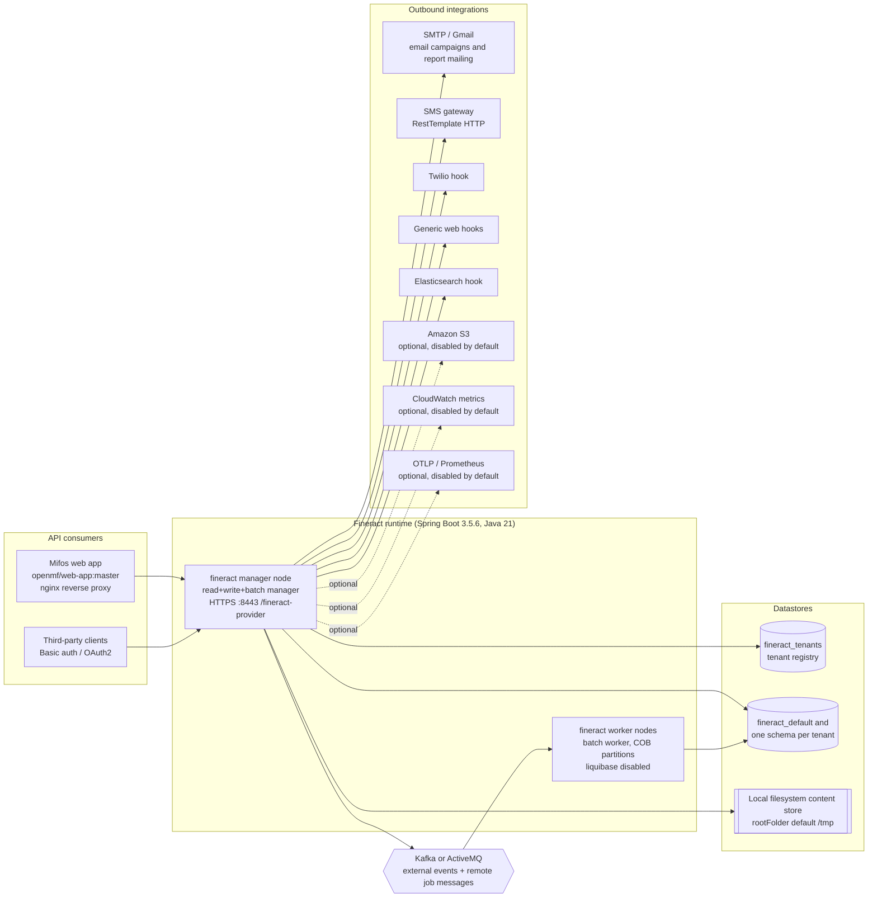
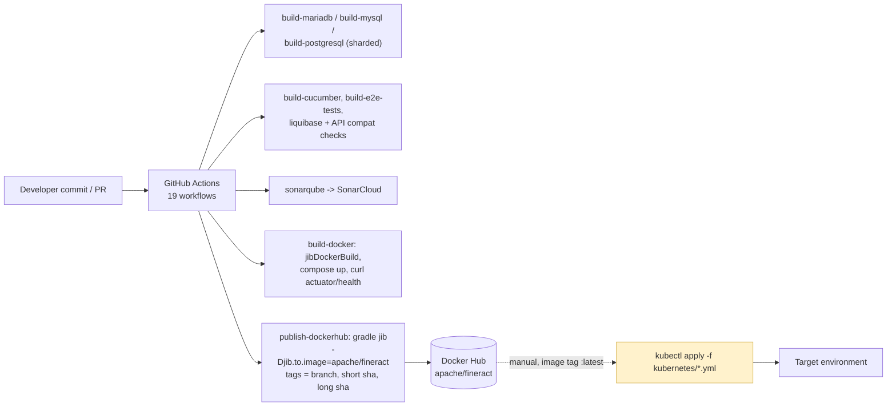

# Current State — COG-GTM/fineract-Core-Banking

Derived from the `develop` branch at commit `8c187f9d1`. Every claim below cites `file:line` in this
repository. Statements that could not be read directly from an artefact are prefixed **Inference:**.

This document describes what the repository contains. It does not describe any running production
deployment; nothing in the repository proves which artefact is actually deployed, and that gap is
raised as an open question (`Q-PROG-02`).

## System context

Mermaid source

## Runtimes and frameworks

| Fact | Value | Evidence |
| --- | --- | --- |
| Language / toolchain | Java 21 (Gradle toolchain) | `build.gradle:395` |
| Framework | Spring Boot 3.5.6 | `buildSrc/src/main/groovy/org.apache.fineract.dependencies.gradle:28`, `build.gradle:113` |
| Build tool | Gradle multi-project, 34 included modules | `settings.gradle:50-83` |
| Source size | 4,855 `src/main/java` files, ~507,600 lines | measured with `find`/`wc` over `*/src/main/java/**/*.java` |
| Persistence | JPA via EclipseLink with compile-time static weaving | `STATIC_WEAVING.md:1`, `static-weaving.gradle:1` |
| Scheduler | Quartz 2.5.0 plus Spring Batch partitioned jobs | `buildSrc/src/main/groovy/org.apache.fineract.dependencies.gradle:73`, `fineract-provider/src/main/java/org/apache/fineract/infrastructure/jobs/service/JobRegisterServiceImpl.java:1` |
| Schema migration | Liquibase 4.33.0, 237 changelog XML files under `db/changelog` | `buildSrc/src/main/groovy/org.apache.fineract.dependencies.gradle:215`, `fineract-provider/src/main/resources/db/changelog/db.changelog-master.xml:1` |
| Packaging | Self-contained JAR (preferred) or WAR for Tomcat 10+ | `README.md:86-118`, `fineract-war/build.gradle:1`, `docker/server.xml:22` |
| Container image | Jib, base `azul/zulu-openjdk-alpine:21`, main class `org.apache.fineract.ServerApplication` | `fineract-provider/build.gradle:264-289` |

Java 21 is a current LTS; no runtime on this list is end-of-life. **Inference:** the EclipseLink static
weaving step is a build-time bytecode transform, so any target build pipeline must run the same Gradle
tasks rather than repackaging a plain JAR.

## Datastores

| Store | Engine / version | Access | Evidence |
| --- | --- | --- | --- |
| Tenant registry `fineract_tenants` | MariaDB 11.4 in compose and Kubernetes; MariaDB ≥ 11.5.2 or PostgreSQL ≥ 18.0 per README | HikariCP JDBC | `config/docker/compose/mariadb.yml:21`, `kubernetes/fineractmysql-deployment.yml:89`, `README.md:33`, `fineract-provider/src/main/resources/application.properties:405-406` |
| Per-tenant business schema (`fineract_default`, one database per tenant) | Same engine as above | Dynamic Hikari datasource per tenant | `fineract-core/src/main/java/org/apache/fineract/infrastructure/core/service/database/DataSourcePerTenantServiceFactory.java:63-96`, `fineract-core/src/main/java/org/apache/fineract/infrastructure/core/service/database/RoutingDataSource.java:41-47` |
| Document/content store | Local filesystem by default, S3 optional | `fineract.content.filesystem.rootFolder` default `${user.home}/.fineract`; container override `/tmp` | `fineract-provider/src/main/resources/application.properties:186-194`, `config/docker/env/fineract-common.env:57` |
| Report export target | S3, disabled by default | `fineract.report.export.s3.enabled=false` | `fineract-provider/src/main/resources/application.properties:202-203` |

Both engines are supported in code: `DatabaseType`, `MySQLQueryService` and `PostgreSQLQueryService`
sit side by side under
`fineract-core/src/main/java/org/apache/fineract/infrastructure/core/service/database/`, and Liquibase
ships a PostgreSQL extension (`buildSrc/src/main/groovy/org.apache.fineract.dependencies.gradle:218`).
CI runs the full suite against MariaDB, MySQL and PostgreSQL separately
(`.github/workflows/build-mariadb.yml:1`, `.github/workflows/build-mysql.yml:1`,
`.github/workflows/build-postgresql.yml:1`).

**Contradiction:** `README.md:33` requires `MariaDB >= 11.5.2`, but every manifest in the repository
pins `mariadb:11.4` (`config/docker/compose/mariadb.yml:21`, `kubernetes/fineractmysql-deployment.yml:89`).

## Data access style

| Pattern | Count | Evidence |
| --- | --- | --- |
| Files using `JdbcTemplate` / `NamedParameterJdbcTemplate` | 220 | `rg -l JdbcTemplate --glob '*.java'` |
| `createNativeQuery` call sites | 1 | `rg -n createNativeQuery --glob '*.java'` |
| `@Query(nativeQuery = true)` | 1 | `rg -n 'nativeQuery *= *true' --glob '*.java'` |
| Stored procedure calls (`CallableStatement`) | 0 | `rg -n 'CallableStatement' --glob '*.java'` |
| `@Scheduled` annotations | 0 — all scheduling is Quartz/Spring Batch driven | `rg -n '@Scheduled' --glob '*.java'` |
| `RestTemplate` use in `src/main` | 4 call sites, all SMS-related | `fineract-provider/src/main/java/org/apache/fineract/infrastructure/sms/scheduler/SmsMessageScheduledJobServiceImpl.java:62`, `.../campaigns/sms/service/SmsCampaignDropdownReadPlatformServiceImpl.java:58`, `.../campaigns/jobs/sendmessagetosmsgateway/SendMessageToSmsGatewayTasklet.java:64`, `.../campaigns/jobs/getdeliveryreportsfromsmsgateway/GetDeliveryReportsFromSmsGatewayTasklet.java:52` |
| `WebClient` | 0 | `rg -n WebClient --glob '*.java'` |

The zero counts matter for a MariaDB → PostgreSQL move: there are no stored procedures and effectively
no native JPA queries, but 220 files build SQL through `JdbcTemplate`, and dialect differences are
centralised in `DatabaseSpecificSQLGenerator`
(`fineract-core/src/main/java/org/apache/fineract/infrastructure/core/service/database/DatabaseSpecificSQLGenerator.java:1`).

## Outbound integrations

| Integration | Transport | Default | Evidence |
| --- | --- | --- | --- |
| External business events | Kafka or JMS/ActiveMQ, Avro-encoded (83 `.avsc` schemas) | disabled | `fineract-provider/src/main/resources/application.properties:124-160`, `config/docker/env/kafka-client.env:25-28`, `config/docker/env/activemq.env:23-26` |
| Remote job messaging (manager → workers) | Spring events, JMS or Kafka | Spring events | `fineract-provider/src/main/resources/application.properties:97-122` |
| Amazon MSK with IAM auth | Kafka SASL_SSL + `aws-msk-iam-auth` 2.2.0 | sample config only | `config/docker/env/kafka-client-msk.env:20-35`, `buildSrc/src/main/groovy/org.apache.fineract.dependencies.gradle:59` |
| Email (campaigns, report mailing) | SMTP, Gmail-backed implementation | configured per tenant in DB | `fineract-provider/src/main/java/org/apache/fineract/infrastructure/core/service/GmailBackedPlatformEmailService.java:1`, `.../reportmailingjob/service/ReportMailingJobEmailServiceImpl.java:1` |
| SMS gateway | HTTP via `RestTemplate` | per-tenant configuration | `fineract-provider/src/main/java/org/apache/fineract/infrastructure/sms/scheduler/SmsMessageScheduledJobServiceImpl.java:62` |
| Hooks | Twilio, generic web hook, Elasticsearch, message gateway | per-tenant configuration | `fineract-provider/src/main/java/org/apache/fineract/infrastructure/hooks/processor/` (`TwilioHookProcessor.java:44`, `WebHookProcessor.java:1`, `ElasticSearchHookProcessor.java:1`, `MessageGatewayHookProcessor.java:1`) |
| S3 object storage | AWS SDK v2 `S3Client` | disabled | `fineract-provider/src/main/java/org/apache/fineract/infrastructure/core/config/ContentS3Config.java:42`, `.../dataqueries/service/export/S3DatatableReportExportServiceImpl.java:36` |
| CloudWatch metrics | Micrometer / Spring Cloud AWS | disabled | `fineract-provider/src/main/resources/application.properties:362-367` |
| OTLP traces / Prometheus scrape | Micrometer | disabled | `fineract-provider/src/main/resources/application.properties:347-358` |
| Pentaho reporting | in-process report generation, HTML/PDF/CSV output | optional | `fineract-provider/src/main/java/org/apache/fineract/infrastructure/campaigns/jobs/executeemail/ExecuteEmailTasklet.java:209` |

## Hosting model

The repository contains three deployment descriptions and no infrastructure-as-code:

- **Docker Compose** — 12 compose files at the repo root covering MariaDB, MySQL, PostgreSQL,
  ActiveMQ, Kafka, MSK, the web app and an observability stack (`docker-compose.yml:19-39`,
  `docker-compose-postgresql-kafka.yml:21-67`, `config/docker/compose/observability.yml:32-76`).
  The Kafka variant is the only multi-node topology: one manager plus two batch workers
  (`docker-compose-postgresql-kafka.yml:34-67`, `config/docker/env/fineract-manager.env:20-26`,
  `config/docker/env/fineract-worker.env:20-24`).
- **Kubernetes** — four raw manifests plus two shell scripts, aimed at minikube
  (`kubernetes/kubectl-startup.sh:58-61`). Fineract and the Mifos web app are both exposed with
  `type: LoadBalancer` (`kubernetes/fineract-server-deployment.yml:34`,
  `kubernetes/fineract-mifoscommunity-deployment.yml:73`). MariaDB runs in-cluster on a `hostPath`
  persistent volume at `/mnt/data` (`kubernetes/fineractmysql-deployment.yml:26-47`). There is no
  Helm chart and no Terraform: `find . -name Chart.yaml` and `find . -name '*.tf'` both return 0.
- **WAR on Tomcat** — supported but discouraged by the README (`README.md:110-118`, `docker/server.xml:22`).

Resource envelope in Kubernetes: Fineract requests 200m CPU / 1Gi and is limited to 1000m / 2Gi with
`-Xmx1G` (`kubernetes/fineract-server-deployment.yml:64-70,122-123`); the database requests 1000m / 1Gi
and is limited to 2000m / 5Gi (`kubernetes/fineractmysql-deployment.yml:91-97`). The README asks for a
16 GB / 8-core machine for development (`README.md:32`).

Health probes hit `/fineract-provider/actuator/health/liveness` and `/readiness` over HTTPS
(`kubernetes/fineract-server-deployment.yml:71-86`), which the actuator exposes
(`fineract-provider/src/main/resources/application.properties:335-337,347`).

## Release flow

Mermaid source

**There is no continuous delivery.** Nineteen workflows exist under `.github/workflows/`; none of them
reference `kubectl`, `helm`, or any deployment step (`rg -n 'deploy|kubectl|helm' .github/workflows/`
returns no matches). The pipeline ends at pushing an image to Docker Hub
(`.github/workflows/publish-dockerhub.yml:37-48`). Promotion into any environment is manual, via
`kubernetes/kubectl-startup.sh:25-46`.

**Contradiction:** CI publishes immutable tags (branch name, short SHA, long SHA —
`.github/workflows/publish-dockerhub.yml:39-48`) while the Kubernetes deployment pins the mutable tag
`apache/fineract:latest` (`kubernetes/fineract-server-deployment.yml:63`). The manifests can never
select a CI-built commit.

## Authentication, session and secrets

| Aspect | Current behaviour | Evidence |
| --- | --- | --- |
| Primary auth | HTTP Basic, enabled by default | `fineract-provider/src/main/resources/application.properties:24`, `README.md:73-78` |
| OAuth2 | Available, disabled by default; sample client redirects to `http://localhost:3000/callback` | `fineract-provider/src/main/resources/application.properties:25,38-42` |
| Two-factor | Available, disabled by default | `fineract-provider/src/main/resources/application.properties:26` |
| Multi-tenancy | `Fineract-Platform-TenantId` header selects the tenant datasource | `fineract-core/src/main/java/org/apache/fineract/infrastructure/core/service/database/RoutingDataSource.java:41-47` |
| Tenant DB password storage | Encrypted in the tenant registry with a master password, default `fineract` | `fineract-provider/src/main/resources/application.properties:53-54`, `fineract-core/src/main/java/org/apache/fineract/infrastructure/core/service/database/DatabasePasswordEncryptor.java:1` |
| TLS termination | In-process, keystore `classpath:keystore.jks`, default password `openmf` | `fineract-provider/src/main/resources/application.properties:386-391`, `fineract-provider/src/main/resources/keystore.jks` |
| CORS | `allowed-origin-patterns` default `*` with `allow-credentials=true` | `fineract-provider/src/main/resources/application.properties:31-35` |
| Outbound TLS verification | `fineract.insecure-http-client` defaults to `true` | `fineract-provider/src/main/resources/application.properties:221` |

Committed non-production credentials that a migration must treat as rotate-and-revoke work (values are
not reproduced here): `config/docker/env/fineract-common.env:31,51,52`,
`config/docker/env/fineract-postgresql.env:23-24`, `config/docker/env/mysql.env:20`,
`config/docker/env/postgresql.env:20-23`, `config/docker/env/mariadb.env:20`, and the shipped keystore
password at `fineract-provider/src/main/resources/application.properties:391`. In Kubernetes the
database credentials do come from a `Secret`, but the secret is generated ad hoc by a shell script and
grants `root` (`kubernetes/kubectl-startup.sh:24`, `kubernetes/fineractmysql-configmap.yml:32-33`).

**Defect found in configuration:** `config/docker/env/kafka-client-msk.env:33` uses `:` instead of `=`
as the assignment operator (`FINERACT_EXTERNAL_EVENTS_KAFKA_PRODUCER_EXTRA_PROPERTIES:linger.ms=10|...`),
so that Kafka producer tuning is silently dropped when the file is loaded as a Docker env file. The same
file hard-codes publicly reachable MSK bootstrap brokers on port 9198
(`config/docker/env/kafka-client-msk.env:23,31`).

## Stateful and environment-specific behaviour

- Uploaded documents and generated reports land on the container filesystem unless S3 is switched on;
  the shipped container config points the content root at `/tmp`
  (`config/docker/env/fineract-common.env:57`), which is lost on restart.
- `config/docker/env/fineract-common.env:58` sets `SPRING_PROFILES_ACTIVE=test,diagnostics` and
  `config/docker/env/fineract-common.env:60` enables a JDWP debug agent on port 5000, which
  `docker-compose.yml:32` publishes. These are development settings shipped in the default compose path.
- Liquibase runs on the manager node at startup and is explicitly disabled on workers
  (`fineract-provider/src/main/resources/application.properties:433`,
  `config/docker/env/fineract-worker.env:24`), so schema upgrade order is a deployment constraint, not
  a database job.
- The tenant-upgrade executor is intentionally pinned to a single thread because of a Liquibase
  thread-safety issue (`fineract-provider/src/main/resources/application.properties:157-160`), which
  bounds how fast a many-tenant estate can be upgraded.
