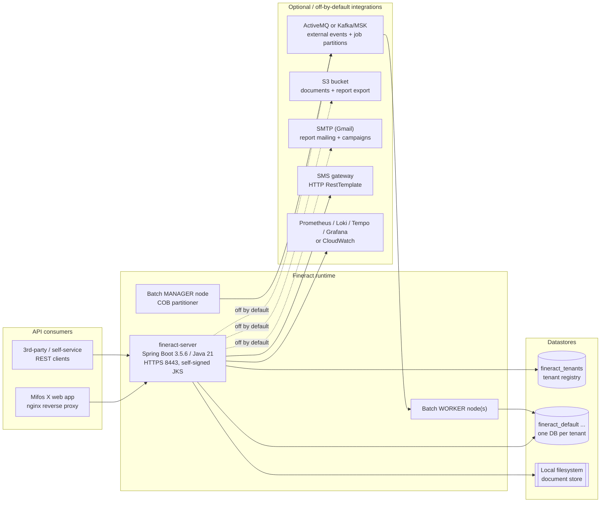
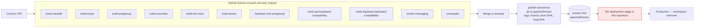

# Current State — Apache Fineract (COG-GTM/fineract-Core-Banking)

Scope: everything below is derived from the `develop` branch of this repository at commit `8c187f9d1`. Every claim carries a `file:line` citation. Anything not read directly from a repository artefact is prefixed **Inference:** and must be confirmed by the owning team before design sign-off (see `open-questions.md`).

---

## 1. System context

Mermaid source

---

## 2. Runtime and framework inventory

| Fact | Value | Evidence |
|---|---|---|
| Language / toolchain | Java 21 (Gradle toolchain) | `build.gradle:395` |
| Framework | Spring Boot 3.5.6 (BOM + plugin) | `buildSrc/src/main/groovy/org.apache.fineract.dependencies.gradle:28`, `build.gradle:113` |
| Build tool | Gradle multi-project, 34 `include` statements | `settings.gradle:50-90` |
| Source size | 4,855 main-source Java files, ~507k lines | `find . -name "*.java" -path "*/src/main/*"` over the working tree |
| Packaging (recommended) | Self-contained Spring Boot JAR, embedded servlet container | `README.md:36`, `README.md:86-101` |
| Packaging (alternative) | WAR for external Tomcat ≥ 10 | `README.md:110-118`, module `:fineract-war` at `settings.gradle:68` |
| Container image | Built with Jib from `azul/zulu-openjdk-alpine:21`, main class `org.apache.fineract.ServerApplication`, runs as `nobody:nogroup`, exposes 8080/8443 | `fineract-provider/build.gradle:264-296` |
| Minimum host sizing (documented) | 16 GB RAM, 8 vCPU | `README.md:32` |
| JVM options in dev compose | `-Xmx1G`, container support, remote debug agent on 5000, several `--add-opens` | `config/docker/env/fineract-common.env:60` |
| EOL status | Java 21 is a current LTS; Spring Boot 3.5.x is in OSS support. **No EOL runtime is present in this repository.** | `build.gradle:395`, `buildSrc/src/main/groovy/org.apache.fineract.dependencies.gradle:28` |

---

## 3. Datastores and data access

| Fact | Value | Evidence |
|---|---|---|
| Supported engines | MariaDB ≥ 11.5.2 or PostgreSQL ≥ 18.0 | `README.md:33` |
| Engine abstraction in code | `DatabaseType` enum with exactly two values, `MYSQL` and `POSTGRESQL` | `fineract-core/src/main/java/org/apache/fineract/infrastructure/core/service/database/DatabaseType.java:23-33` |
| Engine-specific query services | `MySQLQueryService`, `PostgreSQLQueryService`, `DatabaseSpecificSQLGenerator` | `fineract-core/src/main/java/org/apache/fineract/infrastructure/core/service/database/` (directory listing) |
| Multi-tenancy | Database-per-tenant; a `fineract_tenants` registry database plus one database per tenant, resolved at request time | `README.md:58-59`, `config/docker/env/fineract-mariadb.env:22`, `fineract-core/src/main/java/org/apache/fineract/infrastructure/core/service/database/RoutingDataSource.java` |
| Read replica support | First-class: `fineract.tenant.read-only-host/port/username/password/name` | `fineract-provider/src/main/resources/application.properties:56-61` |
| Connection pool | HikariCP, dev defaults min-idle 3 / max 10, `FINERACT_HIKARI_*` | `config/docker/env/fineract-common.env:23-43`, `README.md:330-335` |
| Schema migration | Liquibase, enabled by default, master changelog `db/changelog/db.changelog-master.xml`; 322 changelog XML files across `tenant` and `tenant-store` tiers | `fineract-provider/src/main/resources/application.properties:433-434`, `fineract-provider/src/main/resources/db/changelog/` |
| Tenant-upgrade concurrency | Deliberately pinned to a single thread because of an open Liquibase thread-safety issue | `fineract-provider/src/main/resources/application.properties:157-160` |
| ORM | EclipseLink JPA with compile-time static weaving | `STATIC_WEAVING.md`, `static-weaving.gradle` |
| Raw SQL | `JdbcTemplate` used in 204 main-source files, 590 occurrences | grep over `*/src/main/java` |
| JPA `EntityManager` direct use | 19 main-source files | grep over `*/src/main/java` |
| Native queries | 1 occurrence of `createNativeQuery` in main source | grep over `*/src/main/java` |
| **Stored procedures / functions** | **None.** No `CREATE PROCEDURE`, `CREATE FUNCTION` or `DELIMITER` anywhere under `fineract-provider/src/main/resources/db` | grep over `fineract-provider/src/main/resources/db` |

The last row is the single most important migration fact in this document: the schema is expressed entirely in Liquibase changelogs and the SQL that exists lives in Java string literals, not in the database. A MariaDB→PostgreSQL move is therefore a code-and-changelog exercise that the project already runs in CI, not a stored-procedure rewrite.

---

## 4. Scheduling and batch

| Fact | Value | Evidence |
|---|---|---|
| Scheduler | Quartz, driven through Fineract's own `JobRegisterService` (8 main-source files import `org.quartz`) | `fineract-provider/src/main/java/org/apache/fineract/infrastructure/jobs/service/JobRegisterServiceImpl.java`, grep over `*/src/main/java` |
| **Spring `@Scheduled` annotations** | **Zero in main source.** All scheduling flows through the Quartz-backed job registry, which is database-driven and therefore tenant-aware | grep over `*/src/main/java` |
| Close of Business (COB) | Spring Batch partitioned job `LOAN_COB`, chunk 100, partition 100, 5 threads, retry limit 5 | `fineract-provider/src/main/resources/application.properties:88-95` |
| Node roles | Independently togglable read / write / batch-manager / batch-worker modes on one image | `fineract-provider/src/main/resources/application.properties:67-70` |
| Manager/worker split (dev) | Manager `NODE_ID=1` with worker disabled; worker `NODE_ID=2` with manager disabled and Liquibase disabled | `config/docker/env/fineract-manager.env:20-26`, `config/docker/env/fineract-worker.env:20-24` |
| Partition transport | Spring in-JVM events by default; JMS or Kafka optional | `fineract-provider/src/main/resources/application.properties:97-122`, `README.md:257-288` |

---

## 5. Outbound integrations

| Integration | Default | Evidence |
|---|---|---|
| Object storage (documents) | S3 client present, **disabled by default**; filesystem store enabled instead | `fineract-provider/src/main/resources/application.properties:186-194`, `fineract-document/src/main/java/org/apache/fineract/infrastructure/contentstore/service/S3ContentStoreService.java` |
| Object storage (report export) | `fineract.report.export.s3.enabled` default `false` | `fineract-provider/src/main/resources/application.properties:202-203`, `fineract-provider/src/main/java/org/apache/fineract/infrastructure/dataqueries/service/export/S3DatatableReportExportServiceImpl.java` |
| AWS SDK | `software.amazon.awssdk` used in 8 files; LocalStack customizer present for local/CI runs | `fineract-provider/src/main/java/org/apache/fineract/infrastructure/s3/LocalstackS3ClientCustomizer.java`, `.github/workflows/build-postgresql.yml:39-44` |
| SMTP | Spring `JavaMailSenderImpl`, STARTTLS, Gmail-oriented configuration read from the database | `fineract-provider/src/main/java/org/apache/fineract/infrastructure/reportmailingjob/service/ReportMailingJobEmailServiceImpl.java:32,60,94-96` |
| SMS gateway | Outbound HTTP via `RestTemplate` in 4 main-source files (scheduler, campaign dropdown, send-message tasklet, delivery-report tasklet) | `fineract-provider/src/main/java/org/apache/fineract/infrastructure/sms/scheduler/SmsMessageScheduledJobServiceImpl.java` and 3 others |
| **`WebClient` / reactive HTTP** | **Zero occurrences.** All outbound HTTP is blocking `RestTemplate` | grep over the repository |
| Message broker | ActiveMQ 5.18.3 (dev compose) or Kafka; both disabled by default | `config/docker/compose/activemq.yml:23`, `fineract-provider/src/main/resources/application.properties:129-150` |
| Managed Kafka | AWS MSK with IAM auth is a supported and pre-wired path (`aws-msk-iam-auth` on the classpath) | `README.md:285-286`, `config/docker/env/kafka-client-msk.env:22-35` |
| Metrics / traces | Prometheus endpoint, CloudWatch exporter, OTLP to Tempo, Loki log driver, Grafana | `config/docker/env/prometheus.env:20`, `config/docker/env/cloudwatch.env:20-23`, `config/docker/env/oltp.env:20-22`, `config/docker/compose/observability.yml:35-63` |
| Local disk state | Document store root defaults to `${user.home}/.fineract`, and to `/tmp` in the dev compose; logs and JFR recordings written to a bind mount | `fineract-provider/src/main/resources/application.properties:187`, `config/docker/env/fineract-common.env:57`, `config/docker/compose/fineract.yml:23-26` |

---

## 6. Security and session model

| Fact | Value | Evidence |
|---|---|---|
| Primary auth | HTTP Basic, **enabled by default** | `fineract-provider/src/main/resources/application.properties:24` |
| OAuth2 | Present but disabled by default; sample `frontend-client` registration ships in the properties file | `fineract-provider/src/main/resources/application.properties:25,37-42` |
| Two-factor | Disabled by default; dedicated `:twofactor-tests` module | `fineract-provider/src/main/resources/application.properties:26`, `settings.gradle:70` |
| HSTS | Disabled by default | `fineract-provider/src/main/resources/application.properties:27` |
| CORS | Enabled by default with `*` for origins, methods, headers and exposed headers, and `allow-credentials=true` | `fineract-provider/src/main/resources/application.properties:30-35` |
| Actuator CORS | `allowed-origins=*` hard-coded (not env-overridable) | `fineract-provider/src/main/resources/application.properties:341-343` |
| TLS termination | In-process TLS on 8443 using a keystore **committed to the repository** with a default password in plain text | `fineract-provider/src/main/resources/application.properties:386-391`, `fineract-provider/src/main/resources/keystore.jks` |
| Outbound TLS verification | `fineract.insecure-http-client` defaults to `true` | `fineract-provider/src/main/resources/application.properties:221` |
| Tenant credential encryption | AES/CBC/PKCS5Padding with a master password defaulting to `fineract` | `fineract-provider/src/main/resources/application.properties:53-54,206` |
| Committed credentials | A database password literal is committed in the dev env file (value deliberately not reproduced here) | `config/docker/env/fineract-common.env:31,51` |
| Committed infrastructure identifiers | Three real-looking public MSK broker endpoints in `eu-central-1` | `config/docker/env/kafka-client-msk.env:23,31` |
| Idempotency | Client-supplied `Idempotency-Key` header | `fineract-provider/src/main/resources/application.properties:163` |
| SQL-injection screening | Regex pattern list applied to dynamic SQL | `fineract-provider/src/main/resources/application.properties:226-230` |

These defaults are dev-oriented. They are recorded here as current-state facts, not as defects to fix in this package; `migration-plan.md` WS8 gates production cutover on each of them.

---

## 7. Hosting model as the repository defines it

| Artefact | What it actually deploys | Evidence |
|---|---|---|
| `docker-compose.yml` | MariaDB container + one Fineract container, ports 8443 and 5000 (debug), three env files | `docker-compose.yml:19-39` |
| Compose Fineract service | Image `fineract:latest` — the **locally built** Jib image, not a registry image | `config/docker/compose/fineract.yml:21` |
| Compose health check | `nc -z localhost 8443` only; it never calls the actuator | `config/docker/compose/fineract.yml:28-31` |
| Compose DB | `mariadb:11.4` | `config/docker/compose/mariadb.yml:21` |
| Compose profile | `SPRING_PROFILES_ACTIVE=test,diagnostics` in the shared env file used by the default compose | `config/docker/env/fineract-common.env:58` |
| Kubernetes app | Image `apache/fineract:latest` from Docker Hub, `strategy: Recreate`, 1 vCPU / 2 GiB limit, actuator liveness and readiness probes over HTTPS | `kubernetes/fineract-server-deployment.yml:49-86` |
| Kubernetes exposure | `Service type: LoadBalancer` directly on 8443 — the self-signed application certificate is what clients see | `kubernetes/fineract-server-deployment.yml:26-34` |
| Kubernetes DB | `mariadb:11.4` in a `Deployment` (not a StatefulSet) on a `hostPath: /mnt/data` PersistentVolume, `ReadWriteMany`, 10 Gi | `kubernetes/fineractmysql-deployment.yml:20-47,89` |
| Kubernetes secrets | DB username/password from a `fineract-tenants-db-secret` Kubernetes Secret | `kubernetes/fineract-server-deployment.yml:94-117` |
| Kubernetes UI | Mifos X web app behind nginx, `proxy_ssl_verify off`, `proxy_redirect https:// http://` | `kubernetes/fineract-mifoscommunity-deployment.yml:35-55` |
| Compose variants | 11 alternative compose files (MySQL, PostgreSQL, ActiveMQ, Kafka, MSK, development, custom, web-app, community-app) | repository root listing |

### Contradictions between artefacts

1. **Database version.** `README.md:33` states MariaDB ≥ 11.5.2 is required, but both the dev compose (`config/docker/compose/mariadb.yml:21`) and the Kubernetes manifest (`kubernetes/fineractmysql-deployment.yml:89`) pin `mariadb:11.4`. Nothing in the repository runs the documented minimum.
2. **Which image runs.** Compose runs a locally built `fineract:latest` (`config/docker/compose/fineract.yml:21`); Kubernetes runs the upstream `apache/fineract:latest` (`kubernetes/fineract-server-deployment.yml:63`); CI publishes to `apache/fineract` with branch, short-hash and long-hash tags (`.github/workflows/publish-dockerhub.yml:43-48`). The three paths cannot all describe the same artefact, and `latest` is not a pinned reference in either deployment.
3. **Health signal.** Kubernetes probes `/fineract-provider/actuator/health/{liveness,readiness}` (`kubernetes/fineract-server-deployment.yml:71-86`) while compose only checks that the TCP port is open (`config/docker/compose/fineract.yml:29`). Compose will report healthy while the application is failing.
4. **Database as a stateless Deployment.** The MariaDB Kubernetes object is a `Deployment` with `strategy: Recreate` over a `hostPath` volume (`kubernetes/fineractmysql-deployment.yml:20-33,69-81`), which pins the database to one node's local disk and loses it if that node is replaced.
5. **Dev profile in the default compose.** `SPRING_PROFILES_ACTIVE=test,diagnostics` and a JDWP debug agent on port 5000 are in the shared env file (`config/docker/env/fineract-common.env:58,60`) that `docker-compose.yml:37-39` loads.

---

## 8. Path a change takes to production

```mermaid
flowchart LR
    dev["Commit / PR"] --> checks

    subgraph checks[GitHub Actions on push and pull_request]
      mariadb["build-mariadb"]
      mysql["build-mysql"]
      pg["build-postgresql"]
      cuke["build-cucumber"]
      e2e["build-e2e-tests"]
      dock["build-docker"]
      lb["liquibase-only-postgresql"]
      apicompat["verify-api-backward-compatibility"]
      lbcompat["verify-liquibase-backward-compatibility"]
      smoke["smoke-messaging"]
      sonar["sonarqube"]
    end

    checks --> merge["Merge to develop"]
    merge --> pub["publish-dockerhub<br/>jib to apache/fineract<br/>tags: branch, short SHA, long SHA"]
    pub --> hub[("Docker Hub<br/>apache/fineract")]
    hub -.-> gap["NO deployment stage in this repository"]
    gap -.-> prod["Production — mechanism unknown"]

    style gap fill:#ffe6e6,stroke:#cc0000
    style prod stroke-dasharray: 5 5
```

Mermaid source

| Fact | Value | Evidence |
|---|---|---|
| CI triggers | 11 workflows fire on every `push` and `pull_request` | `.github/workflows/*.yml` `on:` blocks |
| Database matrix | Separate MariaDB, MySQL and PostgreSQL build workflows; PostgreSQL CI runs `postgres:18.3` | `.github/workflows/build-mariadb.yml`, `build-mysql.yml`, `build-postgresql.yml:20` |
| Compatibility gates | API backward compatibility (Swagger Brake) and Liquibase backward compatibility workflows | `.github/workflows/verify-api-backward-compatibility.yml`, `verify-liquibase-backward-compatibility.yml` |
| Static analysis | SonarQube/SonarCloud workflow, Spotless, SpotBugs, Modernizer, RAT, CycloneDX SBOM | `.github/workflows/sonarqube.yml`, `build.gradle:108-128` |
| CI AWS surface | LocalStack S3 with `FINERACT_REPORT_EXPORT_S3_ENABLED: true` | `.github/workflows/build-postgresql.yml:39-44` |
| Publish | On push to `develop` and on tags, Jib pushes `apache/fineract` using `DOCKERHUB_USER` / `DOCKERHUB_TOKEN` | `.github/workflows/publish-dockerhub.yml:2-48` |
| **Deployment to any environment** | **Not present.** No Helm chart, no Terraform, no CloudFormation, no CDK, no Harness/Argo/Spinnaker configuration exists in the repository. The pipeline ends at a container registry. | repository-wide file listing |

**Inference:** whatever deploys this application into the customer's environments lives outside this repository, so the "current CD" column of the target-state table cannot be filled from code. This is open question `Q-DEL-1`.

---

## 9. What this repository does *not* contain

Recorded explicitly, because each absence removes a workstream that a migration of this kind normally carries:

- No stored procedures or database functions (`fineract-provider/src/main/resources/db`, grep).
- No `@Scheduled` annotations — no hidden cron in application code (grep over `*/src/main/java`).
- No `WebClient`/reactive stack (grep over the repository).
- No infrastructure-as-code and no CD pipeline (repository listing).
- No Pentaho `.prpt` report bundles, despite Pentaho references surviving in SQL sample data and report service code (`find . -name "*.prpt"` returns nothing; references at `fineract-provider/src/main/java/org/apache/fineract/infrastructure/dataqueries/service/ReadReportingServiceImpl.java`).
- No FTP, file-share or fixed-width batch-file interface (grep over `*/src/main/java`).
- No frontend: Fineract is API-only, with Swagger UI as the sole shipped browser surface (`README.md:366-371`).
