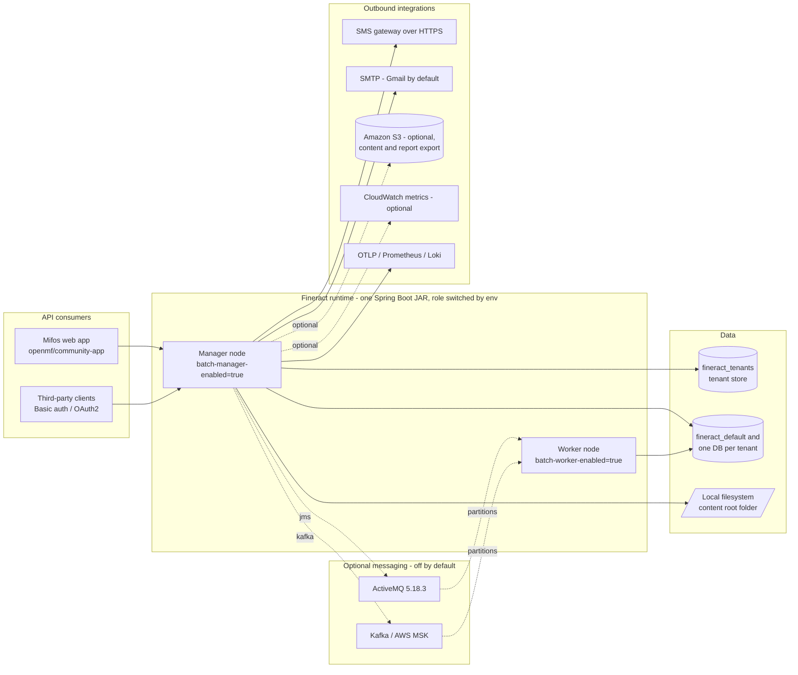
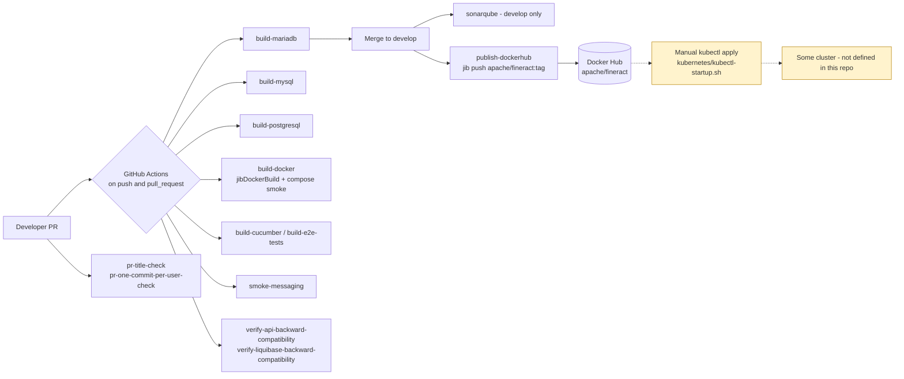

# Current State — Apache Fineract (COG-GTM/fineract-Core-Banking)

Derived by reading this repository at commit `8c187f9d1` on branch `develop`. Every claim below cites
`file:line`. Anything not read directly from a file in this repository is prefixed **Inference:**.

Mermaid source — context diagram

## 1. What this repository is

| Fact | Evidence |
| --- | --- |
| Apache Fineract, a headless core banking platform; no UI is shipped, only a REST API | `README.md:10`, `README.md:369` |
| 32 Gradle modules declared, ~4,855 Java source files, ~507,600 lines under `src/main/java` | `settings.gradle` (32 `include` lines); counted with `find`/`wc` over `*/src/main/java/**/*.java` |
| Java toolchain 21 | `build.gradle:394-395` |
| Spring Boot 3.5.6 (BOM) | `buildSrc/src/main/groovy/org.apache.fineract.dependencies.gradle:28` |
| Gradle 8.14.3 wrapper | `gradle/wrapper/gradle-wrapper.properties` (`distributionUrl`) |
| Two published artefacts: self-contained JAR (recommended) and a Tomcat 10 WAR | `README.md:86-118`, `fineract-war/build.gradle:21-27` |
| Stated infra requirement: 16 GB RAM / 8 core CPU, MariaDB ≥ 11.5.2 or PostgreSQL ≥ 18.0, Java ≥ 21 | `README.md:32-34` |

Neither Java 21 nor Spring Boot 3.5.x is end-of-life. **Inference:** this is not a language-runtime
modernisation; the migration work is hosting, data, delivery and security, not code rewriting.

## 2. Runtime topology

| Fact | Evidence |
| --- | --- |
| One deployable, whose role is chosen by four environment flags: read / write / batch-worker / batch-manager | `fineract-provider/src/main/resources/application.properties:67-70` |
| Manager profile: `FINERACT_MODE_BATCH_MANAGER_ENABLED=true`, worker disabled, node id 1 | `config/docker/env/fineract-manager.env:20-26` |
| Worker profile: worker enabled, manager disabled, node id 2, **Liquibase disabled** on workers | `config/docker/env/fineract-worker.env:20-24` |
| Server listens on 8443 with TLS terminated in the app, using a keystore shipped on the classpath | `application.properties:382`, `:386-391` |
| Multi-tenant: tenant selected per request, tenant store DB plus one database per tenant | `application.properties:433-451`, `fineract-provider/.../migration/TenantDatabaseUpgradeService.java:104-138` |
| Liquibase runs at application start-up against the tenant store and then each tenant DB | `TenantDatabaseUpgradeService.java:80-138`, `application.properties:433-434` |
| 237 Liquibase changelog XML files, 217 of them tenant "parts" | `fineract-provider/src/main/resources/db/changelog/**` (file count) |

## 3. Datastore and data access

| Fact | Evidence |
| --- | --- |
| Only two database engines are supported in code, and both are first class: `MYSQL`, `POSTGRESQL` | `fineract-core/.../database/DatabaseType.java:21-33` |
| Engine differences are abstracted in one place | `fineract-core/.../database/DatabaseSpecificSQLGenerator.java:42` |
| CI runs the full build against MariaDB, MySQL and PostgreSQL separately | `.github/workflows/build-mariadb.yml`, `build-mysql.yml`, `build-postgresql.yml` |
| Default JDBC driver and URL are MariaDB | `application.properties:405-406` |
| PostgreSQL 18.3 is the engine used by the PostgreSQL CI job and compose profile | `.github/workflows/build-postgresql.yml:20`, `config/docker/compose/postgresql.yml:23` |
| Connection pooling is HikariCP, default max pool size 10 per node | `application.properties:405-415`, `config/docker/env/fineract-common.env:24` |
| ORM is EclipseLink JPA with compile-time static weaving | `STATIC_WEAVING.md`, `static-weaving.gradle` |
| Raw SQL via `JdbcTemplate` is pervasive: 204 files under `src/main/java` reference it, 24 use `NamedParameterJdbcTemplate` | ripgrep over `*/src/main/java/**/*.java` |
| `@Query(nativeQuery = true)` appears in exactly 1 file; `createNativeQuery` in 1 | ripgrep, same scope |
| **Zero** stored procedures: no `CREATE PROCEDURE`, no `createStoredProcedureQuery` anywhere in Java or changelogs | ripgrep, zero matches |

The zero-stored-procedure result is load-bearing: an engine change is a schema-and-data exercise, not a
procedural-code rewrite, and the code already ships a PostgreSQL dialect that CI exercises on every push.

## 4. Scheduling, batch and caching

| Fact | Evidence |
| --- | --- |
| **Zero** `@Scheduled` annotations in main source; scheduling is Quartz, driven from database-configured jobs | ripgrep (0 matches); `fineract-provider/.../jobs/service/JobRegisterServiceImpl.java` |
| Quartz schedulers are created programmatically per tenant with only a thread count set — no `JobStore`, no `org.quartz.jobStore.isClustered` anywhere | `JobRegisterServiceImpl.java:319-331` |
| Close-of-business (COB) is a Spring Batch partitioned job; partition/chunk sizes are configurable | `application.properties:88-95` |
| Remote partitioning is dispatched over Spring events (default), JMS or Kafka | `application.properties:97-122`, `README.md:257-288` |
| External business events (Avro) are off by default; ActiveMQ or Kafka producers can be enabled | `application.properties:124-145` |
| Spring Batch schema is never auto-initialised and jobs do not auto-run at boot | `application.properties:467-469` |
| Cache is per-JVM: `NoOpCacheManager` by default, Ehcache 3.10.8 as the single-node option | `fineract-core/.../cache/service/RuntimeDelegatingCacheManager.java:38-61`, `buildSrc/.../dependencies.gradle:74` |
| **`MULTI_NODE` cache throws `UnsupportedOperationException`** — there is no distributed cache | `RuntimeDelegatingCacheManager.java:114` |
| Cache mode is switched globally on the first authenticated request of a JVM | `fineract-security/.../filter/TenantAwareBasicAuthenticationFilter.java:140-151` |
| No Redis, Hazelcast, JNDI or SOAP usage in main source | ripgrep, zero matches |

**Inference:** because Quartz uses the default in-memory job store and the cache is per-JVM, running more
than one *write/manager* replica is not a safe scale-out lever today; horizontal scale-out is expressed in
this codebase as read nodes plus batch workers, not as N identical replicas.

## 5. Outbound integrations

| Integration | Mechanism | Evidence |
| --- | --- | --- |
| SMS gateway | `RestTemplate` created inline (`new RestTemplate()`), no timeouts or connection pool configured | `.../sms/scheduler/SmsMessageScheduledJobServiceImpl.java:62`, `.../campaigns/jobs/sendmessagetosmsgateway/SendMessageToSmsGatewayTasklet.java:64` |
| Email | Spring `JavaMailSenderImpl`, SMTP credentials read from the tenant database at send time | `.../core/service/GmailBackedPlatformEmailService.java:57-64` |
| Object storage | AWS SDK v2 S3, used for document content and report export, both **disabled by default** | `application.properties:186-203`, `fineract-provider/.../infrastructure/s3/AmazonS3Config.java` |
| Document content default | Local filesystem, root `${user.home}/.fineract`; the container stack overrides it to `/tmp` | `application.properties:186-187`, `config/docker/env/fineract-common.env:57` |
| Metrics | Prometheus scrape and/or CloudWatch push, both off by default | `application.properties:358-367` |
| Tracing | OTLP export, off by default, default endpoint `http://tempo:4318/v1/traces` | `application.properties:349-356` |
| Logs | Loki via the Docker logging driver in the development stack | `README.md:146-151`, `config/docker/compose/logging-loki.yml:19-22` |
| Kafka on AWS | MSK with `AWS_MSK_IAM` SASL, sample config committed | `config/docker/env/kafka-client-msk.env:20-35` |
| HTTP client posture | `FINERACT_INSECURE_HTTP_CLIENT=true` in the shared container env file | `config/docker/env/fineract-common.env:56` |

No FTP, no file-share drop, no CDN and no ACME/cert-issuance code path exists in main source (ripgrep).
Document content on local disk is the only stateful thing outside the database.

## 6. Authentication and authorisation

| Fact | Evidence |
| --- | --- |
| HTTP Basic authentication is on by default; OAuth2 and 2FA are off by default | `application.properties:24-26` |
| Tenant is selected by the `Fineract-Platform-TenantId` request header | `README.md:74-78` |
| CORS defaults to `*` for origins, methods, headers and exposed headers, with credentials allowed | `application.properties:30-35` |
| HSTS is disabled by default | `application.properties:27` |
| Maker-checker (two-step authorisation) and a command pattern back sensitive actions | `fineract-command/`, `.../portfolio/.../command/` |
| An OAuth2 mock server is used in CI, so the OAuth2 path is exercised | `.github/workflows/build-postgresql.yml:28-34` |

## 7. Secrets and configuration

Config is entirely environment-variable driven with defaults in `application.properties`; there is no
config server and no secrets manager integration.

| Finding | Evidence |
| --- | --- |
| Database password committed in the shared container env file (used by every compose profile) | `config/docker/env/fineract-common.env:31`, `:51` |
| Tenant master password committed | `config/docker/env/fineract-common.env:52` |
| MariaDB / MySQL / PostgreSQL root passwords committed | `config/docker/env/mariadb.env:20`, `mysql.env:20`, `postgresql.env:21-23` |
| TLS keystore password committed as the property default | `application.properties:391` |
| Default API credentials published in the README and the Kubernetes start script | `README.md:222-224`, `kubernetes/kubectl-startup.sh:63-65` |
| AWS credentials file mounted into the container from the repo | `config/docker/compose/fineract.yml:25`, `config/docker/aws/etc/credentials` (no live key committed) |
| Named AWS MSK broker endpoints, on the **public** listener port 9198, committed | `config/docker/env/kafka-client-msk.env:23`, `:31` |
| The default compose stack runs with `SPRING_PROFILES_ACTIVE=test,diagnostics` and a JDWP debug agent open on 5000 | `config/docker/env/fineract-common.env:58`, `:60`, `docker-compose.yml:32` |

These values are development defaults committed upstream by the Apache project, not production
credentials — but any environment that inherits these files inherits the values. Rotation and removal are
tracked as work in the migration plan (WS1), not fixed in this docs-only change.

## 8. Hosting model as the repository defines it

| Fact | Evidence |
| --- | --- |
| Container image is built with Jib (no Dockerfile exists in the repo), base image `azul/zulu-openjdk-alpine:21`, runs as `nobody:nogroup` | `fineract-provider/build.gradle:264-304`, `:295` |
| Image entrypoint sets UTC and `-Duser.home=/tmp`; `allowInsecureRegistries = true` | `fineract-provider/build.gradle:287-292`, `:298` |
| 12 Docker Compose profiles exist (MariaDB, MySQL, PostgreSQL, ActiveMQ, Kafka, MSK, observability, web app, custom, development) | `docker-compose*.yml` (12 files at repo root) |
| Kubernetes manifests exist for a **single-node / minikube** deployment only: `hostPath` PersistentVolume at `/mnt/data`, `storageClassName: manual` | `kubernetes/fineractmysql-deployment.yml:21-33` |
| Both Deployments use `strategy: Recreate` — a restart is a full outage, not a rolling update | `kubernetes/fineract-server-deployment.yml:49-50`, `kubernetes/fineractmysql-deployment.yml:80-81` |
| No `replicas` is set anywhere, so every Deployment runs one pod | `kubernetes/*.yml` (no `replicas` key) |
| The API Service is `type: LoadBalancer` exposing 8443 directly, with no Ingress and no WAF | `kubernetes/fineract-server-deployment.yml:26-34` |
| The database runs in-cluster as a `Deployment` (not a StatefulSet) with a hostPath volume | `kubernetes/fineractmysql-deployment.yml:69-132` |
| Deployment is a manual `kubectl apply` script, which also mints the DB secret with a random password inline | `kubernetes/kubectl-startup.sh:24-36` |
| **No IaC of any kind**: no Terraform, CloudFormation, CDK, Pulumi or Helm chart in the repository | repository-wide file search |

### Contradictions between artefacts

These are current-state facts, not defects to fix in this package:

1. **Database version.** `README.md:33` requires `MariaDB >= 11.5.2`, but both the compose stack
   (`config/docker/compose/mariadb.yml:21`) and the Kubernetes manifest
   (`kubernetes/fineractmysql-deployment.yml:89`) pin `mariadb:11.4`. Nothing in the repo runs the version
   the README requires.
2. **Which image actually runs.** CI builds and loads `fineract:latest` locally
   (`.github/workflows/build-docker.yml:43`), compose consumes `fineract:latest`
   (`config/docker/compose/fineract.yml:21`), but Kubernetes pulls `apache/fineract:latest` from Docker Hub
   (`kubernetes/fineract-server-deployment.yml:63`) — the upstream community image, not the image this
   pipeline produced. Digest-pinning is absent everywhere.
3. **Health probes vs. TLS.** Probes hit `/fineract-provider/actuator/health/{liveness,readiness}` over
   HTTPS on 8443 (`kubernetes/fineract-server-deployment.yml:71-86`) against a classpath self-signed
   keystore (`application.properties:390-391`).
4. **Init container image.** The MariaDB wait loop uses `busybox:1.28`
   (`kubernetes/fineract-server-deployment.yml:59`), a 2018 image tag.
5. **Secret creation is idempotent-by-accident.** `kubectl-startup.sh:24` swallows the error if the secret
   already exists (`2>/dev/null || echo "Secret already exists, skipping..."`), so a re-run against an
   existing cluster silently keeps the old password while the MariaDB pod may be re-initialised.

## 9. How a release actually reaches production today

Mermaid source — release flow

| Fact | Evidence |
| --- | --- |
| 19 GitHub Actions workflows; the build matrix runs on every `push` and `pull_request` | `.github/workflows/` (19 files), e.g. `build-mariadb.yml` (`on: [push, pull_request]`) |
| The only publish step pushes a multi-arch image to Docker Hub as `apache/fineract`, on push to `develop` and on `1.*` tags | `.github/workflows/publish-dockerhub.yml:38-48` |
| Registry credentials are GitHub secrets `DOCKERHUB_USER` / `DOCKERHUB_TOKEN` | `.github/workflows/publish-dockerhub.yml:44-45` |
| Tag strategy on `develop`: branch name plus short and long commit SHA; **`latest` is only produced by a local `jib` run**, not by the publish workflow | `publish-dockerhub.yml:39-48` vs. `fineract-provider/build.gradle:276-281` |
| Static analysis is SonarQube/SonarCloud on `develop` only | `.github/workflows/sonarqube.yml` |
| API and Liquibase backward compatibility are gated in CI | `.github/workflows/verify-api-backward-compatibility.yml`, `verify-liquibase-backward-compatibility.yml` |
| ~300 integration test classes and 48 Cucumber feature files | `integration-tests/`, `fineract-e2e-tests-runner/` (file counts) |
| **There is no deployment workflow.** No workflow references a cloud account, a cluster, Helm, Argo, Harness, or any environment | `.github/workflows/` (no deploy job in any file) |

**Inference:** the deployed-to environment, its account structure, its database and its release approval
process are all outside this repository. Everything after "image pushed to Docker Hub" in the diagram above
is an assumption to be confirmed (see `open-questions.md`, OQ-P1 and OQ-D1).

## 10. Summary of migration-relevant facts

- Modern runtime (Java 21, Spring Boot 3.5.6): no runtime-EOL forcing function.
- Already container-native (Jib, non-root, 8443, actuator probes) — a container platform target is a short hop.
- Already PostgreSQL-capable and CI-verified on PostgreSQL; no stored procedures anywhere.
- State outside the database is limited to document content on local disk (S3 support already exists, off by default).
- Not multi-instance-safe today for the write role: in-memory Quartz job store and a per-JVM cache with `MULTI_NODE` explicitly unsupported.
- No IaC, no CD, no environment definition, no secrets manager, and committed development credentials.
