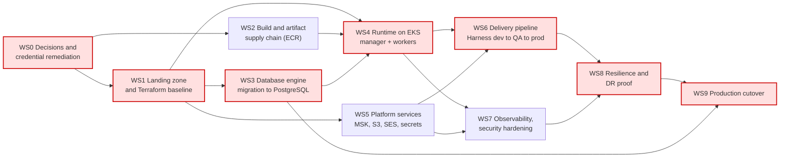

# Migration Plan

Ordered workstreams for moving Fineract from its current MariaDB-on-Kubernetes/Compose footprint
(see [current-state.md](current-state.md)) to the AWS target in [target-state.md](target-state.md).
Each workstream is independently reviewable and has explicit entry criteria. Effort is in Devin
sessions (one session ≈ one to two human-weeks of equivalent work); external waits — account vending,
DBA sign-off, security review — are listed as entry criteria, not effort.

Open question IDs (`Q-*`) refer to [open-questions.md](open-questions.md).

## Dependency graph

Mermaid source

**Critical path:** WS0 → WS1 → WS3 → WS4 → WS6 → WS8 → WS9. The engine migration (WS3) is the longest
single item and the only one whose failure mode is data loss; WS2, WS5 and WS7 can run alongside it.

## WS0 — Decisions and credential remediation

| | |
| --- | --- |
| Entry criteria | None — this is the first workstream. |
| Depends on | — |
| Effort | 0.5 session plus customer response time |

- Close `Q-PLAT-01` (approved service list) and `Q-PLAT-02` (guardrails). Everything downstream is
  provisional until these are answered; the target state currently uses assumed defaults.
- Close `Q-DB-01` (target engine) and `Q-PROG-02` (what is actually deployed today).
- Rotate and revoke every credential committed to the repository: the `.env` defaults under
  `config/docker/env/`, the tenant master password default (`application.properties:53`) and the
  keystore password (`application.properties:391`). Rotation happens in the runtime systems; the
  repository change that removes the defaults is a separate non-docs PR (`Q-SEC-01`).
- Exit criteria: guardrails confirmed, engine confirmed, credential inventory signed off by Security.

## WS1 — Landing zone and Terraform baseline

| | |
| --- | --- |
| Entry criteria | WS0 decisions closed; dev account vended via Control Tower (`Q-PLAT-03`). |
| Depends on | WS0 |
| Effort | 3 sessions |

- Terraform modules for VPC (private subnets, NAT), EKS, Aurora PostgreSQL, MSK, S3, KMS, Secrets
  Manager, internal ALB and Route 53 private zones. No console resources (G5).
- Mandatory tag set applied through provider default tags once `Q-PLAT-05` is answered.
- Dev account first; QA and prod modules are the same code with different tfvars (G4).
- Exit criteria: `terraform plan` clean in dev, an empty EKS cluster and an empty Aurora cluster
  reachable only from inside the VPC.

## WS2 — Build and artifact supply chain

| | |
| --- | --- |
| Entry criteria | WS0 closed; ECR repositories exist (can be created ahead of WS1 completion). |
| Depends on | WS0 |
| Effort | 1 session |

- Publish the Jib image to ECR instead of Docker Hub, using GitHub Actions OIDC (`Q-DEL-03`) with
  immutable tags — the current workflow pushes `apache/fineract` with branch and SHA tags
  (`.github/workflows/publish-dockerhub.yml:37-48`) while the Kubernetes manifest pulls `:latest`
  (`kubernetes/fineract-server-deployment.yml:63`); the target pins a digest.
- Mirror `azul/zulu-openjdk-alpine:21` and the `busybox:1.28` init image into ECR (`Q-PLAT-04`).
- Wire the existing CycloneDX SBOM (`build.gradle:128`) and ECR image scanning into a release gate
  (`Q-DEL-02`).
- Exit criteria: a signed, scanned image in ECR pulled successfully by a dev-account node.

## WS3 — Database engine migration to PostgreSQL

| | |
| --- | --- |
| Entry criteria | `Q-DB-01` answered; Aurora cluster from WS1 available; datatable/objects inventory from `Q-DB-02`. |
| Depends on | WS1 |
| Effort | 4 sessions |
| Risk | **High** — the largest risk in the programme |

- The application already supports PostgreSQL and Liquibase carries a PostgreSQL extension, and there
  are no stored procedures and effectively no native JPA queries. The risk is concentrated in the 220
  files that build SQL through `JdbcTemplate` and in `DatabaseSpecificSQLGenerator`.
- Run the existing PostgreSQL CI job (`.github/workflows/build-postgresql.yml:1`) as the correctness
  baseline, then execute the full API/e2e suites against Aurora.
- Migrate data with DMS + CDC or a maintenance-window dump/restore depending on `Q-DB-03`; validate
  row counts and financial totals per tenant.
- Re-tune Hikari and per-tenant pool sizes against the Aurora connection limit
  (`application.properties:63-64,410`).
- Exit criteria: full test suite green on Aurora, a reconciled trial migration of production-sized
  data, and DBA sign-off on the rollback procedure.

## WS4 — Runtime on EKS

| | |
| --- | --- |
| Entry criteria | WS1 cluster available; WS2 image in ECR; WS3 schema available in dev. |
| Depends on | WS1, WS2, WS3 |
| Effort | 2 sessions |

- Manager Deployment (single replica, Liquibase enabled) and worker Deployment with an HPA
  (Liquibase disabled, as in `config/docker/env/fineract-worker.env:24`).
- Replace the two `type: LoadBalancer` Services (`kubernetes/fineract-server-deployment.yml:34`,
  `kubernetes/fineract-mifoscommunity-deployment.yml:73`) with one internal ALB and Ingress rules.
- TLS terminates at the ALB with ACM; the classpath keystore is removed from the runtime path.
- Keep the existing actuator liveness/readiness probes (`kubernetes/fineract-server-deployment.yml:71-86`),
  switched to the HTTP listener behind the ALB.
- Replace the ad hoc `kubectl-startup.sh` Secret generation (`kubernetes/kubectl-startup.sh:24`) with
  Secrets Manager + IRSA.
- Exit criteria: a dev environment serving the API through the internal ALB with no static credentials
  in any manifest.

## WS5 — Platform services

| | |
| --- | --- |
| Entry criteria | WS1 complete. |
| Depends on | WS1 |
| Effort | 2 sessions |

- MSK with IAM auth replacing the compose Kafka and the ActiveMQ path; the hard-coded public brokers
  (`config/docker/env/kafka-client-msk.env:23,31`) become per-environment Terraform outputs, and the
  malformed assignment at `config/docker/env/kafka-client-msk.env:33` is not carried forward.
- Enable S3 content storage (`fineract.content.s3.enabled`) and S3 report export, retiring the `/tmp`
  content root (`config/docker/env/fineract-common.env:57`).
- SES for the Gmail-backed email service and report mailing; SMS egress path confirmed under `Q-OPS-03`.
- Exit criteria: external events flowing to MSK, documents landing in S3, a test email delivered
  through SES, no local-disk state.

## WS6 — Delivery pipeline

| | |
| --- | --- |
| Entry criteria | WS4 running in dev; WS5 services live; QA account vended. |
| Depends on | WS4, WS5 |
| Effort | 2 sessions |

- GitHub Actions retains build/test; Harness (`Q-DEL-01`) owns deployment and the dev → QA → prod
  promotion gates (G4, G6). There is no CD in the repository today, so nothing is being preserved.
- Liquibase runs as a pre-deploy Job with an explicit approval gate before prod, sized against the
  single-threaded tenant upgrade executor (`application.properties:157-160`).
- Trim the CI matrix once the engine decision lands (`Q-DEL-04`).
- Exit criteria: a change promoted dev → QA by pipeline only, with no manual `kubectl`.

## WS7 — Observability and security hardening

| | |
| --- | --- |
| Entry criteria | WS4 and WS5 complete. |
| Depends on | WS4, WS5 |
| Effort | 1.5 sessions |

- CloudWatch logs and metrics, ADOT collector for the existing OTLP exporter, dashboards in the
  central platform (`Q-OPS-04`); the compose Grafana/Loki/Tempo stack stays development-only.
- Set `fineract.insecure-http-client=false`, replace wildcard CORS with an origin allowlist, remove
  `SPRING_PROFILES_ACTIVE=test,diagnostics` and the JDWP agent from all AWS images.
- Decide Basic vs OAuth2 (`Q-SEC-02`) and 2FA (`Q-SEC-03`); enable WAF rules on the ALB.
- Exit criteria: security review passed against the G8 baseline; alarms firing on synthetic failures.

## WS8 — Resilience and DR proof

| | |
| --- | --- |
| Entry criteria | WS6 pipeline operational; WS7 hardening complete; RTO/RPO agreed (`Q-OPS-01`). |
| Depends on | WS6, WS7 |
| Effort | 2 sessions |

- Multi-AZ in dev/QA and the agreed prod posture (assumed multi-region: Aurora Global Database, ALB
  per region, Route 53 failover) — G7.
- Load test against the COB window measured in `Q-OPS-02`; confirm worker partition scaling
  (`application.properties:88-95`).
- Execute a documented failover test — regional Aurora promotion and traffic shift — and record the
  measured RTO/RPO against target.
- Exit criteria: a signed DR test report; no production approval without it.

## WS9 — Production cutover

**Final workstream.** Entry criteria are hard gates, not a checklist to interpret.

| | |
| --- | --- |
| Depends on | WS8 (and transitively all others), plus WS3 data validation |
| Effort | 1 session plus the cutover window |

Entry criteria:

1. **Correctness** — WS3 complete: full test suite green on Aurora PostgreSQL and a reconciled trial
   migration of production-sized data, with DBA sign-off (`Q-DB-01`, `Q-DB-03`).
2. **Security blockers cleared** — every credential identified in WS0 rotated and revoked; no static
   credentials in the target; secrets only in Secrets Manager; `insecure-http-client=false`; CORS
   allowlisted; debug profiles and JDWP absent (`Q-SEC-01`).
3. **Production entry criteria (G7)** — the agreed resilience posture deployed, load balancing in
   place through the ALB, and the WS8 DR/failover test demonstrated and signed off.
4. **Delivery** — prod account vended and the Harness promotion path exercised end to end into prod
   with an approval gate (G4, G6).
5. **Observability** — logs, metrics and alarms in the central platform with an on-call runbook (G10).
6. **Guardrail confirmation** — `Q-PLAT-01` and `Q-PLAT-02` answered; any remaining `OFF-LIST?` item
   either removed or granted a recorded exception.

Cutover sequence: freeze writes → final CDC catch-up and reconciliation → DNS switch in Route 53 →
smoke tests against the production API → monitored soak → rollback decision point at the agreed
checkpoint, falling back to the legacy environment while the source database is still intact.
