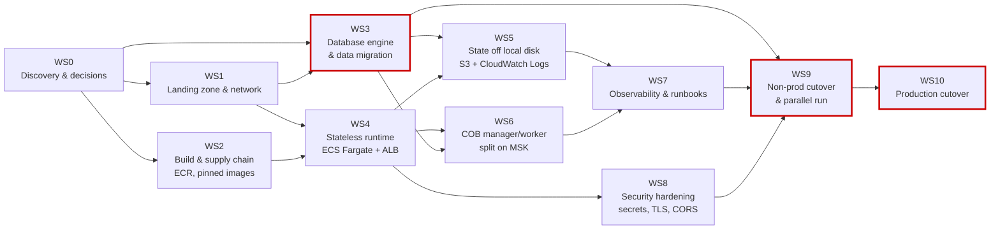

# Migration Plan — Fineract to AWS

Ordered workstreams. Each is independently reviewable and has explicit entry criteria; none may start before its entry criteria are met. Effort is in Devin-sessions of focused engineering work; elapsed time is dominated by the external waits called out per workstream, not by the engineering.

---

## Dependency graph

Mermaid source

**Critical path: WS0 → WS3 → WS9 → WS10.** Everything else can be parallelised around it. WS3 is on the path because data migration and dialect verification cannot be compressed by adding people, and because WS6 and WS9 both consume its output. WS4 (the lift itself) is *not* on the critical path — the application is already a rootless, container-aware image with configuration-driven node roles, so standing it up on Fargate is the cheap part.

---

## WS0 — Discovery and decisions

**Entry criteria:** none; this is the first workstream.
**Dependencies:** none.
**Effort:** 1 session of Devin work, then external waiting on answers.

- Get answers to every **B**-priority question in `open-questions.md`, in particular `Q-PRG-1` (the approved service list), `Q-DB-1` (PostgreSQL or MariaDB), `Q-PLT-1`/`Q-PLT-2` (current and target compute), `Q-DEL-1` (how production is deployed today) and `Q-PRG-3` (whether this repository is what runs in production).
- Reconcile the contradictions in `current-state.md` §7 against the real environment: DB version (`Q-DB-3`), which image runs (`Q-DEL-3`).
- Produce the sizing inputs: tenant count and largest tenant size (`Q-DB-2`), request rate and COB duration (`Q-PLT-7`).

**Exit:** every **B** question answered and the target-state service list replaced with the approved one.

---

## WS1 — Landing zone and network

**Entry criteria:** WS0 answers `Q-PRG-2`, `Q-PLT-3`, `Q-SEC-7`.
**Dependencies:** WS0.
**Effort:** 3 sessions.

- Accounts per environment under Organizations/Control Tower; VPC with three AZs, private subnets for tasks and data, public subnets for the ALB only.
- NAT Gateway egress for the SMS gateway and SMTP relay (`Q-PLT-8`); VPC endpoints for S3, ECR, Secrets Manager, CloudWatch.
- Route 53 zone, ACM certificates, WAF web ACL in front of the ALB.
- IaC repository and module layout in the tool chosen in `Q-PLT-3`. **This is new code, and it does not live in this repository** — see "Scope of this PR" below.

**Exit:** `terraform plan`/`cdk diff` clean in the dev account; a dev VPC exists with no workload in it.

---

## WS2 — Build and supply chain

**Entry criteria:** WS0 answers `Q-DEL-3`.
**Dependencies:** WS0. Parallel with WS1.
**Effort:** 2 sessions.

- Publish the Jib image (`fineract-provider/build.gradle:264-296`) to **ECR** instead of Docker Hub; keep the existing branch/short-SHA/long-SHA tagging from `.github/workflows/publish-dockerhub.yml:39-48` and add immutable tags.
- Stop referencing `latest` anywhere a deployment resolves an image; deploy by digest. This closes current-state contradiction #2.
- Wire the CycloneDX SBOM already produced by the build (`build.gradle:128`) into the artefact record.
- Stand up the CD tool chosen in `Q-DEL-2`.

**Exit:** a commit on `develop` produces an ECR image, by digest, with an SBOM, with no Docker Hub dependency in the deployment path.

---

## WS3 — Database engine and data migration (critical path)

**Entry criteria:** `Q-DB-1` decided, `Q-DB-2` and `Q-DB-5` answered, WS1 dev VPC exists.
**Dependencies:** WS0, WS1.
**Effort:** 6 sessions if PostgreSQL; 2 if RDS for MariaDB.

This is a workstream and not a table row because it is the only part of the programme that can produce *silently wrong financial results*. The scoping facts, all established in `current-state.md` §3:

- Zero stored procedures and zero database functions — nothing to port.
- 322 Liquibase changelogs already applied against `postgres:18.3` in CI on every push (`.github/workflows/build-postgresql.yml:20`).
- 590 `JdbcTemplate` call sites across 204 files, plus 1 `createNativeQuery`. Every one that bypasses `DatabaseSpecificSQLGenerator` is a candidate dialect defect.

Steps:

1. Provision Aurora PostgreSQL (or RDS MariaDB) in dev; create the tenant registry and per-tenant databases through the Liquibase task.
2. Run the full CI suite plus the Cucumber and e2e suites (`.github/workflows/build-cucumber.yml`, `build-e2e-tests.yml`) against the managed instance rather than a container.
3. Audit the `JdbcTemplate` call sites for dialect-sensitive SQL — date arithmetic, string concatenation, `LIMIT`/`OFFSET`, boolean handling, identifier quoting. Any defect found is fixed in a **separate application-code PR**, not this package.
4. Migrate a production-sized copy with DMS (or `pg_dump`/`mariadb-dump` for a MariaDB-to-MariaDB lift), and reconcile: row counts per table per tenant, then a financial reconciliation of loan balances, journal entries and savings balances between source and target.
5. Establish and rehearse the cutover replication mechanism, including the freeze window agreed in `Q-DB-4`.

**Exit:** a full production-sized copy migrated, all suites green against the managed database, and a signed financial reconciliation showing zero variance.

---

## WS4 — Stateless runtime on ECS Fargate

**Entry criteria:** WS1 network exists, WS2 publishes to ECR, `Q-PLT-2` and `Q-PLT-4` decided.
**Dependencies:** WS1, WS2.
**Effort:** 3 sessions.

- One task definition, one `fineract-api` service, ALB target group health-checking `/fineract-provider/actuator/health/readiness` — the same endpoints already configured at `kubernetes/fineract-server-deployment.yml:71-86`, which the compose health check does *not* use (current-state contradiction #3).
- Task role and execution role, least-privilege, no long-lived keys.
- Sizing from `README.md:32` (16 GB / 8 vCPU documented minimum) reconciled against the observed load from `Q-PLT-7` — the Kubernetes manifest's 1 vCPU / 2 GiB limit (`kubernetes/fineract-server-deployment.yml:64-70`) contradicts the README and is not a safe starting point for production.
- Autoscaling on ALB request count and CPU.
- Run Liquibase as a pipeline-gated one-off task, not on service start (`application.properties:157-160,433`).

**Exit:** dev environment serving authenticated API traffic through the ALB, tasks replaceable with no request loss.

---

## WS5 — Move state off local disk

**Entry criteria:** WS4 running, `Q-PLT-5` answered.
**Dependencies:** WS3, WS4.
**Effort:** 2 sessions.

- Flip `fineract.content.s3.enabled` to `true` and `fineract.content.filesystem.enabled` to `false` (`application.properties:186-194`); bucket with SSE-KMS, versioning, lifecycle. The implementation already exists (`S3ContentStoreService.java`) and is CI-exercised against LocalStack.
- Enable report export to S3 (`application.properties:202-203`).
- One-time copy of the existing document store contents; verify object counts and checksums.
- Logs to CloudWatch via the task log driver; enable JSON logging (`application.properties:209`). Remove the bind-mount assumption at `config/docker/compose/fineract.yml:23-26` from any deployment path.

**Exit:** killing and replacing a task loses nothing; no code path writes to container-local disk except `/tmp` scratch.

---

## WS6 — COB manager/worker split on MSK

**Entry criteria:** WS4 running, WS3 database available, `Q-PLT-6` answered, COB duration known (`Q-PLT-7`).
**Dependencies:** WS3, WS4.
**Effort:** 3 sessions.

- Two further ECS services from the same image, configured by the node-role flags already present (`application.properties:67-70`, mirroring `config/docker/env/fineract-manager.env:20-26` and `fineract-worker.env:20-24`).
- MSK cluster with IAM auth using the property set already committed at `config/docker/env/kafka-client-msk.env:22-35`; topics `job-topic` and `external-events`, replication ≥ 3 in prod.
- Switch the partition transport off Spring in-JVM events (`application.properties:97`) — mandatory, since in-JVM events cannot cross tasks.
- Disable Liquibase on worker tasks, as the dev worker env already does (`config/docker/env/fineract-worker.env:24`).
- Scale worker tasks for the COB window; verify a full COB against production-sized data from WS3.

**Exit:** COB completes within the agreed window with the manager and workers in separate tasks, and external events land on MSK.

---

## WS7 — Observability and runbooks

**Entry criteria:** WS5 and WS6 complete.
**Dependencies:** WS5, WS6.
**Effort:** 3 sessions.

- AMP scraping `/actuator/prometheus` (already exposed, `config/docker/env/fineract-common.env:53`); AMG dashboards replacing the compose Grafana stack (`config/docker/compose/observability.yml:35-63`); X-Ray from the existing OTLP export (`config/docker/env/oltp.env:20-22`).
- Alarms for the failure modes the configuration already implies: stuck jobs (`application.properties:79`), COB overrun, Hikari pool exhaustion, ALB 5xx, Aurora replica lag, MSK consumer lag.
- Backups via AWS Backup to the retention agreed in `Q-OPS-1`; a restore rehearsal, not just a policy.
- Runbooks for COB failure (`Q-OPS-4`), tenant onboarding (`Q-OPS-6`) and break-glass DB access (`Q-SEC-9`).

**Exit:** an on-call engineer who has never seen Fineract can detect, triage and recover the top five failure modes from the dashboards and runbooks alone.

---

## WS8 — Security hardening

**Entry criteria:** WS4 running. Runs in parallel with WS5–WS7.
**Dependencies:** WS4.
**Effort:** 3 sessions.

Each item below is a current-state fact from `current-state.md` §6, and each is a **cutover blocker**:

| Item | Current | Required before prod | Evidence |
|---|---|---|---|
| Committed DB password | literal in a tracked env file | rotated, revoked, Secrets Manager, history assessed | `config/docker/env/fineract-common.env:31,51` (`Q-SEC-1`) |
| Tenant master password | defaults to `fineract` | KMS-backed value in Secrets Manager | `application.properties:206` (`Q-DB-6`) |
| Committed keystore | `keystore.jks` in the JAR, password in plain text | ALB + ACM; keystore never client-facing | `application.properties:390-391` (`Q-SEC-6`) |
| Outbound TLS verification | `insecure-http-client=true` | `false` | `application.properties:221` (`Q-SEC-4`) |
| CORS | `*` with `allow-credentials=true`, and `*` on the actuator | explicit origin allow-list; actuator not internet-reachable | `application.properties:30-35,341-343` (`Q-SEC-3`) |
| HSTS | disabled | enabled at the ALB or the app | `application.properties:27` |
| Public MSK endpoints | three public broker hostnames committed | private brokers, IAM auth, no public access | `config/docker/env/kafka-client-msk.env:23,31` (`Q-SEC-5`) |
| Debug agent + test profile | JDWP on 5000, `SPRING_PROFILES_ACTIVE=test,diagnostics` | neither present in any AWS task definition | `config/docker/env/fineract-common.env:58,60` |

**Exit:** every row above closed, evidenced, and re-verified against the deployed dev and pre-prod task definitions.

---

## WS9 — Non-prod cutover and parallel run (critical path)

**Entry criteria:** WS3 reconciliation signed off; WS7 and WS8 complete.
**Dependencies:** WS3, WS7, WS8.
**Effort:** 4 sessions plus the agreed parallel-run duration.

- Pre-prod environment provisioned identically to prod by the same IaC, with a production-sized data copy.
- Full functional regression: the integration, Cucumber and e2e suites (`settings.gradle:69-77`) against pre-prod.
- Performance test at the peak rate from `Q-PLT-7`; a full COB at production volume.
- Parallel run: the same workload against the incumbent and the AWS environment, reconciling financial output daily.
- Cutover rehearsal end-to-end, including rollback, within the freeze window from `Q-DB-4`.
- DR test: failover to the standby posture agreed in `Q-PRG-2`.

**Exit:** two consecutive clean cutover rehearsals, a clean DR test, and zero financial variance across the parallel run.

---

## WS10 — Production cutover (final workstream)

**Entry criteria — all must be true:**

1. WS9 exit criteria met: two clean rehearsals, clean DR test, zero-variance parallel run.
2. WS3 financial reconciliation signed by the DBA and the Application Owner.
3. **Every WS8 row closed**, specifically: the committed credential rotated and revoked (`Q-SEC-1`), the tenant master password no longer the default (`Q-DB-6`), `insecure-http-client=false` (`Q-SEC-4`), CORS restricted (`Q-SEC-3`), no debug agent or `test` profile in any prod task definition, and the MSK cluster private (`Q-SEC-5`).
4. Deployments resolve images by ECR digest, not `latest` (WS2, `Q-DEL-3`).
5. Backup and restore rehearsed, not merely configured (`Q-OPS-1`).
6. Runbooks and alerting accepted by the on-call rota (`Q-OPS-2`, `Q-OPS-4`).
7. Rollback plan agreed, including whether schema changes must be reversible (`Q-DEL-6`).
8. Change approval obtained per `Q-DEL-4`.

**Effort:** 2 sessions plus the freeze window.

Sequence: freeze writes → final replication catch-up → reconcile → switch Route 53 → smoke-test authenticated API paths and one COB → monitor → decide go/no-go at the agreed checkpoint → decommission the incumbent only after the agreed soak.

**Exit:** production traffic served from AWS, incumbent retained read-only for the soak period, and the rollback path still viable until the soak ends.

---

## Scope of this PR

This PR is **documentation only**. It changes no application code, no build file, no pipeline and no deployment manifest. The security and correctness items in WS8, and any dialect defects found in WS3, are deliberately **not** fixed here — they are tracked as cutover blockers in WS10's entry criteria and belong in separate, individually reviewable application-code PRs.
