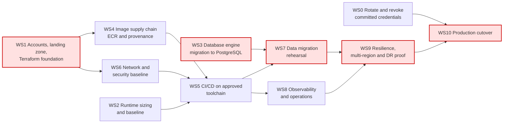

# Migration Plan — Fineract to AWS

Ordered workstreams. Each is independently reviewable and has explicit entry criteria, so no
workstream starts on an assumption that has not been settled. Question IDs refer to
`open-questions.md`; row numbers refer to the `target-state.md` component table.

Durations are rough elapsed estimates for a small dedicated team and assume the referenced questions
are answered on time. They are not a commitment.

---

## Dependency graph

Mermaid source

**Critical path:** `WS1 → WS3 → WS7 → WS9 → WS10` (≈ 30 weeks elapsed). WS3 is the long pole and it
starts on day one — it needs no AWS account, only a target engine decision (**DB-1**, **DB-2**).
WS0 is short but is a hard gate on WS10, so it runs immediately. WS4, WS5, WS6 and WS8 are parallel
to WS3 and are not on the critical path unless account vending (**PLT-4**) is slow, in which case
WS1 becomes the constraint.

---

## WS0 — Rotate and revoke committed credentials *(≈1 week, starts immediately)*

Security remediation, not migration. It is first because the exposure exists today.

**Entry criteria:** owner named for **SEC-1**.

**Scope**
- Rotate and revoke the AWS credentials committed at `config/docker/aws/etc/credentials`
  (referenced by `config/docker/compose/fineract.yml:25`); review CloudTrail for use of the exposed key.
- Replace the committed TLS keystore `fineract-provider/src/main/resources/keystore.jks`, whose
  password is the compiled-in default (`application.properties:390-391`).
- Rotate every database password that appears literally in `config/docker/env/*.env`
  (e.g. `config/docker/env/fineract-common.env:30-31`) if any is used outside local development.
- Decide with Security whether a git-history purge is required in addition to rotation (**SEC-1**).

**Out of scope:** changing any of these files in this package. This PR is documentation only.

**Exit criteria:** all exposed material revoked, replacements issued from the approved secrets store,
Security signs off that no exposed credential remains valid.

**Questions:** SEC-1.

## WS1 — Accounts, landing zone and Terraform foundation *(≈4 weeks)*

**Entry criteria:** **PLT-1** and **PLT-2** answered (service allowlist and guardrails confirmed or
replaced); **PLT-4** account-vending process known; **PLT-5** Terraform standards known.

**Scope:** vend dev, QA and prod accounts; consume or create the VPC/CIDR allocation (**PLT-7**);
Terraform remote state, module skeleton, provider pinning, mandatory tags via `default_tags`
(**OPS-2**); CloudTrail, Config and guardrail baselines.

**Exit criteria:** dev account live, `terraform plan` clean from a pipeline runner, tagging policy
enforced. Per guardrail G4, QA is not requested until dev is running.

**Questions:** PLT-1, PLT-2, PLT-4, PLT-5, PLT-7, OPS-2.

## WS2 — Runtime sizing and baseline *(≈2 weeks, parallel)*

**Entry criteria:** **PRG-2** (tenant count, data volume, peak rate) and **OPS-7** (current sizing).

**Scope:** establish a load profile; size Fargate tasks per instance role
(`application.properties:67-70`) and the Aurora cluster; set the HikariCP pool per task against the
Aurora connection ceiling (`application.properties:410` defaults to 10 per instance); define
autoscaling policies for the `web` and `batch worker` services and pin the batch manager to one task.

**Exit criteria:** documented sizing with a load-test result behind it.

**Questions:** PRG-2, OPS-7, OPS-6.

## WS3 — Database engine migration to PostgreSQL *(≈10 weeks — the long pole)*

A schema-engine change is a workstream, not a configuration flag. It carries the programme's highest
risk (`target-state.md` row 3).

**Entry criteria:** **DB-1** (what production actually runs) and **DB-2** (a supported Aurora
PostgreSQL major version) answered. If production is already PostgreSQL, this workstream reduces to
WS7 alone.

**Scope**
- Validate the 237 Liquibase changelogs against the chosen Aurora PostgreSQL version
  (`application.properties:433-434`); the tenant upgrade path is single-threaded by design
  (`application.properties:157-160`), so measure it against the real tenant count (**DB-7**).
- Regression-test the 204 non-test files using `JdbcTemplate`. The dialect abstraction already
  exists — 310 `DatabaseTypeResolver`/`DatabaseSpecificSQLGenerator` references and 55
  `isMySQL()`/`isPostgreSQL()` branches — so the work is proving coverage, not writing an abstraction.
  The existing PostgreSQL CI matrix (`.github/workflows/build-postgresql.yml`) is the starting harness.
- Run the customer's own "stretchy" report and datatable SQL, which is stored **as data** and is
  therefore invisible to CI (**DB-4**). This is the most likely source of post-cutover breakage.
- Confirm no procedural code needs porting: the repository contains **zero** stored procedures,
  functions or callable statements, and effectively no JPA native queries (1 `nativeQuery=true`,
  1 `createNativeQuery`).
- Decide cluster topology and reader routing (**DB-5**, **DB-6**).

**Exit criteria:** full functional and integration suite green against Aurora PostgreSQL; every
customer report executes; a defect list exists with owners for anything deferred.

**Questions:** DB-1, DB-2, DB-3, DB-4, DB-5, DB-6, DB-7, PRG-6.

## WS4 — Image supply chain *(≈2 weeks, parallel)*

**Entry criteria:** WS1 dev account; **PLT-6** approved registries.

**Scope:** mirror `azul/zulu-openjdk-alpine:21` (`fineract-provider/build.gradle:266`) into the
approved registry; push application images to ECR with immutable digest-based tags, retiring the
`latest` tags used by Compose and Kubernetes today (contradiction C2 in `current-state.md`);
repoint Gradle dependency resolution at the approved proxy; remove
`allowInsecureRegistries = true` (`fineract-provider/build.gradle:298`) from the target build; add
image scanning and SBOM generation. Decide the fate of the Docker Hub publish
(`.github/workflows/publish-dockerhub.yml`, **DEL-5**).

**Exit criteria:** a signed, scanned image in ECR, built only from approved sources, deployed by digest.

**Questions:** PLT-6, DEL-5.

## WS5 — CI/CD on the approved toolchain *(≈4 weeks)*

There is nothing to migrate: **no workflow in this repository deploys anywhere**. The pipeline is new
build, not a port.

**Entry criteria:** WS1, WS4, WS6 (a target to deploy into); **DEL-1** approved tooling and runners.

**Scope:** build → test → image → `terraform apply` → ECS deploy, promoted dev → QA → prod (G4);
Liquibase run as a gated pre-deploy ECS task rather than at container start (`target-state.md` row 4);
change approval gates for prod (**DEL-3**); decide whether the 19 existing GitHub Actions test
workflows remain as pre-merge validation (**DEL-2**).

**Exit criteria:** a commit reaches the dev environment with no human touching a console or `kubectl`;
`kubernetes/kubectl-startup.sh` is retired.

**Questions:** DEL-1, DEL-2, DEL-3.

## WS6 — Network and security baseline *(≈3 weeks, parallel)*

**Entry criteria:** WS1; **SEC-2** secrets store; **SEC-7** data classification and key policy.

**Scope:** private subnets for tasks and Aurora, ALB in public subnets with ACM and WAF
(**SEC-3**, **SEC-8**); VPC endpoints for S3, ECR, Secrets Manager and CloudWatch; NAT egress
allowlist enumerating every outbound destination — SMTP (**OPS-5**), Twilio, message gateway,
Elasticsearch and customer webhooks (**OPS-4**); IAM task roles replacing the bind-mounted AWS
credentials file, which the code already supports through the default credentials provider chain
(`.../infrastructure/core/config/ContentS3Config.java:28-43`); Secrets Manager with Aurora rotation;
KMS CMKs for every store; move the document store from container-local disk
(`application.properties:186-187`) to S3 (**OPS-3**).

**Exit criteria:** no public endpoint except the ALB, no static credentials anywhere in a task
definition, every store encrypted with a managed key.

**Questions:** SEC-2, SEC-3, SEC-7, SEC-8, OPS-3, OPS-4, OPS-5.

## WS7 — Data migration rehearsal and validation *(≈6 weeks)*

**Entry criteria:** WS3 green; WS5 able to deploy; **PRG-2** volumes; **PRG-4** downtime window.

**Scope:** build the target schema with Liquibase (never with a converted dump); DMS full load plus
CDC per tenant database; row counts, financial control totals and trial-balance reconciliation
between source and target; copy the existing document store into S3 (**OPS-3**); rehearse the whole
cutover at least twice end to end, measuring the migration window against **PRG-4** and **DB-7**;
write and test the rollback procedure.

**Exit criteria:** two consecutive rehearsals inside the agreed window with reconciliation clean and a
rollback demonstrated.

**Questions:** PRG-2, PRG-4, DB-7, OPS-3.

## WS8 — Observability and operations *(≈3 weeks, parallel)*

**Entry criteria:** WS5; **OPS-1** central platform.

**Scope:** ship logs to CloudWatch Logs, Micrometer metrics to CloudWatch or the customer's platform
(`application.properties:347,354-367`, all exporters currently disabled), traces to X-Ray; alarms on
the actuator liveness/readiness signals already exposed (`application.properties:335-337`); Close-of-
Business dashboards and failure alerting (**OPS-6**); runbooks and on-call routing (**OPS-8**);
AWS Backup plans and Aurora PITR.

**Exit criteria:** an induced failure raises the right alert to the right on-call rota; COB success and
duration are visible on a dashboard.

**Questions:** OPS-1, OPS-6, OPS-8.

## WS9 — Resilience, multi-region and DR proof *(≈4 weeks)*

**Entry criteria:** WS7 and WS8 complete; **PRG-3** RTO/RPO confirmed.

**Scope:** Aurora global database to the secondary region; warm-standby ECS services and ALB there;
S3 cross-region replication; Route 53 health-check failover; multi-AZ verified in the primary region;
**an actual regional failover exercise**, timed against the RTO/RPO, with the result recorded as
evidence — guardrail G7 requires a demonstrated failover, not a documented intent.

**Exit criteria:** failover test executed and evidenced; measured RTO/RPO within **PRG-3** targets.

**Questions:** PRG-3.

## WS10 — Production cutover *(final workstream)*

Cutover happens only when every gate below is met. Any unmet gate stops the cutover.

**Entry criteria — correctness and security blockers**
1. **WS0 complete.** Every committed credential rotated and revoked, and Security has signed off
   (**SEC-1**).
2. `fineract.insecure-http-client=true` (`application.properties:221`) is overridden to `false` in the
   production configuration, so outbound TLS is verified (**SEC-4**).
3. Wildcard CORS is replaced by an explicit origin allowlist for both the API and the actuator
   (`application.properties:30-35`, `:341-343`) (**SEC-5**).
4. The production auth model is confirmed and configured (**SEC-6**); no default credentials or
   compiled-in master passwords remain in effect (`application.properties:53-54,206`).
5. WS3 exit criteria met: full suite green on Aurora PostgreSQL and every customer report executes
   (**DB-3**, **DB-4**).
6. WS7 exit criteria met: two clean rehearsals and a demonstrated rollback.

**Entry criteria — guardrails**
7. **G1/G2:** the approved service list and container platform are confirmed (**PLT-1**, **PLT-3**) and
   the design contains no unresolved `OFF-LIST?` service — each is either approved as an exception or
   replaced by its in-list alternative.
8. **G2 guardrails confirmed:** **PLT-2** answered; if customer guardrails replace the assumed defaults,
   the compliance table in `target-state.md` §5 has been re-assessed against them.
9. **G4:** prod is a separately vended account and the change has been promoted through dev and QA.
10. **G5/G6:** the production environment is deployed exclusively by Terraform from the approved
    pipeline; no console-built resource exists; change approval is recorded (**DEL-3**).
11. **G7 production entry criteria:** multi-region posture live, ALB load balancing across ≥ 3 AZs, and
    the WS9 failover test evidenced within the **PRG-3** RTO/RPO.
12. **G8:** no static credentials, all secrets in the approved store, private networking, encryption in
    transit and at rest verified.
13. **G9:** the deployed image is a digest-pinned ECR image built only from approved sources.
14. **G10:** mandatory tags present on every resource and telemetry flowing to the central platform.

**Entry criteria — business**
15. Cutover window agreed with the business, respecting COB and statutory reporting dates (**PRG-4**).
16. On-call rota, runbooks and escalation confirmed (**OPS-8**).

**Cutover sequence:** freeze changes → final DMS CDC sync → stop the source → reconcile control totals
→ run Liquibase pre-deploy task → start the ECS services (web, then batch manager, then workers) →
smoke test the API and one tenant end to end → flip DNS → monitor.

**Rollback:** DNS back to the source, source database re-enabled; valid until the first write lands in
Aurora that has not been reverse-replicated. The rollback deadline is fixed before cutover starts.

**Exit criteria:** first production COB completes successfully on AWS (**OPS-6**); reconciliation clean
after 24 hours; the legacy environment is decommissioned only after an agreed soak period.
