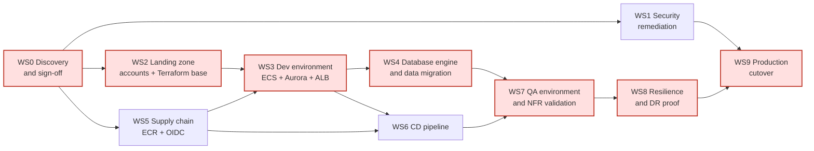

# Migration Plan — Fineract to AWS

Ordered workstreams, each independently reviewable. Effort is in Devin-sessions (one session ≈ one to two
human-weeks of equivalent engineering) and excludes external waits such as account vending or change
approval, which are called out separately. Question IDs refer to `open-questions.md`.

Mermaid source — workstream dependency graph

Red nodes are the critical path: **WS0 → WS2 → WS3 → WS4 → WS7 → WS8 → WS9**. WS1, WS5 and WS6 run in
parallel; only WS1's completion is a hard gate on cutover.

---

## WS0 — Discovery and design sign-off

**Goal.** Replace the assumptions in this package with facts and get the target architecture approved.

**Entry criteria.** This package reviewed.

**Scope.**
- Answer the blocker questions: OQ-P1 and OQ-P2 (approved service list and guardrails), OQ-P6 (is this the
  deployed repository), OQ-P7 (existing production or greenfield), OQ-DB1 (current engine and version),
  OQ-A1 (write-tier replica count), OQ-D1 (CD tool), OQ-O1 (resilience posture), OQ-S1 (were committed
  credentials ever real).
- Re-issue `target-state.md` against the real allowlist and guardrails; anything still `OFF-LIST?` gets an
  exception request or an in-list substitute.
- Confirm sizing inputs (OQ-A2) and tag taxonomy (OQ-O2).

**Exit criteria.** Every blocker question answered in writing; the guardrail-compliance table reviewed by
Platform Engineering and Security with exceptions either granted or designed out.

**Dependencies.** None. **Effort.** 1 session plus review time.

---

## WS1 — Security remediation (runs in parallel from day one)

**Goal.** Close the findings that the inventory surfaced, independently of where the workload runs.

**Entry criteria.** OQ-S1 answered — whether the committed credentials were ever used decides whether this
is rotation or incident response.

**Scope.**
- Rotate and revoke every credential committed to this repository, and treat the values as public because
  they are in git history: `config/docker/env/fineract-common.env:31`, `:51-52`;
  `config/docker/env/mariadb.env:20`; `mysql.env:20`; `postgresql.env:21-23`; the TLS keystore password
  default at `application.properties:391`; and the default API credentials published at `README.md:222-224`.
- Confirm whether the MSK endpoints at `config/docker/env/kafka-client-msk.env:23` are real and, if so,
  whether the public listener on 9198 is reachable (OQ-S7).
- Decide the disposition of SMTP credentials stored in the tenant database (OQ-S2).
- Raise, as application work outside this package, the missing HTTP timeouts on the SMS client
  (`SmsMessageScheduledJobServiceImpl.java:62`) and the wildcard CORS default
  (`application.properties:30-35`).
- Ensure production deployments never inherit `SPRING_PROFILES_ACTIVE=test,diagnostics` or the JDWP debug
  agent from `config/docker/env/fineract-common.env:58`, `:60`.

**Exit criteria.** All rotations complete and evidenced; each remaining item either fixed or accepted in
writing by Security. **This workstream gates WS9 — nothing goes to production with these open.**

**Dependencies.** WS0 (OQ-S1). **Effort.** 1 session, plus whatever incident response OQ-S1 triggers.

---

## WS2 — Landing zone

**Goal.** Vended accounts and the Terraform foundation, before any application resource exists.

**Entry criteria.** OQ-P1/OQ-P2 answered (WS0); account-vending path and lead time known (OQ-P4).

**Scope.** Dev, QA and prod accounts through the standard vending process (G4) — dev first, QA requested
only once dev is running. Terraform repository and module layout, remote state with locking, CI plan/apply
workflow, mandatory tag defaults (OQ-O2), baseline guardrails (SCPs, GuardDuty, Config, CloudTrail), VPC
with private subnets across three AZs, VPC endpoints, NAT egress, and KMS CMKs per OQ-S8.

**Exit criteria.** `terraform apply` from a clean state reproduces the dev network end to end; no
console-created resources exist (G5).

**Dependencies.** WS0. **External wait:** account vending (OQ-P4). **Effort.** 3 sessions.

---

## WS3 — Dev environment on ECS and Aurora

**Goal.** Fineract running in the dev account on the target services, on PostgreSQL, with no static
credentials.

**Entry criteria.** WS2 dev network live; WS5 has an ECR repository and a pushed image; OQ-P3 (ECS vs. EKS),
OQ-A1 (write replica count), OQ-A3 (broker), OQ-S3 (public or private ingress), OQ-S4 (auth mode) answered.

**Scope.**
- Terraform for ALB (ACM cert), three ECS Fargate services (write/manager, read, COB worker) from one task
  definition family, Aurora PostgreSQL multi-AZ, Secrets Manager entries injected as task secrets, S3
  buckets for content and report export, and the broker if OQ-A3 requires one.
- Configuration changes made **only through environment variables**, never code: enable S3 content
  (`application.properties:186-194`), enable report export S3 (`:202-203`), set
  `FINERACT_AWS_CREDENTIALS_INSTANCE_PROFILE=true` (`:376`), disable in-app Liquibase on the app services
  (`:433`), restrict CORS (`:30-35`), and point OTLP/metrics at the chosen observability platform
  (`:349-367`, OQ-O3).
- Run Liquibase as a separate ECS run-task using the existing `liquibase-only` profile
  (`fineract-provider/src/main/resources/application-liquibase-only.properties`).
- Egress allowlisting for the SMS gateway and SMTP relay (OQ-A5).

**Exit criteria.** A tenant can be provisioned and the API smoke suite passes against dev over the ALB; no
static AWS or database credentials exist in any task definition; the write tier's replica count matches the
OQ-A1 decision.

**Dependencies.** WS2, WS5. **Effort.** 4 sessions.

---

## WS4 — Database engine change and data migration

**Goal.** Move production data from MariaDB to Aurora PostgreSQL (or, if OQ-DB1 says production is already
PostgreSQL, from self-managed PostgreSQL to Aurora).

**Entry criteria.** WS3 running on PostgreSQL in dev; OQ-DB1 (current engine/version), OQ-DB2 (tenant count
and volumes), OQ-DB3 (acceptable downtime and wave strategy), OQ-DB4 (direct database consumers), OQ-DB5
(engine-specific SQL stored in `stretchy_report` and custom datatables) and OQ-O5 (timezone) answered.

**Scope.**
- Build the target schema by running the existing Liquibase changelogs against Aurora — not by converting
  the MariaDB schema. The changelogs are engine-aware and CI-verified on PostgreSQL
  (`.github/workflows/build-postgresql.yml`).
- Migrate data with DMS (full load plus CDC if OQ-DB3 requires a short window), per tenant database.
- Reconcile row counts and financial control totals per tenant; run a full COB cycle on migrated data and
  compare outputs against the source system.
- Port any engine-specific SQL found in report definitions and custom datatables (OQ-DB5). Code-level risk
  is low: the repository contains **zero** stored procedures and only one native `@Query`, and engine
  differences are centralised in `DatabaseSpecificSQLGenerator`.
- Copy document content to S3 if it exists on disk today (OQ-A4).

**Exit criteria.** Reconciliation signed off by the Application Owner; a rehearsed migration run has been
completed end to end at production data volume with a measured duration.

**Dependencies.** WS3. **Effort.** 4 sessions, plus rehearsal cycles. **Highest-risk workstream.**

---

## WS5 — Supply chain (parallel)

**Goal.** Images come from an approved registry, built without static credentials.

**Entry criteria.** OQ-P5 (base-image policy) and OQ-D3 (GitHub OIDC federation) answered.

**Scope.** ECR repositories with immutable tags and scan-on-push; GitHub Actions publishing via OIDC instead
of `DOCKERHUB_USER`/`DOCKERHUB_TOKEN` (`.github/workflows/publish-dockerhub.yml:44-45`); mirror or replace
`azul/zulu-openjdk-alpine:21` (`fineract-provider/build.gradle:266`); disable
`allowInsecureRegistries` (`:298`); digest-pin task definitions so the running image is provably the image
CI built — closing the current-state gap where the cluster pulls `apache/fineract:latest` from Docker Hub
(`kubernetes/fineract-server-deployment.yml:63`).

**Exit criteria.** A build produces an ECR image with a scan result and no static registry credentials
anywhere in the pipeline (G9).

**Dependencies.** WS0. **Effort.** 2 sessions.

---

## WS6 — Delivery pipeline (parallel)

**Goal.** Deployment happens through the approved CD tool, promoting dev → QA → prod.

**Entry criteria.** OQ-D1 (which CD tool) answered — this workstream cannot be designed without it; WS5
producing ECR images; WS3 giving it something to deploy to.

**Scope.** Keep GitHub Actions for build and test (~300 integration test classes and 48 Cucumber features
are worth preserving), add CD stages for the Liquibase run-task followed by the ECS rolling deployment with
a deployment circuit breaker and automatic rollback; environment promotion gates with the approvers named in
OQ-D4; retire the manual `kubectl-startup.sh` path; decide the release-gate test scope (OQ-D5).

**Exit criteria.** A commit reaches dev with no human running a CLI command; promotion to QA requires an
approval; rollback has been demonstrated.

**Dependencies.** WS3, WS5. **Effort.** 3 sessions.

---

## WS7 — QA environment and non-functional validation

**Goal.** A production-shaped environment that proves the design under load.

**Entry criteria.** QA account vended (dev running first, per G4); WS4 migration rehearsed; WS6 promoting
into QA; sizing inputs from OQ-A2.

**Scope.** Terraform-identical QA stack; load test at peak rate from OQ-A2; full COB run at production
volume within the batch window; autoscaling thresholds tuned; validation that the write tier behaves as
OQ-A1 decided — specifically that no job double-fires and no stale-cache defect appears at the chosen
replica count; CORS locked to real origins (OQ-S5); observability dashboards and alerts wired to the SLOs
from OQ-O4.

**Exit criteria.** Load and COB tests pass within target; alerting fires correctly in a fault injection
test; Security signs off the QA configuration as the prod template.

**Dependencies.** WS4, WS6. **Effort.** 3 sessions.

---

## WS8 — Resilience and DR proof

**Goal.** Meet the production entry criteria in guardrail G7 before asking for prod.

**Entry criteria.** WS7 passed; OQ-O1 (resilience posture), OQ-DB7 (RTO/RPO) and OQ-S6 (data residency
constraints on the DR region) answered.

**Scope.** Aurora Global Database (or the posture OQ-O1 dictates) to the secondary region; S3 cross-region
replication; warm-standby ECS services and Route 53 failover; AWS Backup plans with PITR; documented and
rehearsed failover and failback runbooks; a **measured** RTO and RPO from an actual failover test, compared
against OQ-DB7.

**Exit criteria.** A DR test has been executed and evidenced, with measured RTO/RPO inside target, and the
failback path proven.

**Dependencies.** WS7. **Effort.** 3 sessions.

---

## WS9 — Production cutover (final workstream)

**Goal.** Serve production traffic from AWS.

### Entry criteria — all must be true

1. **Security blockers closed (WS1).** Every credential committed to this repository has been rotated and
   revoked; the disposition of the tenant-database SMTP credentials (OQ-S2) and the MSK endpoint exposure
   (OQ-S7) is resolved; no production task inherits the `test,diagnostics` profile or the JDWP debug agent.
2. **Correctness blockers closed (WS4).** Per-tenant reconciliation and a full COB comparison against the
   source system are signed off by the Application Owner; the timezone decision (OQ-O5) is implemented.
3. **Resilience posture demonstrated (WS8, guardrail G7).** The agreed posture is deployed and a failover
   test has been executed with measured RTO/RPO inside the OQ-DB7 targets.
4. **Load balancing in place (G7).** All ingress is through the ALB; rolling deployments with automatic
   rollback replace the current `strategy: Recreate` behaviour
   (`kubernetes/fineract-server-deployment.yml:49-50`); the read tier runs at least two tasks across AZs.
5. **Write-tier decision honoured (OQ-A1).** Either the write/manager service runs at desired count 1 with
   a proven replacement time inside the SLO, or the clustered-Quartz and shared-cache application work has
   shipped and been validated in WS7.
6. **Guardrail compliance re-checked.** The compliance table in `target-state.md` re-run against the real
   guardrails from WS0, with every exception formally granted.
7. **Operational readiness.** Runbooks, on-call, SLOs and alerting agreed (OQ-O4, OQ-O6); change approval
   obtained (OQ-D4).

### Cutover sequence

1. Freeze changes; confirm the rehearsed migration timing from WS4 fits the window agreed in OQ-DB3.
2. DMS CDC caught up; source set read-only.
3. Final reconciliation; document content copy verified (OQ-A4).
4. Liquibase run-task against prod Aurora; ECS services scaled up.
5. DNS cut over in Route 53, with the previous stack left running and reversible.
6. Smoke suite, then one supervised COB cycle on AWS.
7. Hypercare, then decommission the legacy stack once the rollback window has expired.

**Rollback.** Until the first successful COB on AWS, rollback is a DNS reversal to the legacy stack with the
source database returned to read-write. After that point, rollback requires a reverse data migration and is
a business decision, not an operational one.

**Dependencies.** WS1, WS8. **Effort.** 2 sessions plus hypercare.

---

## Critical path and sequencing summary

| WS | Name | Depends on | Effort (sessions) | On critical path |
| --- | --- | --- | --- | --- |
| WS0 | Discovery and sign-off | — | 1 | Yes |
| WS1 | Security remediation | WS0 | 1+ | No (gates WS9) |
| WS2 | Landing zone | WS0 | 3 | Yes |
| WS3 | Dev environment | WS2, WS5 | 4 | Yes |
| WS4 | Database migration | WS3 | 4+ | Yes |
| WS5 | Supply chain | WS0 | 2 | No |
| WS6 | Delivery pipeline | WS3, WS5 | 3 | No |
| WS7 | QA and NFR validation | WS4, WS6 | 3 | Yes |
| WS8 | Resilience and DR proof | WS7 | 3 | Yes |
| WS9 | Production cutover | WS1, WS8 | 2 | Yes |

Critical path total: roughly 20 sessions of engineering, excluding external waits — account vending
(OQ-P4), change-approval windows (OQ-D4) and hypercare. The two schedule risks that dominate are the
database migration rehearsal cycles (WS4) and, if OQ-A1 requires horizontal write scaling, unplanned
application work that is not in scope of this migration.
