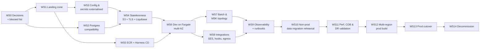

# Migration Plan — Fineract to AWS

Ordered workstreams, each independently reviewable and independently mergeable. Dependencies are
explicit. Effort is in **Devin sessions** (one session ≈ a 1–2 week human-team chunk); calendar time
is dominated by external waits (AWS account provisioning, SES production access, change-advisory
approvals, regulator sign-off), which are called out separately.

Nothing here changes application code until WS4, and even then the changes are configuration-shaped.

---

## WS0 — Decisions and discovery (blocking everything)

**Depends on:** nothing. **Effort:** 0.5 session of our time; calendar-bound by other teams.

* Obtain the approved AWS service list and re-issue `target-state.md` against it.
* Work `open-questions.md` to closure with the DBA, platform, app owner, security and network
  owners. Q9–Q11 (engine, data volume, downtime tolerance) and Q31 (Quartz clustering) gate the
  design; Q0, Q1–Q3 (real prod topology and release path) gate the pipeline design.
* Ratify **active-passive DR** for multi-region prod, or fund the work to make active-active
  possible (see `target-state.md` §3).
* **Exit criteria:** blessed list received; production engine/version/volumes documented; cutover
  window and RPO/RTO agreed in writing.

## WS1 — Landing zone

**Depends on:** WS0 (accounts, regions, residency). **Effort:** 1–2 sessions.

VPCs across 3 AZs per region, subnets, NAT with fixed EIPs (needed for partner allow-lists, Q20/Q47),
security groups, IAM roles for ECS task/execution, KMS keys, ECR repository, Route 53 zones, ACM
certs, and baseline CloudWatch log groups. Reviewable as pure IaC with no application involvement.

**Exit criteria:** an empty-but-complete dev environment that a container can be scheduled into.

## WS2 — PostgreSQL compatibility (can run fully in parallel with WS1)

**Depends on:** WS0 (Q9, Q12, Q13). **Effort:** 3–5 sessions.

* Run the repo's existing Postgres CI matrix (`.github/workflows/build-postgresql.yml`,
  `liquibase-only-postgresql.yml`, `build-cucumber.yml`) as the compatibility harness — it already
  exists and is the cheapest signal available.
* Audit the hand-written SQL surface for engine-specific syntax: 204 files / 523 JDBC call sites,
  plus the two native queries (`TrialBalanceRepository.java:31`,
  `CustomLoanAccountLockRepositoryImpl.java:52`).
* Export production `stretchy_report` rows and execute every report against a Postgres restore.
  These are data, not code, so CI cannot cover them.
* Confirm collation/timezone behaviour and decimal/rounding parity on financial columns.

**Exit criteria:** full test suite green on Postgres; every production report definition executes
with identical results; a written list of any SQL that must be changed (raised as separate,
app-owner-approved PRs — out of scope for this package).

## WS3 — Configuration and secrets externalisation

**Depends on:** WS1. **Effort:** 1 session.

Every setting is already `${ENV_VAR:default}`, so this is a packaging exercise: Secrets Manager
entries for the Hikari password, tenant master password, SMTP credentials and hook API keys; SSM
parameters for the rest; ECS task-definition wiring; **rotation of every credential currently
committed under `config/docker/env/`** (`open-questions.md` Q41).

**Exit criteria:** the app starts with no secret present in an image, a repo file, or a task
definition `environment` block.

## WS4 — Make the runtime stateless

**Depends on:** WS2, WS3. **Effort:** 2–3 sessions. **This is the hard prerequisite for Fargate.**

1. Switch the content store to S3 (`fineract.content.s3.enabled=true`) and migrate existing
   documents; verify upload/download/delete paths through `S3ContentStoreService`.
2. Move TLS termination to the ALB; run the container HTTP-only inside the VPC and stop shipping
   `keystore.jks`.
3. Take Liquibase out of application startup (`FINERACT_LIQUIBASE_ENABLED=false` everywhere) and
   make schema migration a standalone ECS run-task.
4. Decide the fate of the file dead-letter queue (`application.properties:617-618`).

**Exit criteria:** two concurrent tasks can serve the same tenant with no local-disk divergence; a
task can be killed mid-request without data loss.

## WS5 — Image supply chain and Harness CD

**Depends on:** WS1. Parallel with WS2–WS4. **Effort:** 2–3 sessions.

Publish to ECR instead of Docker Hub (keep GitHub Actions as CI); immutable tags and scan-on-push;
Harness pipelines with the stage order **artifact → migrate (run-task) → deploy batch-manager →
deploy workers → deploy API**, plus environment promotion gates and rollback.

**Exit criteria:** a commit on `develop` reaches the dev environment with no human `kubectl`.

## WS6 — Dev environment on Fargate, multi-AZ

**Depends on:** WS4, WS5. **Effort:** 1–2 sessions.

RDS PostgreSQL Multi-AZ; four ECS services split by `fineract.mode.*`; ALB target groups and health
checks on the existing actuator liveness/readiness paths; autoscaling policies; **batch-manager
pinned to exactly 1 task**.

**Exit criteria:** full functional suite passes against the dev Fargate stack.

## WS7 — Batch and messaging topology

**Depends on:** WS6. **Effort:** 2 sessions.

MSK cluster; `job-topic` partition dispatch manager→workers; `external-events` topic with the Avro
payloads; retire the JMS path; worker autoscaling on consumer lag; verify COB correctness under
task recycling and partial failure.

**Exit criteria:** a full LOAN_COB run completes correctly with workers scaling up and down mid-run.

## WS8 — Outbound integrations

**Depends on:** WS6, and on answers to Q18–Q25. **Effort:** 2–3 sessions; calendar-bound by SES
production access and partner allow-list changes.

SES domain/DKIM and config rows repointed; SMS gateway and Twilio bridge reachability from the VPC;
NAT EIPs communicated to any partner that IP-allow-lists us; web-hook and Elasticsearch-hook
destinations validated per tenant.

**Exit criteria:** one real message of each type (report e-mail, SMS, web hook, external event)
delivered end-to-end from AWS.

## WS9 — Observability, alerting and runbooks

**Depends on:** WS7, WS8. **Effort:** 1–2 sessions.

CloudWatch log groups with retention, metric filters and alarms for failed jobs / COB overrun /
DLQ depth / 5xx rate / RDS saturation; X-Ray via the existing OTLP exporter; dashboards replacing
the compose Grafana stack; on-call runbooks for job failure, migration failure and DR promotion.

**Exit criteria:** a deliberately failed job pages the right team.

## WS10 — Data migration rehearsal (non-prod)

**Depends on:** WS9, WS2. **Effort:** 3–4 sessions.

DMS full-load + CDC from the production engine into RDS Postgres using a production-sized restore;
per-tenant row-count and financial-control-total reconciliation (GL trial balance, loan and savings
balances); measure the load window; rehearse rollback.

**Exit criteria:** a rehearsal that meets the agreed cutover window with zero reconciliation
variance, executed at least twice.

## WS11 — Performance, COB and DR validation

**Depends on:** WS10. **Effort:** 2–3 sessions.

Load test the API at production peak; run COB against production-volume data and compare against
the current SLA; failover drills — AZ loss, RDS failover, region promotion — with measured RPO/RTO.

**Exit criteria:** signed-off performance and DR results against the WS0 targets.

## WS12 — Multi-region production build

**Depends on:** WS11. **Effort:** 2–3 sessions.

Primary region prod stack; secondary-region warm standby; RDS cross-region replica; S3 CRR on both
content buckets; Route 53 health-check failover; MSK strategy for the DR window; AWS Backup plans
and restore tests.

**Exit criteria:** documented, drilled failover to the secondary region.

## WS13 — Production cutover

**Depends on:** WS12. **Effort:** 1–2 sessions, executed inside the agreed window.

Ordered runbook:

1. Freeze change; announce the window; complete the final COB on the current platform.
2. Quiesce writes; stop Quartz on the legacy platform (this is the point of no easy return).
3. Final DMS CDC catch-up; stop replication; reconcile control totals.
4. Run Liquibase migration task; update the tenant registry rows to the RDS endpoints.
5. Start batch-manager (1 task), then workers, then the API services.
6. Smoke test: login per tenant, one loan disbursement, one savings transaction, one report,
   one document upload/download, one outbound e-mail, one external event consumed downstream.
7. Cut DNS in Route 53; watch error rate and latency.
8. Run the first COB on AWS under supervision.
9. Go/no-go at each of steps 3, 6 and 8; rollback is DNS back to legacy plus a reverse CDC path that
   must exist before the window opens.

**Exit criteria:** production serving from AWS with the first COB completed inside SLA.

## WS14 — Decommission

**Depends on:** WS13 plus an agreed soak period. **Effort:** 1 session.

Retire legacy compute and the Docker Hub publishing workflow, archive the old database under the
regulator's retention rules, remove the Kubernetes manifests and unused compose files from the repo,
and record the final architecture.

---

## Critical path

`WS0 → WS2 → WS4 → WS6 → WS7 → WS9 → WS10 → WS11 → WS12 → WS13`

WS1/WS3/WS5 are parallelisable early; WS8 is parallel to WS7 but is the most likely calendar
slip because it depends on third parties. The two genuine technical risks that can push the whole
plan are **Postgres compatibility of database-resident SQL (WS2)** and **COB behaviour on Fargate
with a single pinned manager (WS7/WS11)**.
