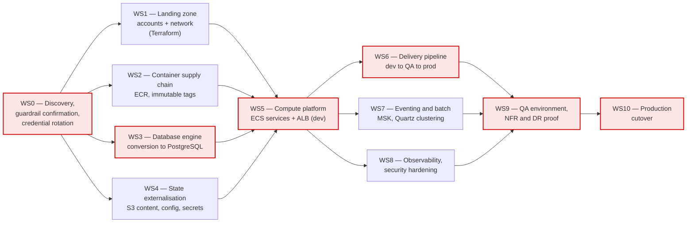

# Migration Plan

Ordered workstreams from discovery to production cutover. Each workstream is independently
reviewable, states its entry criteria and dependencies, and references the open questions
([open-questions.md](open-questions.md)) that must be closed before it can start. Effort is in
engineering-sessions of focused work, not calendar time; account vending, security review and
customer sign-off are external waits and are called out separately.

Mermaid source — dependency graph

**Critical path (highlighted above): WS0 → WS3 → WS5 → WS6 → WS9 → WS10.** The engine conversion
(WS3) is the long pole: it is the only workstream whose duration is driven by production data volume
rather than by engineering effort, and every functional test in WS9 depends on it. WS1, WS2, WS4,
WS7 and WS8 can run alongside it. If OQ-D1 comes back "production is already PostgreSQL", WS3 drops
from ~8 sessions to ~2 and the critical path shifts to WS5 → WS6 → WS9.

---

## WS0 — Discovery, guardrail confirmation and credential remediation

**Entry criteria:** repository access (done); a named owner for each role in the open-questions
document.
**Dependencies:** none.
**Closes:** OQ-P1, OQ-P2, OQ-P3, OQ-P4, OQ-P6, OQ-A1, OQ-A4, OQ-D1, OQ-D2, OQ-S5, OQ-O1.

1. Confirm or replace the assumed approved-service list and the assumed guardrail set. Until this is
   done every service choice in the target-state document is provisional.
2. Establish what actually runs in production (OQ-A1, OQ-P6). The committed Kubernetes manifests use
   a `hostPath` volume and a single-replica `Recreate` deployment, which is not a production shape;
   treat them as a development sample until proven otherwise.
3. **Credential rotation and revocation.** A working local-development database password is committed
   at `config/docker/env/fineract-common.env:31`, a default tenant database password at
   `:51`, and placeholder AWS credentials at `config/docker/aws/etc/credentials`. Confirm none of
   these values is reused in any real environment; if any is, rotate it and revoke the old value
   before anything else in this plan proceeds. Also confirm the self-signed keystore password
   (`application.properties:391`) is not in use outside local development. Remediation of the
   committed values in the repository is separate follow-up work — this package is docs-only.
4. Inventory the user-authored report SQL held in the database (OQ-D5) — it is invisible to code
   review and is the largest single unknown in WS3.

**Effort:** 3 sessions of analysis, plus external time waiting on answers.

## WS1 — Landing zone: accounts, network, IaC foundation

**Entry criteria:** WS0 complete; guardrails confirmed (OQ-P2); account-vending path known (OQ-P5).
**Dependencies:** WS0.
**Closes:** OQ-P5, OQ-A2, OQ-A3, OQ-O2.

Vend dev, QA and prod accounts (G4); dev first — QA is not requested until dev is running. Terraform
repository and remote state; VPC with private subnets, NAT, and VPC endpoints for S3, ECR, Secrets
Manager, CloudWatch, SES and STS (G8); Route 53 zones; ACM certificates; mandatory default tags
(G10); GuardDuty, Config, CloudTrail and Security Hub baselines.

**Effort:** 8 sessions. External: account vending lead time.

## WS2 — Container supply chain

**Entry criteria:** WS0 complete; approved registry identified (OQ-DL2).
**Dependencies:** WS0.
**Closes:** OQ-DL2, OQ-DL4.

Create ECR repositories with tag immutability and scan-on-push; mirror the Jib base image
`azul/zulu-openjdk-alpine:21` (`fineract-provider/build.gradle:266`) into the approved registry;
retarget the existing publish workflow from `docker.io/apache/fineract`
(`.github/workflows/publish-dockerhub.yml:47`) to ECR with OIDC-federated credentials instead of the
`DOCKERHUB_USER`/`DOCKERHUB_TOKEN` secrets; deploy by digest so the mutable `:latest` reference in
`kubernetes/fineract-server-deployment.yml:63` (finding C1) cannot recur.

**Effort:** 3 sessions.

## WS3 — Database engine conversion to Aurora PostgreSQL

**Entry criteria:** WS0 complete; production engine, version and data volume known (OQ-D1, OQ-D2);
non-Liquibase schema objects inventoried (OQ-D4); report SQL inventoried (OQ-D5).
**Dependencies:** WS0.
**Closes:** OQ-D3, OQ-D4, OQ-D5, OQ-D7.

This is a workstream, not a table row. In its favour: there are zero stored procedures and zero
`CallableStatement` uses in the codebase, the PostgreSQL driver already ships in the image
(`fineract-provider/build.gradle:302`), and CI already runs the full suite against PostgreSQL
(`.github/workflows/build-postgresql.yml`). Against it: 204 non-test files use `JdbcTemplate`, and
the user-authored report SQL stored in the database is not covered by any test.

1. Stand up Aurora PostgreSQL in dev; run Liquibase from scratch and diff the resulting schema
   against a MariaDB-built schema.
2. Convert and re-test the stored report SQL (OQ-D5).
3. Full-volume trial conversion with DMS (or `pg_loader`/dump-restore if the outage budget allows),
   measured end-to-end, then a CDC-based rehearsal to size the cutover window.
4. Row-count and checksum reconciliation; performance comparison of the heaviest queries.
5. Decide database-per-tenant-in-one-cluster versus cluster-per-tenant (OQ-D3).

**Effort:** 8 sessions, plus rehearsal runs whose duration is set by data volume.

## WS4 — State externalisation

**Entry criteria:** WS0 complete; content-store size and criticality known (OQ-A6); secrets policy
decided (OQ-S2).
**Dependencies:** WS0.
**Closes:** OQ-A6, OQ-S2, OQ-S7.

Enable `fineract.content.s3.enabled` (`application.properties:188`) with a KMS-encrypted, versioned
bucket and an ECS task role rather than static keys; copy existing document/image content off local
disk (finding C10, `application.properties:186-187` and the `/tmp` override at
`config/docker/env/fineract-common.env:57`); move the database and SES credentials into Secrets
Manager with rotation; decide whether the external-service credentials held in tenant tables
(`ExternalServicesPropertiesReadPlatformServiceImpl.java:54-94`) stay there under Aurora encryption
or require an application change (OQ-S2 — an application change is out of scope for this programme
and would need its own ticket).

**Effort:** 4 sessions.

## WS5 — Compute platform in dev

**Entry criteria:** WS1, WS2, WS3 and WS4 complete for the dev environment; ECS-versus-EKS decided
(OQ-P4); throughput and batch-window figures available for sizing (OQ-A7).
**Dependencies:** WS1, WS2, WS3, WS4.

Terraform the ECS Fargate cluster and the four services (`fineract-write`, `fineract-read`,
`fineract-batch-manager` at exactly one task, `fineract-batch-worker`) from one image, differing only
in environment variables as the existing compose profiles already do
(`config/docker/env/fineract-manager.env`, `fineract-worker.env`). ALB with an ACM certificate
terminating TLS, replacing the in-JVM keystore (`application.properties:386-391`) and the raw
`type: LoadBalancer` service (`kubernetes/fineract-server-deployment.yml:26-33`). Health checks onto
the existing `/actuator/health` endpoint (`:71-86`). Liquibase disabled on service tasks and run as a
one-shot task instead (`application.properties:433`). Right-size CPU and memory against the README's
16 GB / 8-core guidance rather than the 1 vCPU / 2 GiB in the manifest (finding C8).

**Effort:** 8 sessions.

## WS6 — Delivery pipeline

**Entry criteria:** WS5 running in dev; approved CD tool known (OQ-DL1); approval path known
(OQ-DL3); acceptable release outage agreed (OQ-DL5).
**Dependencies:** WS5.
**Closes:** OQ-DL1, OQ-DL3, OQ-DL5.

Net-new: there is no deployment automation anywhere in this repository — none of the 19 GitHub
Actions workflows deploys anything, and the only deployment path committed is a manual shell script
(`kubernetes/kubectl-startup.sh:25-45`). Build a promotion pipeline dev → QA → prod (G4, G6) that
deploys ECS task definitions by digest, runs the Liquibase task as a gated stage, and requires
approval at the QA and prod boundaries. Rolling deployments replace the `Recreate` full-outage
strategy (`kubernetes/fineract-server-deployment.yml:49-50`), which requires Liquibase changes to be
backward-compatible — the repository already runs a Liquibase backward-compatibility check in CI
(`.github/workflows/`), which should become a pipeline gate.

**Effort:** 5 sessions.

## WS7 — Eventing and batch correctness

**Entry criteria:** WS5 running in dev; external eventing confirmed in use (OQ-A4); COB window and
deadline known (OQ-O4).
**Dependencies:** WS5.
**Closes:** OQ-A4, OQ-A5, OQ-O4.

Provision MSK in private subnets with `SASL_SSL` and `AWS_MSK_IAM` auth, replacing the public
bootstrap endpoints in `config/docker/env/kafka-client-msk.env:23` (finding C6) and correcting the
malformed `:` assignment at `:33` (finding C2) in whatever configuration is actually deployed.
Address the Quartz job store (finding C7): the scheduler is created with only a thread count set
(`JobRegisterServiceImpl.java:319-331`), so it uses the in-memory store — jobs are lost on task
replacement and would double-fire if the batch-manager service ever ran more than one task. Either
pin the manager to one task and accept restart loss, or move Quartz to a JDBC-clustered job store.
The decision must be recorded before WS9, because the DR proof depends on it.

**Effort:** 5 sessions.

## WS8 — Observability and security hardening

**Entry criteria:** WS5 running in dev; tag keys and observability endpoint known (OQ-O2); auth
target decided (OQ-S1); CORS origins agreed (OQ-S3).
**Dependencies:** WS5.
**Closes:** OQ-S1, OQ-S3, OQ-S4, OQ-S6, OQ-O2, OQ-O3, OQ-O6.

CloudWatch logs and metrics plus an ADOT sidecar exporting the OTLP traces the application already
supports (`application.properties:354-356`); dashboards and alarms for the COB job, API latency and
Aurora health (OQ-O3). Set `fineract.insecure-http-client=false` (`application.properties:221`,
OQ-S4); restrict the CORS origin patterns from `*` (`:31,35`) and the actuator CORS origin (`:341`);
decide Basic auth versus OAuth2 and 2FA (OQ-S1); WAF ruleset if the API is internet-facing (OQ-A3,
OQ-S6); confirm no `test`/`diagnostics` Spring profile and no JDWP agent reaches any AWS environment
(`config/docker/env/fineract-common.env:58,60`; `docker-compose.yml:32` — findings C5 and C9).

**Effort:** 5 sessions.

## WS9 — QA environment, NFR validation and DR proof

**Entry criteria:** dev environment stable and promoted through the WS6 pipeline; QA account vended
(G4 requires dev running before QA is granted); WS7 and WS8 complete; RTO/RPO targets stated
(OQ-O1).
**Dependencies:** WS6, WS7, WS8.

Terraform-apply the same modules into QA; run the full functional suite against Aurora PostgreSQL;
performance-test to the OQ-A7 figures; run a full-volume COB batch inside the OQ-O4 window; run a
restore-from-backup test and a documented multi-AZ failover; produce the evidence pack that G7
requires. Sign-off from Application Owner, Security and Operations.

**Effort:** 8 sessions.

## WS10 — Production cutover (final workstream)

**Entry criteria — all must be met, no exceptions granted informally:**

*Correctness and security blockers from the current-state analysis:*
1. Credential remediation from WS0 complete: every value found committed in the repository is
   confirmed unused in production or rotated and revoked (`config/docker/env/fineract-common.env:31,51`;
   `config/docker/aws/etc/credentials`).
2. Immutable image references only: production deploys by ECR digest, no `:latest`
   (finding C1).
3. Outbound TLS verification enabled (`fineract.insecure-http-client=false`) and no
   `proxy_ssl_verify off` equivalent anywhere in the target (findings C4, C9).
4. No debug agent, no `test`/`diagnostics` profile, and no default keystore or default tenant
   credentials in the production configuration (findings C5, C9).
5. The Quartz job-store decision from WS7 implemented and evidenced: exactly one batch-manager task,
   or a clustered JDBC job store (finding C7).
6. No stateful local disk: all content served from S3 (finding C10).
7. CORS restricted to an agreed origin list, and the authentication decision from OQ-S1 implemented.

*Production entry criteria from guardrail G7:*
8. The agreed resilience posture is deployed — multi-AZ in-region, and the multi-region arrangement
   confirmed in OQ-P3 with Aurora Global Database sized to the OQ-O1 RPO.
9. Load balancing in place: ALB in front of every internet- or client-facing service, ≥2 tasks per
   service across AZs, rolling deployments proven.
10. A DR/failover test has been executed **in QA** and its evidence accepted — regional failover,
    database promotion, and measured RTO/RPO against the OQ-O1 targets.

*Programme criteria:*
11. Every question marked **blocking** in [open-questions.md](open-questions.md) is closed.
12. WS9 sign-off recorded from Application Owner, Security and Operations.
13. Prod account vended and promoted through the WS6 pipeline with no manual steps.

**Dependencies:** WS9 (and transitively every other workstream).

**Cutover execution:** freeze writes; final DMS CDC catch-up and reconciliation; run the Liquibase
task; scale up ECS services; smoke-test authenticated endpoints and one COB run; switch Route 53;
hold the legacy environment in a read-only, restorable state for an agreed rollback window before
decommissioning.

**Effort:** 5 sessions, plus the rehearsed cutover window itself.
