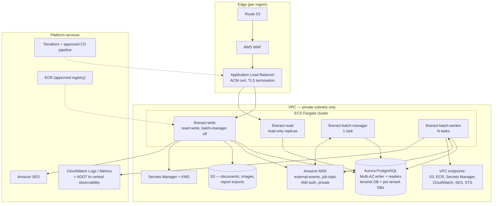

# Target State — Apache Fineract on AWS

Companion to [current-state.md](current-state.md). Every component in the current state is mapped to
a target AWS service, assessed against the platform guardrails below.

> **Two inputs were not supplied for this package and are assumed.** The approved ("blessed") AWS
> service list in §1 and the platform guardrails in §2 are **assumed defaults, not the customer's own
> policy**. Confirming or replacing them is [OQ-P1 and OQ-P2](open-questions.md) and must be closed
> before design sign-off. Where the natural choice falls outside the assumed list it is tagged
> `OFF-LIST?` with an in-list alternative rather than being substituted silently.

Mermaid source — target diagram

## 1. Assumed approved service list

**Assumed, pending confirmation (OQ-P1).** Only the services below are used in the target design.

Compute and delivery: ECS on Fargate, ECR, AWS CodePipeline/CodeBuild *or* the customer's existing
pipeline tool, Terraform, AWS Control Tower / Organizations, Systems Manager.
Networking and edge: VPC (private subnets, NAT, VPC endpoints), Application Load Balancer, Route 53,
ACM, AWS WAF, Transit Gateway/PrivateLink.
Data: Aurora PostgreSQL, S3, Amazon MSK, Amazon MQ (ActiveMQ), ElastiCache (Redis).
Security: IAM, KMS, Secrets Manager, GuardDuty, Security Hub, CloudTrail, Config.
Observability: CloudWatch Logs/Metrics/Alarms, AWS Distro for OpenTelemetry, X-Ray.
Messaging out: Amazon SES, Amazon SNS.
Resilience: AWS Backup, Route 53 ARC or DNS failover.

## 2. Platform migration guardrails in force

**These are the default guardrail set, assumed because the customer's own guardrails were not supplied
(OQ-P2). They are not presented as the customer's policy.**

| G | Guardrail |
| --- | --- |
| G1 | **Approved-service allowlist** — only allow-listed services appear in the target; the allowlist is assumed to be enforced organisation-wide by SCPs. |
| G2 | **Containers first** — a managed container platform is the preferred compute target; VM lift-and-shift needs explicit justification. |
| G3 | **Standard target RDBMS** — relational workloads target PostgreSQL; staying on another engine is an exception that must be justified. |
| G4 | **Account vending and environment promotion** — onboarding via the standard vending process with separate dev, QA and prod accounts; dev runs before QA is granted; changes promote dev → QA → prod. |
| G5 | **Everything as code** — all target infrastructure in the approved IaC tool; no console-built resources. |
| G6 | **Approved delivery toolchain** — CI/CD on approved pipeline tooling; moving off legacy pipelines is part of the plan. |
| G7 | **Production entry criteria** — prod requires the stated resilience posture (multi-region), load balancing, and a demonstrated DR/failover test. |
| G8 | **Security baseline** — private networking by default, encryption in transit and at rest, least-privilege IAM roles with no long-lived static credentials, secrets in the approved secrets manager. |
| G9 | **Approved artifact sources** — images and dependencies only from approved registries/repositories. |
| G10 | **Tagging and observability standards** — mandatory tags (owner, cost centre, environment, data classification) and logs/metrics to the central observability platform. |

Assumed environment posture, also pending confirmation (OQ-P3): dev and QA multi-AZ single region,
production multi-region active/passive; target RDBMS PostgreSQL; target compute ECS Fargate.

## 3. Component mapping

Effort is expressed in engineering-sessions of focused work, not calendar time. Risk is H/M/L.

| # | Current component (evidence) | Target AWS service | Rationale | Risk | Effort |
| --- | --- | --- | --- | --- | --- |
| 1 | Fineract Spring Boot container, `type: LoadBalancer` on 8443, single replica, `Recreate` strategy (`kubernetes/fineract-server-deployment.yml:26-50`) | **ECS Fargate** service behind an **ALB**, rolling deployment, ≥2 tasks across AZs | G2 satisfied without running a cluster control plane; the app is already a stateless container with liveness/readiness endpoints (`:71-86`). EKS is the alternative if the organisation standardises on Kubernetes — see OQ-P4 | M | 2 |
| 2 | Four runtime modes read / write / batch-manager / batch-worker (`application.properties:67-70`; `config/docker/env/fineract-manager.env:20-26`) | Four **ECS services** off one image, differing only in env: `fineract-write`, `fineract-read`, `fineract-batch-manager` (1 task, no autoscaling), `fineract-batch-worker` (scaled on queue depth) | The manager/worker split already exists in the Kafka compose profile (`docker-compose-postgresql-kafka.yml:33-63`); the manager must stay at one task because jobs are bound to `node-id` (`JobRegisterServiceImpl.java:206-212`) | M | 2 |
| 3 | MariaDB 11.4 in-cluster on a `hostPath` PV (`kubernetes/fineractmysql-deployment.yml:26-47,89`) | **Aurora PostgreSQL**, Multi-AZ writer + reader endpoint, automated backups, KMS-encrypted | G3. No stored procedures exist (0 matches) and PostgreSQL is already a first-class engine with its own CI lane (`.github/workflows/build-postgresql.yml`), so the engine change is a data/ops workstream, not a code rewrite | H | 8 |
| 4 | Per-tenant databases + `fineract_tenants` registry (`application.properties:44-53`) | One Aurora cluster per environment, one **database per tenant** inside it; tenant registry unchanged | Preserves the application's tenancy model with no code change. Tenant-per-cluster is the alternative if isolation requirements demand it (OQ-D3) | M | 2 |
| 5 | Read-only replica settings already present but unused (`application.properties:56-62`) | Point `fineract-read` tasks at the Aurora **reader endpoint** | Existing configuration surface; removes reporting load from the writer | L | 1 |
| 6 | Liquibase runs at application start, 318 changelogs (`application.properties:433-434`) | Liquibase as a **one-shot ECS task** gated in the pipeline; `FINERACT_LIQUIBASE_ENABLED=false` on service tasks, as the worker profile already does (`config/docker/env/fineract-worker.env:24`) | Prevents N tasks racing on the same schema; makes migrations a reviewable pipeline stage | M | 2 |
| 7 | Document/image content on container-local disk (`application.properties:186-187`; `/tmp` at `config/docker/env/fineract-common.env:57`) | **S3** with SSE-KMS, versioning, `fineract.content.s3.enabled=true`, credentials via **task role** (`application.properties:376`) | Removes the only stateful local disk (C10); the S3 path already exists in the code, so this is configuration plus data copy | M | 2 |
| 8 | Report export to S3, disabled (`application.properties:202-203`) | Same S3 bucket, separate prefix and lifecycle policy | Already supported | L | 1 |
| 9 | External events + remote job dispatch over Kafka, MSK profile present (`config/docker/env/kafka-client-msk.env:23-33`) | **Amazon MSK** in private subnets, `SASL_SSL` + `AWS_MSK_IAM` auth, IAM-authenticated topics | The IAM auth wiring already exists; fix C2 (the `:` instead of `=` on line 33) and drop the public bootstrap endpoints (C6) | M | 3 |
| 10 | JMS/ActiveMQ alternative producer (`application.properties:129-137`) | **Amazon MQ (ActiveMQ)** — only if the organisation prefers JMS over Kafka | Both paths are supported by the app; pick one (OQ-D4) | L | 1 |
| 11 | Quartz with in-memory job store, jobs pinned to `node-id` (`JobRegisterServiceImpl.java:319-331`) | Keep Quartz, single batch-manager task, **plus** a JDBC-clustered job store as follow-on work | In-memory Quartz plus >1 manager task double-fires jobs; in-memory Quartz plus rolling deploys loses in-flight COB runs (C7). This is the highest-risk behavioural item in the migration | H | 5 |
| 12 | SMTP e-mail (`GmailBackedPlatformEmailService.java`, `ReportMailingJobEmailServiceImpl.java`) | **Amazon SES** SMTP interface, credentials in Secrets Manager | Drop-in for host/port/credentials, which are already read from the database at runtime (`ExternalServicesPropertiesReadPlatformServiceImpl.java:82-94`) | L | 1 |
| 13 | SMS gateway + Twilio hook (`hooks/processor/TwilioHookProcessor.java`, `…:136-142`) | Unchanged third-party endpoints, egress via **NAT gateway**; **SNS** only if the customer wants to replace the provider | Third-party contracts are out of scope for the platform migration | L | 1 |
| 14 | ElasticSearch hook (`hooks/processor/ElasticSearchHookProcessor.java`) | `OFF-LIST?` — OpenSearch Service is the natural AWS target but is **not on the assumed allowlist**. In-list alternative: keep the hook pointing at the existing external cluster over PrivateLink, or disable it | Flagged rather than substituted, per G1 | M | 1 |
| 15 | Web hooks / outbound HTTP with `fineract.insecure-http-client=true` (`application.properties:221`) | Same egress path, but set the flag to `false` and use ACM/private CAs | G8: TLS verification must be on outside a laptop | M | 1 |
| 16 | Secrets: env files with a committed DB password (`config/docker/env/fineract-common.env:31`), script-generated k8s Secret (`kubernetes/kubectl-startup.sh:24`), external-service credentials in the tenant DB | **Secrets Manager** with rotation for DB and SES credentials, injected into ECS task definitions; **KMS** CMKs; no static AWS keys anywhere | G8. External-service credentials stored inside tenant tables stay where they are but the columns must be KMS/ Aurora-encrypted at rest (OQ-S2) | M | 3 |
| 17 | Self-signed keystore, default keystore password, TLS terminated in the JVM (`application.properties:386-391`) | TLS terminated at the **ALB** with an **ACM** certificate; in-VPC hop to the task over HTTP or a private-CA cert | Removes the bundled keystore and the `proxy_ssl_verify off` workaround (C4) | L | 1 |
| 18 | Basic auth default, OAuth2 present but off, 2FA off, CORS `*` with credentials (`application.properties:24-35`) | Keep Basic auth for machine clients initially; enable OAuth2 against the corporate IdP; restrict CORS to known origins; enable HSTS | Security posture decision, not a platform constraint (OQ-S1) | M | 3 |
| 19 | Docker Hub `apache/fineract`, mutable `:latest` in the manifest (`.github/workflows/publish-dockerhub.yml:47`; `kubernetes/fineract-server-deployment.yml:63`) | **ECR** with immutable tags and scan-on-push; deploy by digest | G9 and C1: what CI tested must be what runs | L | 2 |
| 20 | No deployment pipeline at all (no `kubectl`/`helm`/`argo` step in any of the 19 workflows) | Approved CD tool promoting dev → QA → prod, deploying ECS task definitions by image digest, with the Liquibase task as a gated stage | G4 and G6. This is net-new, not a migration | M | 5 |
| 21 | No IaC in the repository — three YAML manifests applied by `kubernetes/kubectl-startup.sh:25-45` | **Terraform** modules: network, Aurora, ECS services, MSK, S3, IAM, observability; state in S3 + DynamoDB lock | G5 | M | 8 |
| 22 | Prometheus endpoint and CloudWatch export, both off (`application.properties:347,358,362-367`) | **CloudWatch** metrics + logs, **ADOT** sidecar exporting OTLP traces (`:354-356`) to the central platform; actuator exposure unchanged | G10; the export paths already exist behind flags | L | 2 |
| 23 | No environment separation of any kind in the repo | Separate **dev / QA / prod accounts** via account vending, one Terraform workspace per environment | G4 | M | 3 |
| 24 | Single-region, single-replica, `Recreate` (full outage per release) | Multi-AZ in every environment; **multi-region active/passive** for prod with Aurora Global Database and Route 53 failover | G7. Aurora Global Database is the assumption behind the RPO estimate — confirm target RTO/RPO (OQ-O1) | H | 8 |
| 25 | Mifos web-app UI `openmf/web-app:master` behind nginx with `proxy_ssl_verify off` (`kubernetes/fineract-mifoscommunity-deployment.yml:48,102`) | Out of scope for this repository. If in scope: **S3 + CloudFront** static hosting with the API behind the same ALB (OQ-A2) | L | — |
| 26 | Compose exposes a JDWP debug agent and runs `test,diagnostics` profiles (`docker-compose.yml:32`; `config/docker/env/fineract-common.env:58,60`) | Not carried forward; compose stays a local-development artefact | G8: no debug agent and no test profile in any AWS environment | L | — |

## 4. Guardrail compliance

| G | How the target design satisfies it | Exception / open item |
| --- | --- | --- |
| G1 Allowlist | Every row in §3 targets a service in the §1 list | Row 14 (ElasticSearch hook) is tagged `OFF-LIST?` with two in-list alternatives. The whole list is assumed — OQ-P1 |
| G2 Containers first | ECS Fargate for all four runtime modes (rows 1-2); no EC2, no VM lift-and-shift | ECS vs EKS is OQ-P4 |
| G3 Standard RDBMS | Aurora PostgreSQL (row 3); the application already ships the PostgreSQL driver (`fineract-provider/build.gradle:302`) and tests against it in CI | None — but the MariaDB → PostgreSQL data conversion is workstream WS3, not a config flag |
| G4 Account vending / promotion | Separate dev, QA, prod accounts (row 23); pipeline promotes dev → QA → prod (row 20); dev stands up first in WS1 | Account vending lead time is external — OQ-P5 |
| G5 Everything as code | Terraform modules for all target infrastructure (row 21); the current `kubectl apply` script is retired | None |
| G6 Approved toolchain | CD pipeline is net-new (row 20); GitHub Actions CI is retained for build/test and publishes to ECR (row 19) | Which CD tool is approved — OQ-DL1 |
| G7 Production entry criteria | Multi-region active/passive, ALB in front of every service, DR failover test as a WS8 entry criterion (row 24) | Target RTO/RPO unconfirmed — OQ-O1 |
| G8 Security baseline | Private subnets with VPC endpoints; ALB/ACM TLS in transit (row 17); KMS at rest on Aurora, S3, MSK; task roles instead of static keys (rows 7, 16); Secrets Manager for DB and SES credentials (row 16); `fineract.insecure-http-client=false` (row 15) | Committed local-dev DB password (`config/docker/env/fineract-common.env:31`) and the public MSK endpoints (C6) must be dealt with in WS0 — OQ-S3 |
| G9 Approved artifact sources | ECR with immutable tags, scan-on-push, deploy by digest (row 19); the Jib base image `azul/zulu-openjdk-alpine:21` must be mirrored into the approved registry, and `allowInsecureRegistries = true` (`fineract-provider/build.gradle:298`) must not be used against ECR | Which registry mirrors public base images — OQ-DL2 |
| G10 Tagging and observability | Mandatory tag set applied by Terraform default tags (row 21); CloudWatch + ADOT export (row 22); correlation-ID header already available (`application.properties:76-77`) | Exact mandatory tag keys and the central platform's ingest endpoint — OQ-O2 |
