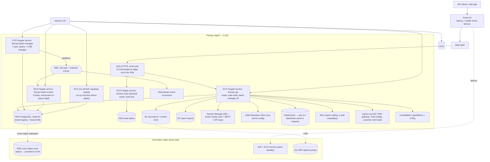

# Target-State Architecture on AWS — Apache Fineract

> **⚠ Blocked input — the approved ("blessed") service list was not supplied.** The request
> contained the literal placeholder `[PASTE BLESSED SERVICE LIST]`. This document is therefore
> written against the **assumed list** below and every choice is tagged so it can be swapped in one
> pass once the real list arrives. Nothing here should be treated as approved.
>
> **Assumed in-list services:** ECS Fargate, ECR, ALB, Route 53, ACM, WAF, VPC/NAT, RDS for
> PostgreSQL, ElastiCache, S3, EFS, Secrets Manager, SSM Parameter Store, KMS, SQS, SNS,
> EventBridge, MSK, SES, CloudWatch (Logs/Metrics/Alarms), X-Ray, IAM, Transfer Family, Cognito,
> Backup, DMS.
>
> Anything that is *not* in the assumed list is called out explicitly in §4 with the best in-list
> alternative. **No service is silently substituted.**

**Standing assumptions given by the requester:** multi-AZ in dev, multi-region in prod;
PostgreSQL as the target RDBMS; containers on ECS Fargate; Harness for CD.

---

## 1. Target diagram

---

## 2. Component mapping

Risk = migration risk. Effort is engineering effort for the migration itself, expressed in Devin
sessions (roughly a 1–2 week human-team chunk each).

| # | Current component (evidence) | Target AWS service | Rationale | Risk | Rough effort |
|---|---|---|---|---|---|
| 1 | Spring Boot 3.5.6 JAR in a Jib image, ports 8080/8443 (`fineract-provider/build.gradle:264-296`) | **ECS Fargate** service `fineract-api` behind ALB | Stateless once §7-of-current-state disk usage is removed; no EC2 fleet to patch. Requested constraint | M | 1–2 sessions |
| 2 | `fineract.mode.*` instance roles: read / write / batch-manager / batch-worker (`application.properties:67-70`) | **Separate ECS services per mode**, same image, different task definition env | Lets the COB manager stay a singleton while workers autoscale; matches the compose topology already in the repo (`docker-compose-postgresql-kafka.yml:14-40`) | M | 1 session |
| 3 | Quartz in-process scheduler, 38 jobs (`JobName.java:21-59`) | Quartz retained **inside the batch-manager service**, task count pinned to 1 | Jobs are tenant-aware and DB-backed; moving them to EventBridge Scheduler would fork job admin away from the in-app scheduler UI/API. **[INFERENCE]** Quartz here is not clustered — running >1 manager task risks duplicate job firing | **H** | 1–2 sessions |
| 4 | Spring Batch partitioned LOAN_COB, partitions over Kafka/JMS (`application.properties:88-122`) | **MSK** topics + Fargate worker service, autoscaled on consumer lag | Keeps the existing Kafka code path unchanged | M | 1 session |
| 5 | ActiveMQ/JMS alternative transport (`application.properties:99-100,133`) | **Not migrated** — standardise on MSK; retire the JMS path in AWS | Two transports doubles the surface; Amazon MQ is not in the assumed list (see §4) | L | 0.5 session |
| 6 | MariaDB 11.4 / MySQL 8 tenant + tenant-store DBs (`config/docker/compose/mariadb.yml:21`) | **RDS for PostgreSQL**, Multi-AZ; cross-region read replica in prod | Requested constraint; Fineract already ships first-class Postgres support (`DatabaseType.java:21-25`, `liquibase-postgresql`) | **H** | 3–4 sessions |
| 7 | Engine conversion of data (523 JDBC call sites, 204 files) | **DMS** for bulk+CDC load; Liquibase for schema | The 236 JPA entities port cleanly; the hand-written SQL is where MySQL-isms hide. Report definitions live **in table rows**, so DMS moves them verbatim and they must be re-tested against Postgres | **H** | 3–5 sessions |
| 8 | Tenant registry with per-tenant host/port/user/password rows (`FineractPlatformTenantConnection.java:39-67`) | Rows point at **RDS endpoints**; passwords stay app-encrypted, master password in **Secrets Manager** | Minimal code impact; the registry is the only place that knows the topology | M | 1 session |
| 9 | Per-tenant read-only replica config (`application.properties:56-61`) | **RDS read replica** wired into the read-only tenant fields | Existing feature, no code change | L | 0.5 session |
| 10 | Filesystem content store at `${user.home}/.fineract`, default **on** (`application.properties:186-187`) | **S3** — flip `fineract.content.s3.enabled=true`; migrate existing files with S3 sync | The code already has `S3ContentStoreService`. Fargate tasks have no durable local disk, so this is a hard prerequisite, not an optimisation | **H** | 1–2 sessions |
| 11 | Report export to S3 (`application.properties:202-203`) | **S3** (already native) | Enable and point at a bucket | L | 0.25 session |
| 12 | Command dead-letter queue on `/tmp` (`application.properties:617-618`) | **SQS** DLQ, or leave disabled (it is `false` today) | Local-disk DLQ is meaningless on Fargate. **[INFERENCE]** requires a small adapter if the feature is wanted — flagged, not assumed | M | 0.5 session (only if enabled) |
| 13 | TLS terminated in the JVM from `classpath:keystore.jks`, password `openmf` (`application.properties:386-391`) | **ACM cert on ALB**; container listens HTTP on 8080 inside the VPC | Removes a baked-in keypair from the image; enables cert rotation without a rebuild | L | 0.5 session |
| 14 | HTTP Basic + optional self-hosted OAuth2 authorization server (`SecurityConfig.java:81,343-344`; `AuthorizationServerConfig.java:90,170-171`) | Keep as-is initially; **Cognito** as the eventual IdP fronting the resource-server JWT path | Stateless auth already suits Fargate. Swapping IdP is a separate, reviewable workstream | M | 1 session (keep) / 2–3 (Cognito) |
| 15 | Secrets in `.env` files and property defaults (`config/docker/env/fineract-common.env:31,51,52`) | **Secrets Manager** (secrets) + **SSM Parameter Store** (plain config), injected as ECS task-definition `secrets`/`environment` | No code change: every value is already an `${ENV_VAR:default}` | L | 1 session |
| 16 | Encryption keys / tenant master password | **KMS**-backed Secrets Manager, rotation policy | Bank-grade key custody | M | 0.5 session |
| 17 | SMTP via `JavaMailSenderImpl` with host/user/password in DB rows (`ReportMailingJobEmailServiceImpl.java:60-66`) | **SES** SMTP endpoint; credentials in Secrets Manager, values written into the config rows | Code needs no change — it is generic SMTP. Needs SES production access + domain/DKIM | M | 1 session |
| 18 | Kafka external events, Avro (`application.properties:124-152`) | **MSK** (+ Glue Schema Registry if in list — see §4) | Same client, same topics | M | 1 session |
| 19 | Outbound web hooks / Elasticsearch hook / SMS gateway / Twilio bridge (`WebHookService.java:55-61`, `ElasticSearchHookProcessor.java:38-70`, `SmsMessageScheduledJobServiceImpl.java:69-74`) | Egress through **NAT Gateway**, allow-listed; destinations still come from DB rows | Destinations are tenant data, not config — they cannot be enumerated from the repo (see `open-questions.md`) | **H** | 1 session + discovery |
| 20 | Docker Hub image `apache/fineract` (`publish-dockerhub.yml:43-48`) | **ECR** private registry, immutable tags, scan-on-push | Removes a public-registry dependency from the deploy path | L | 0.5 session |
| 21 | GitHub Actions build/test (19 workflows) | **Keep GitHub Actions for CI**; **Harness** for CD | Requested constraint; CI already works and is engine-matrixed | L | 0.5 session |
| 22 | Manual `kubectl apply` / `docker compose up` (`kubernetes/*.yml`) — **[INFERENCE]** no automated prod deploy exists | **Harness** pipelines: ECR artifact → Liquibase task → rolling ECS deploy per service, per env | This is the biggest process gap, not a technical one | M | 2–3 sessions |
| 23 | Liquibase running on app start, workers disabled (`application.properties:433`; `fineract-worker.env`) | **Standalone ECS run-task step in Harness**, `FINERACT_LIQUIBASE_ENABLED=false` on all services | Prevents N tasks racing on migration and makes migration a gated pipeline stage | M | 1 session |
| 24 | Prometheus/Grafana/Loki/Tempo compose stack (`config/docker/compose/observability.yml`) | **CloudWatch** Logs + Metrics + Alarms, **X-Ray** via the OTLP exporter already present (`application.properties:347-358`) | Managed, in-list. Amazon Managed Prometheus/Grafana are not in the assumed list (see §4) | M | 1–2 sessions |
| 25 | Health probes on `/fineract-provider/actuator/health/{liveness,readiness}` (`kubernetes/fineract-server-deployment.yml:66-80`) | **ALB target-group health check** + ECS container health check on the same paths | Direct mapping | L | 0.25 session |
| 26 | k8s `Recreate` strategy, single replica (`kubernetes/fineract-server-deployment.yml`) | ECS rolling deploy, min-healthy 100% for API; **manager stays recreate-style (1 task, no overlap)** | Two Quartz managers must never overlap | M | included in #3 |
| 27 | No backup/DR story in repo | **RDS automated backups + AWS Backup**, S3 versioning + CRR, cross-region replica promotion runbook | Regulatory baseline for core banking | M | 1–2 sessions |
| 28 | Batch file exchange with other bank systems — **not present in this repo** | **Transfer Family** if SFTP is needed | Placeholder pending confirmation (see `open-questions.md`) | ? | unknown |

---

## 3. Multi-AZ dev / multi-region prod

* **Dev:** one region, 3 AZs. RDS Multi-AZ (single instance + standby), one ECS service per mode
  with min 1 / max 2 tasks, single MSK cluster across 3 AZs, no CRR.
* **Prod:** primary region as above with ≥2 tasks per API service; secondary region running a
  warm-standby ECS stack scaled to zero-to-minimal, an RDS cross-region read replica, S3
  cross-region replication for both content buckets, and Route 53 health-check failover.
  **[INFERENCE]** active-active is not viable without deeper work: Quartz/COB assumes a single
  batch manager per tenant and the app has no cross-region write conflict resolution, so prod DR
  should be **active-passive with a documented RPO/RTO**, not active-active. This is the single
  most important target-state decision to ratify in the architecture review.
* MSK does not replicate cross-region by itself; either accept event-loss-on-failover for the DR
  window or add MirrorMaker 2 on the secondary cluster.

## 4. Choices where the natural answer may not be on the list

Flagged explicitly rather than substituted:

| Natural choice | On the assumed list? | In-list alternative proposed | Note |
|---|---|---|---|
| Amazon MQ (ActiveMQ) — the drop-in for the existing JMS transport | **No** | **MSK**, retiring the JMS code path | If Amazon MQ *is* blessed, keeping JMS is lower-risk than switching transports |
| Amazon MSK Serverless / Kinesis | assumed **MSK** only | MSK provisioned | Confirm which Kafka flavour is blessed |
| AWS Glue Schema Registry (for the 83 Avro schemas) | **No** | Ship schemas inside the artifact, as today | Fineract does not use a registry today, so this is only a maturity gap |
| Amazon Managed Prometheus + Managed Grafana (matches the existing dashboards) | **No** | CloudWatch + X-Ray | Existing Grafana dashboards would need rebuilding; cost/effort trade-off for the review |
| Amazon OpenSearch (for the Elasticsearch hook target) | **No** | none in-list — the hook posts to whatever URL the tenant configured; leave it external | Do **not** assume the ES endpoint is ours to migrate |
| EFS as a quick fix for the filesystem content store | assumed **yes** | Use **S3** anyway | EFS would preserve the local-disk pattern; S3 is already implemented in code. EFS listed only as a fallback if S3 migration slips |
| AWS Batch / EventBridge Scheduler instead of in-app Quartz | EventBridge assumed in-list | Keep Quartz in a pinned ECS service | Replacing Quartz means reimplementing the job admin API |
| CodePipeline/CodeDeploy | irrelevant | **Harness**, per constraint | — |

## 5. Prerequisites before any Fargate cutover

1. Content store moved to S3 (#10) — without it, documents are lost on task recycle.
2. Liquibase removed from application startup and made a pipeline stage (#23).
3. TLS moved to the ALB (#13) so the keystore leaves the image.
4. All secrets sourced from Secrets Manager (#15/#16); the values currently in
   `config/docker/env/*.env` must be treated as **compromised and rotated**, since they are in git
   history.
5. Confirmation that exactly one batch-manager task runs per environment (#3).
