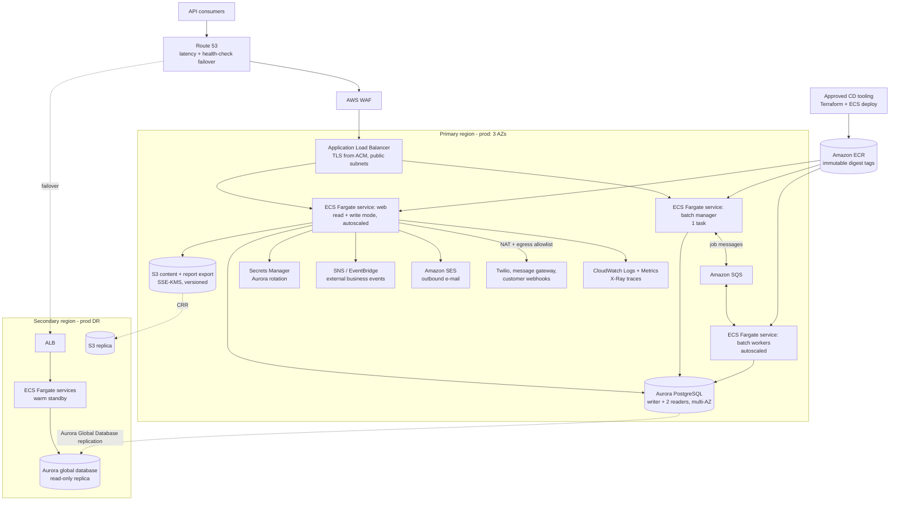

# Target State — Apache Fineract on AWS

Companion to `current-state.md`. Everything here is a proposal for review, not an approved design.

> **Assumptions in force.** The customer supplied **no** approved AWS service list and **no**
> platform guardrails. This document therefore uses:
> 1. an **ASSUMED** service allowlist (§2) — it is *not* the customer's list and must not be treated
>    as one. Confirming or replacing it is **open question PLT-1**;
> 2. the playbook's **default guardrail set** (§1), labelled as assumed defaults. Confirming or
>    replacing it is **open question PLT-2**;
> 3. environment assumptions given verbally with this request: multi-AZ dev, multi-region prod,
>    Amazon Aurora PostgreSQL, ECS Fargate, Terraform, and the organisation's approved pipeline
>    tooling for CD.
>
> Any service below that is not on the assumed allowlist is tagged **`OFF-LIST?`** with an in-list
> alternative.

---

## 1. Platform migration guardrails (ASSUMED DEFAULTS — not customer policy)

| # | Guardrail |
| --- | --- |
| G1 | **Approved-service allowlist** — only allowlisted services appear in the target architecture; the allowlist is assumed to be enforced org-wide by SCPs. Anything else is tagged `OFF-LIST?` with an in-list alternative. |
| G2 | **Containers first** — the approved managed container platform is the preferred compute target; VM lift-and-shift needs explicit justification. |
| G3 | **Standard target RDBMS** — relational workloads target the organisation's standard engine (assumed PostgreSQL); staying on a non-standard engine is a flagged exception. |
| G4 | **Account vending and environment promotion** — onboarding via the standard account-vending process, separate dev/QA/prod accounts, promotion dev → QA → prod. |
| G5 | **Everything as code** — all infrastructure in the approved IaC tool (assumed Terraform); no console-built resources. |
| G6 | **Approved delivery toolchain** — CI/CD on the organisation's approved pipeline tooling; migrating off legacy pipelines is in the plan. |
| G7 | **Production entry criteria** — prod requires the stated resilience posture (multi-region), load balancing, and a demonstrated DR/failover test. |
| G8 | **Security baseline** — private networking by default, encryption in transit and at rest, least-privilege IAM roles with no long-lived static credentials, secrets in the approved secrets manager. |
| G9 | **Approved artifact sources** — images and dependencies only from approved registries. |
| G10 | **Tagging and observability standards** — mandatory tag set (owner, cost centre, environment, data classification) and central observability. |

## 2. ASSUMED AWS service allowlist

Assumed only, pending **PLT-1**. Services used in this design and believed to be conventional
enterprise-approved choices:

VPC (subnets, route tables, NAT, VPC endpoints), Application Load Balancer, Route 53, AWS WAF,
Amazon ECS on Fargate, Amazon ECR, Amazon Aurora PostgreSQL, Amazon S3, AWS Secrets Manager, AWS KMS,
Amazon CloudWatch (Logs, Metrics, Alarms), AWS X-Ray, Amazon SQS, Amazon SNS, AWS Backup,
AWS Database Migration Service (DMS), AWS Identity and Access Management, AWS Organizations /
Control Tower, AWS CloudTrail, AWS Config, Amazon EventBridge, Amazon EFS, AWS Certificate Manager,
Amazon SES, AWS Global Accelerator.

Anything outside that list is marked `OFF-LIST?` below.

## 3. Target architecture

Mermaid source

**Deployment shape.** One ECS service per Fineract instance role (`current-state.md` §3,
`application.properties:67-70`): a `web` service (read+write, autoscaled behind the ALB), a single-task
`batch manager` service, and an autoscaled `batch worker` service. Dev is single-region, multi-AZ.
Prod is two regions: primary active, secondary warm standby fed by an Aurora global database, with
Route 53 health-check failover.

## 4. Component-by-component mapping

Risk is migration risk (H/M/L). Effort is rough, in engineer-weeks, for design + build + test.

| # | Current component | Evidence | Target AWS service | Rationale | Risk | Effort |
| --- | --- | --- | --- | --- | --- | --- |
| 1 | Spring Boot JAR in a Jib-built image, run on Kubernetes/Compose | `fineract-provider/build.gradle:264-296`, `kubernetes/fineract-server-deployment.yml:38-63` | **ECS on Fargate**, one service per instance role | Containers-first (G2) without operating a control plane; the image already runs non-root on 8443 and needs no change to run on Fargate | L | 2 |
| 2 | `apache/fineract:latest` from Docker Hub, `fineract:latest` locally | `kubernetes/fineract-server-deployment.yml:63`, `config/docker/compose/fineract.yml:21`, `.github/workflows/publish-dockerhub.yml:47` | **Amazon ECR**, immutable tags, deploy by digest; base image mirrored into ECR | G9: Docker Hub is not an approved source and `latest` is unpinnable. Base image `azul/zulu-openjdk-alpine:21` must be pulled through the approved registry | M | 1 |
| 3 | MariaDB 11.4 container / MariaDB ≥ 11.5.2, one database per tenant | `kubernetes/fineractmysql-deployment.yml:89`, `README.md:33`, `application.properties:405-406` | **Aurora PostgreSQL**, writer + 2 readers, one database per tenant on a shared cluster; **Aurora Global Database** for the second region | G3 standard engine. Fineract already supports PostgreSQL in CI and Compose, so this is a data + SQL-dialect exercise, not a code port — but 204 `JdbcTemplate` files must be regression-tested | **H** | 10 |
| 4 | Schema migration at application start (Liquibase, 237 changelogs, single-threaded tenant upgrades) | `application.properties:433-434,157-160` | Keep Liquibase, but run it as a **dedicated ECS task** before the service deploys, not at container start | Startup-time migration on N tenants blocks readiness probes and races across tasks; a gated pre-deploy task makes the migration a reviewable pipeline step | M | 2 |
| 5 | Data copy MariaDB → PostgreSQL | — | **AWS DMS** (full load + CDC) plus Liquibase-built target schema | DMS gives a cutover with bounded downtime; schema comes from Liquibase so it is identical to what the app expects | **H** | 6 |
| 6 | Local-filesystem document store on container `/tmp` | `application.properties:186-187`, `config/docker/env/fineract-common.env:57` | **Amazon S3** (`fineract.content.s3.*`), SSE-KMS, versioned | The S3 backend already exists in the code (`ContentS3Config.java:42-43`) — this is configuration plus a one-off document copy, and it removes the only blocker to running more than one task | M | 3 |
| 7 | Report export to local disk / optional S3 | `application.properties:202-203` | **Amazon S3**, presigned-URL download | Same S3 backend, already CI-tested against LocalStack (`.github/workflows/build-mariadb.yml:38-43`) | L | 1 |
| 8 | Quartz scheduler with per-tenant job definitions in the database | `JobRegisterServiceImpl.java:320-326`, no `@Scheduled` anywhere | Unchanged — Quartz on the **batch-manager ECS service** (exactly one task), state in Aurora | Scheduling is data, not code; migrating it is a database concern. Fargate must not run two managers, so the service is pinned to desired-count 1 | M | 1 |
| 9 | Spring Batch COB, partitioned `LOAN_COB`, manager/worker split over Spring events, JMS or Kafka | `application.properties:88-110`, `docker-compose-postgresql-kafka.yml:50-53` | **Amazon SQS** for remote job messages, workers on an autoscaled ECS service | SQS is the in-list broker and Fineract's JMS handler is an interface, not ActiveMQ-specific. Kafka would mean **`OFF-LIST?` Amazon MSK** — only justified if the customer already runs Kafka (question DEL-4) | M | 4 |
| 10 | External business events over Kafka/ActiveMQ (off by default) | `application.properties:124-152` | **Amazon SNS + EventBridge** (or SQS per consumer); `OFF-LIST?` **Amazon MSK** if Avro/Kafka semantics are contractual | Consumers are external; SNS/EventBridge is the in-list fan-out. Avro-on-Kafka compatibility is question DEL-4 | M | 3 |
| 11 | Kubernetes `Service type: LoadBalancer` on 8443, `Recreate` strategy | `kubernetes/fineract-server-deployment.yml:34,50` | **ALB** (public subnets) + **AWS WAF**, ECS rolling deploy with circuit breaker | G7 load balancing; rolling deploys remove the downtime that `Recreate` guarantees today | L | 1 |
| 12 | TLS terminated in the app from a committed `keystore.jks` with the default password | `application.properties:390-391` | **ACM** certificate on the ALB; re-encrypt to the task over TLS inside the VPC | G8 encryption in transit without shipping a keystore in the artefact | M | 1 |
| 13 | DB credentials in Compose env files and a script-generated Kubernetes Secret; AWS credentials file bind-mounted | `config/docker/env/fineract-common.env:30-31`, `kubernetes/kubectl-startup.sh:24`, `config/docker/compose/fineract.yml:25` | **Secrets Manager** with Aurora rotation, injected as ECS task-definition secrets; **IAM task roles** for all AWS access | G8: no static credentials. `ContentS3Config.java:28-43` already prefers the default credentials provider chain, so task roles work with no code change | M | 2 |
| 14 | Encryption at rest — none visible in the manifests (`hostPath` volume) | `kubernetes/fineractmysql-deployment.yml:27-33` | **KMS** CMKs for Aurora, S3, ECR, CloudWatch Logs, Secrets Manager | G8 | L | 1 |
| 15 | No network isolation model; app Service is internet-facing on the app port | `kubernetes/fineract-server-deployment.yml:34` | **VPC**: private subnets for tasks and Aurora, ALB in public subnets, VPC endpoints for S3/ECR/Secrets Manager/CloudWatch, NAT with an egress allowlist for Twilio/SMTP/webhooks | G8 private-by-default; the outbound surface is small and enumerable (`current-state.md` §4) | M | 3 |
| 16 | Outbound SMTP via a Gmail-backed sender | `.../core/service/GmailBackedPlatformEmailService.java` | **Amazon SES** (or keep the customer's relay through NAT) | In-list, deliverability and DKIM managed; the code takes host/port/credentials from tenant configuration so this is configuration | L | 1 |
| 17 | Prometheus scrape + OTLP + optional CloudWatch, all off by default | `application.properties:347,354-358,362-367` | **CloudWatch Logs/Metrics/Alarms** + **X-Ray**; `OFF-LIST?` **Amazon Managed Prometheus/Grafana** if the customer's central platform is Prometheus-based | G10. Both exporters already exist, so enabling them is configuration; which platform is central is question OPS-1 | L | 2 |
| 18 | No IaC of any kind in the repository | grep: no Terraform/CloudFormation/Helm | **Terraform**, modules per environment, remote state, no console changes | G5 | M | 5 |
| 19 | GitHub Actions build + publish to Docker Hub; **no** deployment workflow exists | `.github/workflows/publish-dockerhub.yml`, grep: no deploy step | Build on the **approved pipeline tooling**, push to ECR, deploy to ECS via Terraform; keep the existing test workflows until parity is proven | G6. There is no CD to migrate — it must be built (WS5) | M | 4 |
| 20 | Manual `kubectl apply` from a shell script | `kubernetes/kubectl-startup.sh:24-39` | Pipeline-driven deploys only; the manifests are retired, not converted | G5/G6 | L | 1 |
| 21 | Single environment implied; no account model | — | **Control Tower** account vending, separate dev/QA/prod accounts, promotion dev → QA → prod | G4 | M | 3 |
| 22 | No backup or DR mechanism in the repository | — | **AWS Backup** + Aurora PITR + S3 cross-region replication; documented and *tested* regional failover | G7 requires a demonstrated failover, not a documented one | **H** | 4 |
| 23 | Elasticsearch hook processor | `.../hooks/processor/ElasticSearchHookProcessor.java` | `OFF-LIST?` **Amazon OpenSearch Service**; in-list alternative — leave the hook disabled, or point it at the customer's existing search platform through the egress allowlist | Only needed if the hook is actually in use (question OPS-4) | L | 1 |
| 24 | Committed keystore, committed AWS credentials file, literal DB passwords | `current-state.md` §6 | Rotate and revoke; sourced from Secrets Manager thereafter | Security blocker: cutover is gated on it (WS0) | **H** | 1 |

## 5. Guardrail-compliance table

| Guardrail | How the target design satisfies it | Exception / open question |
| --- | --- | --- |
| **G1 Approved-service allowlist** | Every service in §3–§4 comes from the assumed allowlist in §2; three candidates (MSK, OpenSearch, Managed Prometheus/Grafana) are tagged `OFF-LIST?` with in-list alternatives (rows 9, 10, 17, 23) | **The allowlist itself is assumed.** Compliance is unverified until **PLT-1** is answered |
| **G2 Containers first** | ECS Fargate for all three instance roles; no EC2, no VM lift-and-shift; the artefact is already a Jib-built OCI image (`fineract-provider/build.gradle:264-296`) | If the customer's approved container platform is EKS rather than ECS, rows 1, 4, 8, 9 change shape but not substance — **PLT-3** |
| **G3 Standard target RDBMS** | Aurora PostgreSQL for the tenant registry and every tenant database; MariaDB is retired (row 3) | No exception raised. Depends on the engine-version and dialect answers **DB-1..DB-4** |
| **G4 Account vending / promotion** | Separate dev, QA and prod accounts vended through Control Tower; dev built first, promotion dev → QA → prod, identical Terraform modules per environment (row 21, WS1) | Vending process and account topology are **PLT-4** |
| **G5 Everything as code** | All AWS resources in Terraform, remote state, no console changes; the `kubernetes/` manifests and `kubectl-startup.sh` are retired rather than converted (rows 18, 20) | Terraform module/state standards are **PLT-5** |
| **G6 Approved delivery toolchain** | Build, image push and ECS deploy run on the approved pipeline tooling; Docker Hub publishing is retired (rows 2, 19, WS5) | Which tool, and who owns the runners, is **DEL-1** |
| **G7 Production entry criteria** | Multi-region prod (primary + warm standby on an Aurora global database), ALB load balancing across ≥ 3 AZs, and a rehearsed regional failover recorded as evidence before prod approval (rows 11, 22; WS9 entry criteria) | RTO/RPO targets are **PRG-3**; DR evidence is a WS10 gate |
| **G8 Security baseline** | Tasks and Aurora in private subnets, VPC endpoints for AWS traffic, NAT with an egress allowlist; TLS via ACM at the ALB and re-encrypt to tasks; KMS CMKs everywhere at rest; IAM task roles with no static credentials; all secrets in Secrets Manager (rows 12–15) | Three residual defects are **not** fixed by infrastructure and are cutover blockers: committed credentials (row 24), `fineract.insecure-http-client=true` (`application.properties:221`), wildcard CORS (`application.properties:30-35,341-343`). Secrets-manager choice is **SEC-2** |
| **G9 Approved artifact sources** | Images built into ECR with immutable digests; base image mirrored from the approved registry; Gradle dependency resolution repointed at the approved proxy; `allowInsecureRegistries` (`fineract-provider/build.gradle:298`) is removed in the target build (row 2) | Registry endpoints are **PLT-6** |
| **G10 Tagging and observability** | Mandatory tag set applied by Terraform provider `default_tags`; structured logs to CloudWatch Logs, Fineract's Micrometer metrics to CloudWatch, traces to X-Ray, alarms on the actuator health/readiness signals already exposed (`application.properties:335-347`) | Central platform and mandatory tag keys are **OPS-1** and **OPS-2** |

## 6. Explicitly out of scope for this target state

- No change to Fineract application code is proposed here; every row above is infrastructure or
  configuration. Where code work is unavoidable (SQL-dialect regressions found in WS3), it is a
  migration-plan workstream, not a target-state row.
- Tenant onboarding automation, chart-of-accounts data, and business configuration are unchanged.
- Cost modelling is not included — it needs the production sizing facts in **PRG-2**.
