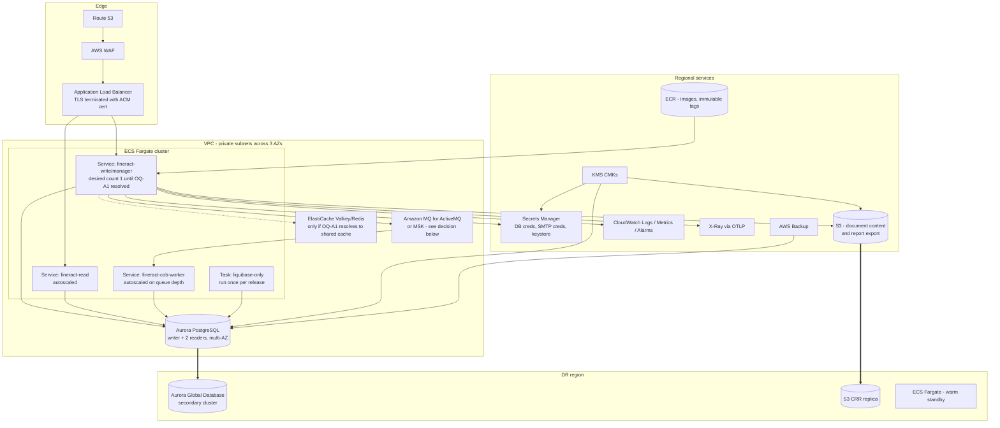

# Target State — Fineract on AWS

This is the proposed AWS target architecture for the application described in `current-state.md`.

> **Two inputs were not supplied and are assumed here.** The approved ("blessed") AWS service list and the
> platform migration guardrails below are **Devin-assumed defaults**, not customer policy. They are raised
> as OQ-P1 and OQ-P2 in `open-questions.md` and must be confirmed or replaced before design sign-off.
> Where the natural design choice falls outside the assumed allowlist it is tagged `OFF-LIST?` with an
> in-list alternative rather than substituted silently.

## Assumed approved AWS service list

**Assumption — to be replaced by the customer's real allowlist (OQ-P1).**

Compute and delivery: ECS Fargate, EKS, ECR, CodeBuild, Lambda.
Networking and edge: VPC, PrivateLink/VPC endpoints, ALB, NLB, Route 53, ACM, WAF, CloudFront.
Data: Aurora PostgreSQL, RDS PostgreSQL, S3, EFS, ElastiCache.
Integration: MSK, Amazon MQ (ActiveMQ), SQS, SNS, SES, EventBridge.
Security and governance: IAM, IAM Identity Center, KMS, Secrets Manager, Parameter Store, Control Tower,
Organizations/SCPs, GuardDuty, Security Hub, Config, CloudTrail.
Observability: CloudWatch (logs, metrics, alarms), X-Ray, Managed Grafana, Managed Prometheus.
Operations: Systems Manager, Backup, DMS, Step Functions.

## Platform migration guardrails in force

**Assumption — the customer's own guardrails were not supplied (OQ-P2). This is the default set.**

| # | Guardrail |
| --- | --- |
| G1 | **Approved-service allowlist.** Only allowlisted services appear in the target architecture; the allowlist is assumed to be enforced organisation-wide by SCPs. |
| G2 | **Containers first.** The approved managed container platform is the preferred compute target; VM-based lift-and-shift needs explicit justification. |
| G3 | **Standard target RDBMS.** Relational workloads target PostgreSQL; staying on another engine is an exception that must be justified. |
| G4 | **Account vending and environment promotion.** Onboarding via Control Tower with separate dev, QA and prod accounts; dev must be running before QA is granted; changes promote dev → QA → prod. |
| G5 | **Everything as code.** All target infrastructure defined in Terraform; no console-built resources. |
| G6 | **Approved delivery toolchain.** CI/CD runs on the organisation's approved pipeline tooling; migrating off legacy pipelines is part of the plan. |
| G7 | **Production entry criteria.** Prod requires multi-region resilience, load balancing, and a demonstrated DR/failover test before approval. |
| G8 | **Security baseline.** Private networking by default, encryption in transit and at rest, least-privilege IAM roles with no long-lived static credentials, secrets in the approved secrets manager — never in code or config files. |
| G9 | **Approved artifact sources.** Container images and dependencies come only from approved registries/repositories. |
| G10 | **Tagging and observability standards.** Mandatory tag set (owner, cost centre, environment, data classification); logs and metrics to the central observability platform. |

## Target architecture

Mermaid source — target architecture

## Component-by-component mapping

Effort is in Devin-sessions of work (one session ≈ one to two human-weeks of equivalent engineering),
excluding external waits such as account vending or change approval.

| Current component (evidence) | Target AWS service | Rationale | Risk | Effort |
| --- | --- | --- | --- | --- |
| Fineract JAR in a Jib-built container, `nobody:nogroup`, port 8443 (`fineract-provider/build.gradle:264-304`) | **ECS Fargate** services, one per role (write/manager, read, COB worker) | Already container-native, so G2 is satisfied without repackaging. Fargate over EKS because the workload is three long-running services with no cluster-level extension needs; EKS is also allowlisted if a platform team already runs it (OQ-P3). | L | 1 |
| Role flags read/write/batch-manager/batch-worker (`application.properties:67-70`) | Three ECS services sharing one task definition family, differing only in environment | Preserves the existing scaling model instead of inventing one; worker count scales on queue depth. | M | 1 |
| App-terminated TLS with a classpath self-signed keystore (`application.properties:386-391`) | **ALB** + **ACM** certificate; app listens HTTP on 8080 inside the VPC, or re-encrypts to a private cert | Removes the committed keystore password and gives a single TLS control point. Note: the container already exposes 8080 (`fineract-provider/build.gradle:293`). | M | 1 |
| Kubernetes `Service type: LoadBalancer` on 8443, no Ingress, no WAF (`kubernetes/fineract-server-deployment.yml:26-34`) | **Route 53 + WAF + internal ALB**, no public API endpoint by default | G8 requires private by default; public exposure becomes an explicit, documented exception. | L | 1 |
| MariaDB 11.4 in-cluster on a `hostPath` PV (`kubernetes/fineractmysql-deployment.yml:21-33`, `:89`) | **Aurora PostgreSQL** (writer + 2 readers, multi-AZ; Global Database for prod) | G3 mandates PostgreSQL, and the code already supports it as a first-class engine (`DatabaseType.java:21-33`) with CI proof (`.github/workflows/build-postgresql.yml`). Zero stored procedures to port. | **H** | 3 |
| Tenant store + one DB per tenant, created and migrated at boot (`TenantDatabaseUpgradeService.java:80-138`) | Same model on Aurora, as separate databases in one cluster; app role granted `CREATEDB` only in non-prod, tenant provisioning promoted to an operator task in prod | Keeps the application's tenancy model intact while removing a standing `CREATEDB` grant from the prod runtime role (G8). | M | 1 |
| Liquibase running inside every writable app instance at start-up (`application.properties:433`) | Dedicated **ECS run-task** using the existing `liquibase-only` profile (`application-liquibase-only.properties`), app instances start with `FINERACT_LIQUIBASE_ENABLED=false` | Makes schema change a deliberate pipeline step, not a side effect of a rolling deploy; the repo already has both the profile and a CI job for it (`.github/workflows/liquibase-only-postgresql.yml`). | M | 1 |
| Document content on local disk, `/tmp` in containers (`config/docker/env/fineract-common.env:57`) | **S3** with KMS SSE, via the already-present S3 content repository (`application.properties:186-194`) | Removes the only non-database state from the compute tier; the code path exists and just needs enabling. | L | 1 |
| Report export (`application.properties:202-203`) | **S3** bucket, separate prefix and lifecycle policy | Same switch, already exercised in CI against LocalStack (`.github/workflows/build-postgresql.yml:39-44`). | L | 0.5 |
| ActiveMQ 5.18.3 container (`config/docker/compose/activemq.yml:23`) | **Amazon MQ for ActiveMQ** (active/standby) *or* **MSK** if events go to Kafka | Both are allowlisted; the choice follows the downstream consumer estate (OQ-A3). Fineract supports both (`application.properties:97-145`). | M | 1 |
| Self-hosted Kafka / existing MSK sample with **public** brokers on 9198 (`config/docker/env/kafka-client-msk.env:23`) | **MSK** with IAM auth on private subnets only, no public listener | The IAM auth path is already supported and on the classpath (`README.md:285`); only the endpoint posture changes. | M | 1 |
| Per-JVM Ehcache; `MULTI_NODE` throws `UnsupportedOperationException` (`RuntimeDelegatingCacheManager.java:114`) | **No distributed cache initially** — run cache mode `NO_CACHE` on multi-replica roles. **ElastiCache** only if a shared cache is later introduced in application code | Honest constraint: the platform cannot share cache state today, so the target must not assume it. This is the single largest scale-out limitation carried forward (OQ-A1). | **H** | 2 |
| Quartz with the default in-memory job store (`JobRegisterServiceImpl.java:319-331`) | Single manager task (desired count 1) plus **EventBridge Scheduler**-triggered ECS run-tasks for anything that must be externally scheduled | Prevents duplicate job firing across replicas without changing application code. | **H** | 1 |
| SMS gateway over `new RestTemplate()` with no timeouts (`SmsMessageScheduledJobServiceImpl.java:62`) | Unchanged endpoint, reached through a **NAT gateway** with egress restricted to the gateway's addresses; timeouts set as a code follow-up outside this package | A no-timeout HTTP client in a batch job is an availability risk that migration does not fix; it is tracked as a cutover dependency, not as a service mapping. | M | 0.5 |
| SMTP via Gmail, credentials from the tenant DB (`GmailBackedPlatformEmailService.java:57-64`) | **SES** (or the existing relay through a VPC endpoint if deliverability is already established) | SES is allowlisted and removes a third-party dependency; the credentials still live in the tenant DB, which is itself an open question (OQ-S2). | M | 1 |
| Committed DB, master, keystore and root passwords (`config/docker/env/fineract-common.env:31`, `:51-52`, `application.properties:391`) | **Secrets Manager** with rotation, injected as ECS task secrets; values rotated and old values revoked | G8. Rotation must happen even if the values were never used in production, because they are public in git history. | **H** | 1 |
| AWS credentials file mounted into the container (`config/docker/compose/fineract.yml:25`) | **ECS task role**, `FINERACT_AWS_CREDENTIALS_INSTANCE_PROFILE=true`, no static keys | G8; the property already exists (`application.properties:376`). | L | 0.5 |
| CORS `*` with credentials allowed (`application.properties:30-35`) | Explicit origin list per environment, set via task environment | Wildcard CORS with credentials is not acceptable for a banking API on a public edge. | M | 0.5 |
| Docker Hub `apache/fineract:latest` pulled by the cluster (`kubernetes/fineract-server-deployment.yml:63`) | **ECR** with immutable tags, digest-pinned task definitions, image scanning on push | G9, and it closes the current-state contradiction where the deployed image is not the image CI built. | L | 1 |
| Jib push to Docker Hub (`.github/workflows/publish-dockerhub.yml:38-48`) | Jib push to **ECR** using OIDC-federated GitHub Actions credentials (no static keys) | Minimal change to the build; removes `DOCKERHUB_USER`/`DOCKERHUB_TOKEN`. | L | 1 |
| GitHub Actions build matrix, 19 workflows (`.github/workflows/`) | **Keep GitHub Actions for build and test**; add the customer's approved CD tool for deployment | The test estate (~300 integration classes, 48 feature files) is valuable and portable; only the deploy stage needs to move (G6, OQ-D1). | L | 1 |
| No CD; manual `kubectl apply` (`kubernetes/kubectl-startup.sh:24-36`) | Approved CD tool driving ECS deployments per environment, gated dev → QA → prod | G4, G6. Named tool to be confirmed (OQ-D1). | M | 2 |
| No IaC anywhere (repository-wide search) | **Terraform**, one module per layer (network, data, compute, observability), state in S3 with DynamoDB locking | G5. `OFF-LIST?`: DynamoDB is not on the assumed allowlist above; in-list alternative is Terraform's S3-native state locking, or add DynamoDB to the allowlist. | M | 3 |
| Prometheus/Loki/Tempo compose stack (`config/docker/compose/observability.yml`) | **CloudWatch** logs and metrics, **X-Ray** via the existing OTLP export, Managed Grafana for dashboards | The app already emits Prometheus and OTLP (`application.properties:349-358`); CloudWatch push is also already supported (`:362-367`). | L | 1 |
| No backup or DR definition | **AWS Backup** for Aurora, PITR enabled, **Aurora Global Database** to a second region, S3 cross-region replication | G7 requires a demonstrated failover before prod approval. | M | 2 |
| Single-node manifests, `strategy: Recreate` (`kubernetes/fineract-server-deployment.yml:49-50`) | Rolling deployments with circuit breaker and automatic rollback; read tier ≥ 2 tasks across AZs | Recreate means an outage on every deploy; unacceptable under G7. The write tier stays at 1 until OQ-A1 is answered. | M | 1 |

### What is deliberately *not* changing

- The application code, the Liquibase changelogs, the API contract and the test suites.
- The multi-tenant, database-per-tenant model.
- The role-based split of read / write / manager / worker instances.

## Guardrail compliance

| Guardrail | How the target satisfies it | Exception raised |
| --- | --- | --- |
| G1 Approved-service allowlist | Every service in the diagram is on the assumed allowlist; the one gap (Terraform state locking on DynamoDB) is tagged `OFF-LIST?` with an in-list alternative | Allowlist itself is assumed — OQ-P1 |
| G2 Containers first | ECS Fargate for all three roles; no EC2 or VM lift-and-shift anywhere in the design | EKS vs. ECS choice — OQ-P3 |
| G3 Standard target RDBMS | Aurora PostgreSQL; the codebase is already PostgreSQL-first-class and CI-verified, and has zero stored procedures | None — but the data migration itself is the highest-risk workstream (WS4) |
| G4 Account vending / promotion | Separate dev, QA and prod accounts vended through Control Tower; WS2 stands up dev before QA is requested; promotion is dev → QA → prod | Account-vending lead time is an external wait — OQ-P4 |
| G5 Everything as code | All resources in Terraform modules; no console-created resources; state in S3 | State-lock backend — see G1 exception |
| G6 Approved delivery toolchain | GitHub Actions retained for build/test; deployment moves to the approved CD tool as WS6 | CD tool not named — OQ-D1 |
| G7 Production entry criteria | Multi-region via Aurora Global Database and a warm-standby ECS service, ALB in front of every tier, and a rehearsed failover test as an explicit WS9 entry criterion | RTO/RPO targets unknown — OQ-O1 |
| G8 Security baseline | Private subnets only, ALB the sole ingress, TLS via ACM, KMS CMKs on Aurora/S3/Secrets Manager, ECS task roles instead of the mounted credentials file, all committed secrets rotated and revoked in WS1 | Wildcard CORS and the tenant-DB-stored SMTP credentials need product decisions — OQ-S1, OQ-S2 |
| G9 Approved artifact sources | ECR with immutable tags and scan-on-push; base image `azul/zulu-openjdk-alpine:21` must be mirrored into the approved registry; `allowInsecureRegistries = true` (`fineract-provider/build.gradle:298`) is turned off | Base-image mirroring policy — OQ-P5 |
| G10 Tagging and observability | Mandatory tags applied through Terraform default tags; CloudWatch logs/metrics plus OTLP traces; the app already tags metrics with `FINERACT_MANAGEMENT_METRICS_TAGS_APPLICATION` (`config/docker/env/fineract-common.env:54`) | Tag taxonomy and cost-centre codes unknown — OQ-O2 |

## Design decisions that need a named owner before build

1. **Write-tier replica count.** Quartz's in-memory job store and the per-JVM cache mean the write/manager
   role is effectively singleton today. Either accept desired count 1 with fast replacement, or fund
   application work (clustered Quartz JDBC job store + shared cache) — OQ-A1.
2. **ECS vs. EKS** — OQ-P3.
3. **Amazon MQ vs. MSK** for external events and COB partitioning — OQ-A3.
4. **Engine cut**: MariaDB → Aurora PostgreSQL as a single cutover, versus running PostgreSQL in
   non-prod first and cutting prod later — OQ-DB1.
