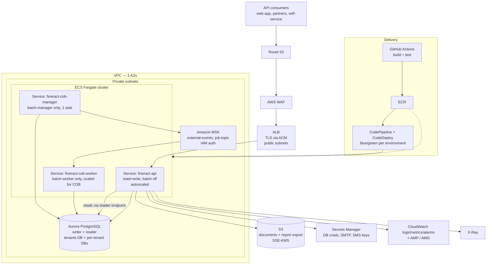

# Target State — Apache Fineract on AWS

This document proposes an AWS target architecture for the application described in `current-state.md`. It is a proposal for review, not an approved design.

---

## 0. Service list constraint — READ FIRST

**No approved ("blessed") AWS service list was supplied for this engagement.** Rather than silently invent one, the table below is an **ASSUMED service list**, used only so that the target architecture can be expressed concretely. Every service named in this document is drawn from it. Confirming or replacing this list is open question **`Q-PRG-1`** and is a prerequisite for design sign-off.

| Layer | Assumed in-list services |
|---|---|
| Compute | ECS on Fargate, AWS Batch (considered, not selected) |
| Data | Aurora PostgreSQL, RDS for PostgreSQL, RDS for MariaDB, ElastiCache (considered, not selected) |
| Networking | VPC, ALB, NAT Gateway, PrivateLink, Route 53, ACM, WAF, Shield Standard |
| Storage | S3, EFS |
| Messaging | Amazon MSK, Amazon MQ (ActiveMQ), SNS/SQS |
| Identity & secrets | IAM, Secrets Manager, SSM Parameter Store, Cognito |
| Delivery | ECR, CodeBuild, CodePipeline, CodeDeploy |
| Observability | CloudWatch (logs/metrics/alarms), X-Ray, AWS Managed Grafana, AWS Managed Prometheus |
| Governance | Organizations, Control Tower, Config, CloudTrail, GuardDuty, KMS, Backup |

Assumed environment posture, also to be confirmed (`Q-PRG-2`):

- **dev**: single region, multi-AZ, single Fineract task, single-AZ database.
- **prod**: single region, multi-AZ across three AZs, warm standby in a second region.
- **Target RDBMS**: Aurora PostgreSQL (see §3 — the repository already supports PostgreSQL first-class).
- **Target compute**: ECS Fargate.
- **CD tool**: not stated by the customer; the table below assumes CodePipeline and flags the alternative.

---

## 1. Target architecture

Mermaid source

---

## 2. Component-by-component mapping

Effort is expressed in Devin-sessions of focused engineering work, not calendar time. Risk is the risk of the *migration step*, not of the component.

| Current component (evidence) | Target AWS service | Rationale | Risk | Effort |
|---|---|---|---|---|
| Spring Boot JAR in a Jib-built Alpine/Zulu 21 image (`fineract-provider/build.gradle:264-296`) | **ECS Fargate** service behind an **ALB** | The image is already rootless, container-aware and exposes 8443; nothing in it assumes a VM or a servlet container. No repackaging needed. | L | 1 |
| Kubernetes `Deployment` + `LoadBalancer` on 8443 (`kubernetes/fineract-server-deployment.yml:26-63`) | **ALB** terminating TLS with an **ACM** certificate; tasks listen on 8443 with the existing self-signed cert or plain 8080 inside the VPC | Removes the committed keystore from the client-facing path (`fineract-provider/src/main/resources/keystore.jks`). ALB target-group health checks map directly onto the actuator probes already configured at `kubernetes/fineract-server-deployment.yml:71-86`. | L | 1 |
| Node-role split: manager/worker env files (`config/docker/env/fineract-manager.env:20-26`, `fineract-worker.env:20-24`) | **Three ECS services from one image**: api, cob-manager, cob-worker | The role split is already pure configuration (`application.properties:67-70`), so it becomes three task definitions with different environment blocks, not three builds. Worker service scales on COB windows. | M | 2 |
| MariaDB 11.4 container on a `hostPath` PV (`kubernetes/fineractmysql-deployment.yml:20-33,89`) | **Aurora PostgreSQL** (in-list), multi-AZ, writer + reader endpoints | See §3: the code supports exactly MySQL and PostgreSQL (`DatabaseType.java:23-33`), CI already builds and tests against `postgres:18.3` (`.github/workflows/build-postgresql.yml:20`), and there are no stored procedures to port. `RDS for MariaDB` is the lower-risk in-list alternative if the engine change is rejected. | H | see WS3 |
| Read-only tenant connection settings (`application.properties:56-61`) | Aurora **reader endpoint** | The application already has a first-class read-replica configuration; this is configuration, not code. | L | 1 |
| Liquibase on startup, single-threaded tenant upgrade (`application.properties:157-160,433-434`) | Liquibase run as a **one-off ECS task** gated in the pipeline, not on service start | 322 changelogs on a multi-tenant estate serialised to one thread makes startup time proportional to tenant count; running migration as a discrete step keeps task start-up predictable and rollout independent of schema change. | M | 2 |
| Filesystem document store, default `${user.home}/.fineract`, `/tmp` in compose (`application.properties:187`, `config/docker/env/fineract-common.env:57`) | **S3** with SSE-KMS, via the existing `S3ContentStoreService` | The S3 implementation already exists and is exercised in CI against LocalStack (`.github/workflows/build-postgresql.yml:39-44`); this is a flag flip plus a bucket, plus a one-time copy of whatever is on disk today. **EFS** is the in-list fallback if any consumer depends on POSIX semantics. | M | 2 |
| Report export to S3, disabled (`application.properties:202-203`) | **S3**, same bucket family, separate prefix and lifecycle policy | Already implemented (`S3DatatableReportExportServiceImpl.java`). | L | 1 |
| ActiveMQ 5.18.3 in compose (`config/docker/compose/activemq.yml:23`), Kafka/MSK path documented (`README.md:283-288`) | **Amazon MSK** with IAM auth | The MSK IAM login module is already on the classpath and a working property set is committed (`config/docker/env/kafka-client-msk.env:22-35`). **Amazon MQ for ActiveMQ** is the in-list alternative if the customer prefers JMS. | M | 2 |
| Spring in-JVM event transport, the default (`application.properties:97`) | MSK for COB partitioning once worker tasks are separate | In-JVM events cannot cross ECS tasks, so this must change at the same time as the manager/worker split, not after it. | M | 1 |
| Credentials in env files and a Kubernetes Secret (`config/docker/env/fineract-common.env:31,51`; `kubernetes/fineract-server-deployment.yml:94-117`) | **Secrets Manager** (rotating DB credentials) + **SSM Parameter Store** (non-secret config) | ECS injects both natively as task-definition secrets, so no application change is required. Rotation closes the committed-credential finding. | M | 2 |
| Tenant master password default `fineract`, AES/CBC (`application.properties:53-54,206`) | **KMS**-held master password delivered through Secrets Manager | The value is used to decrypt per-tenant DB credentials, so it is the highest-value secret in the system. | H | 1 |
| Prometheus/Loki/Tempo/Grafana compose stack (`config/docker/compose/observability.yml:35-63`) | **CloudWatch** logs and alarms + **AMP** scraping the existing `/actuator/prometheus` + **AMG** dashboards + **X-Ray** via the existing OTLP export (`config/docker/env/oltp.env:20-22`) | Every signal the stack emits today already exists in the app; only the sinks change. A CloudWatch metrics exporter is even pre-wired (`config/docker/env/cloudwatch.env:20-23`). | L | 2 |
| HTTP Basic auth by default, OAuth2 present but off (`application.properties:24-25,37-42`) | Keep Basic for machine clients initially; **Cognito** as the OIDC provider when OAuth2 is enabled | OAuth2 support is real but unproven in this deployment (`:oauth2-tests` module, `settings.gradle:71`). Switching auth during a lift is an avoidable correctness risk; it belongs after cutover. | M | 3 |
| SMTP to Gmail, config read from the database (`ReportMailingJobEmailServiceImpl.java:60,94-96`) | `OFF-LIST?` — the natural choice is **Amazon SES**, which is not on the assumed list. In-list alternative: keep the existing external SMTP relay, reached through the NAT Gateway, with credentials in Secrets Manager. | Flagged rather than substituted. Confirm under `Q-PRG-1`. | M | 1 |
| SMS gateway over `RestTemplate` (`SmsMessageScheduledJobServiceImpl.java`) | Egress through **NAT Gateway** to the existing provider; credentials in Secrets Manager | No AWS service substitution is proposed — the provider is a business relationship, not an infrastructure choice. Note `fineract.insecure-http-client` defaults to `true` (`application.properties:221`) and must be `false` before this path leaves the VPC. | M | 1 |
| Docker Hub `apache/fineract:latest` (`kubernetes/fineract-server-deployment.yml:63`, `.github/workflows/publish-dockerhub.yml:43-48`) | **ECR** with immutable tags; deployments reference the image digest | Removes both the public-registry dependency and the `latest`-tag ambiguity recorded as current-state contradiction #2. | L | 1 |
| No deployment automation at all (repository listing) | **CodePipeline + CodeDeploy** blue/green into ECS, promoted dev → prod | `OFF-LIST?` note: if the customer standard is Harness, Argo or Spinnaker, that tool replaces this row without changing anything else in the design. Answer `Q-DEL-1` before building. | M | 3 |
| No infrastructure-as-code (repository listing) | Terraform or CDK, one module per environment | **Q-PLT-3** — the IaC tool is a customer standard, not a repository fact, so no choice is made here. | M | 4 |
| Multi-tenant database-per-tenant (`README.md:58-59`, `RoutingDataSource.java`) | One Aurora cluster hosting the tenant registry plus per-tenant databases, sized from the real tenant count | The pattern survives the move unchanged, but connection-pool maths (`config/docker/env/fineract-common.env:23-24`: 3–10 connections *per tenant datasource*) determines instance sizing and needs the real tenant count (`Q-DB-2`). | H | 2 |
| Local logs and JFR to a bind mount (`config/docker/compose/fineract.yml:23-26`) | **CloudWatch Logs** via the `awslogs`/FireLens driver; JSON logging already available (`application.properties:209`) | Fargate tasks have no durable local disk, so this must change before the first task runs. | L | 1 |

---

## 3. The engine decision is a workstream, not a row

`current-state.md` §3 establishes three facts that together set the risk of a MariaDB→PostgreSQL move:

1. The code models exactly two engines and branches on them explicitly (`DatabaseType.java:23-33`, `MySQLQueryService` / `PostgreSQLQueryService`).
2. CI already runs the full suite against `postgres:18.3` on every push (`.github/workflows/build-postgresql.yml:20`) and separately validates the Liquibase-only path (`.github/workflows/liquibase-only-postgresql.yml`).
3. There are no stored procedures or database functions anywhere in the schema (grep over `fineract-provider/src/main/resources/db`).

The residual risk therefore sits entirely in **data migration and behavioural equivalence on existing production data**, not in application portability: 590 `JdbcTemplate` call sites (204 files) mean SQL is generated in Java, and the ones that are not routed through `DatabaseSpecificSQLGenerator` are where dialect defects hide. This is WS3 in `migration-plan.md`, and it is the reason WS3 sits on the critical path.

If the customer rejects an engine change, **RDS for MariaDB** is the in-list, lower-risk target: it removes WS3 almost entirely at the cost of keeping an engine the upstream project tests less thoroughly than PostgreSQL. That trade-off is `Q-DB-1`.

---

## 4. What this design deliberately does not do

- It does not move authentication to Cognito during the lift (`Q-SEC-2`).
- It does not adopt Aurora Serverless v2, Step Functions, EKS, or any service outside the assumed list, however natural the fit.
- It does not split the modular monolith. The 34-module Gradle build (`settings.gradle:50-90`) is a compile-time structure with one deployable; treating the node-role flags as the unit of scaling gives the elasticity a service split would, at a fraction of the risk.
- It does not change any application code. Every mapping above is reachable through existing configuration switches or existing implementations, with the single exception of dialect defects found in WS3.
