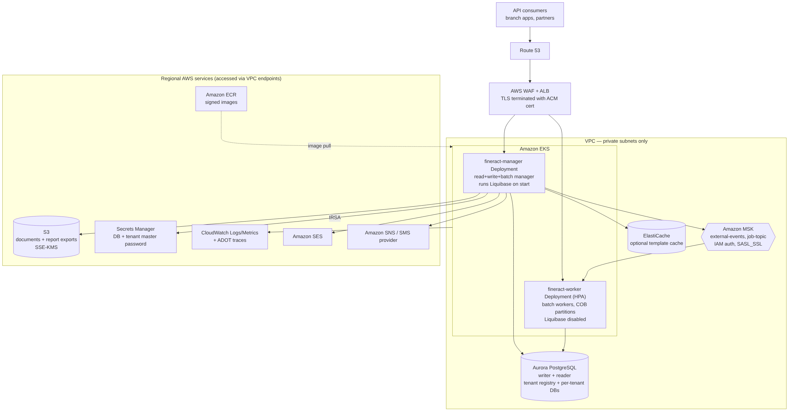
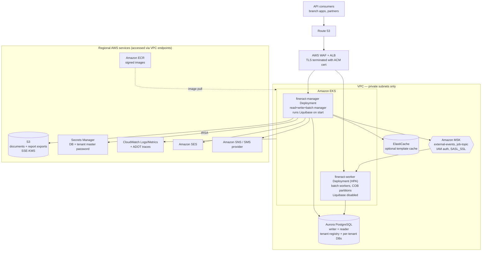

# Target State — AWS

Companion to [current-state.md](current-state.md). Every choice below is constrained by the approved
service list and the platform guardrails in force, both of which are **assumed defaults** in this
revision: no approved AWS service list and no customer guardrail document were supplied with the
request. Confirming or replacing them is open question `Q-PLAT-01`, and until it is answered this
document is a proposal, not a design decision.

## Approved AWS service list (ASSUMED — not supplied by the customer)

| Domain | Assumed approved services |
| --- | --- |
| Compute | Amazon EKS, ECS on Fargate, AWS Lambda |
| Containers / artifacts | Amazon ECR |
| Relational data | Amazon Aurora PostgreSQL, Amazon RDS for PostgreSQL |
| Caching | Amazon ElastiCache |
| Messaging / streaming | Amazon MSK, Amazon SQS/SNS, Amazon MQ |
| Object storage | Amazon S3, AWS Backup |
| Networking / edge | VPC, PrivateLink, ALB/NLB, Route 53, AWS WAF, ACM |
| Identity and secrets | IAM (IRSA), AWS Secrets Manager, AWS KMS, SSM Parameter Store |
| Observability | Amazon CloudWatch (logs, metrics, alarms), AWS X-Ray / ADOT, Amazon Managed Grafana |
| Messaging to customers | Amazon SES, Amazon SNS |
| Migration | AWS DMS, AWS Schema Conversion Tool |
| Governance | AWS Control Tower, AWS Organizations, AWS Config |

Anything outside this list is tagged `OFF-LIST?` below with an in-list alternative.

## Platform Migration Guardrails in force (ASSUMED DEFAULT SET)

The customer's own guardrails were not supplied. The following default set is used and is labelled as
an assumption throughout; it is not presented as the customer's policy.

| # | Guardrail |
| --- | --- |
| G1 | **Approved-service allowlist** — only listed services may appear in the target architecture; assumed to be enforced organisation-wide by SCPs. |
| G2 | **Containers first** — Kubernetes (or the approved managed container platform) is the preferred compute target; VM lift-and-shift needs explicit justification. |
| G3 | **Standard target RDBMS** — relational workloads target PostgreSQL; staying on a non-standard engine is an exception that must be justified. |
| G4 | **Account vending and environment promotion** — onboarding via AWS Control Tower with separate dev, QA and prod accounts; dev runs before QA is granted; changes promote dev → QA → prod. |
| G5 | **Everything as code** — all target infrastructure defined in Terraform; no console-built resources. |
| G6 | **Approved delivery toolchain** — CI/CD runs on the organisation's approved pipeline tooling; migrating off legacy pipelines is part of the plan. |
| G7 | **Production entry criteria** — prod requires multi-region (or the stated resilience posture), load balancing, and a demonstrated DR/failover test. |
| G8 | **Security baseline** — private networking by default, encryption in transit and at rest, least-privilege IAM roles with no long-lived static credentials, secrets only in the approved secrets manager. |
| G9 | **Approved artifact sources** — images and dependencies only from approved registries/repositories. |
| G10 | **Tagging and observability standards** — mandatory tag set (owner, cost centre, environment, data classification) and logs/metrics to the central observability platform. |

Assumed environment posture, also to be confirmed (`Q-PLAT-02`): multi-AZ in dev/QA, multi-region in
prod; target RDBMS PostgreSQL; target compute EKS; delivery tooling Harness.

## Target architecture

Mermaid source

## Component-by-component target

Effort is expressed in Devin sessions (one session ≈ one to two human-weeks of equivalent work);
external waits such as account vending or DBA approvals are excluded and called out separately.

| Current component | Target AWS service | Rationale | Risk | Effort |
| --- | --- | --- | --- | --- |
| Fineract manager node (Spring Boot JAR / Jib image, `fineract-provider/build.gradle:264-289`) | EKS Deployment, 1 replica per region, `fineract.mode.batch-manager-enabled=true` | Already containerised; satisfies G2 with no repackaging. Manager must stay singular because it owns Liquibase startup (`application.properties:433`) | M | 1 |
| Fineract worker nodes (`config/docker/env/fineract-worker.env:20-24`) | EKS Deployment behind HPA, Liquibase disabled | Horizontal scale for COB partitions; existing manager/worker split maps directly | M | 1 |
| Mifos web app + nginx (`kubernetes/fineract-mifoscommunity-deployment.yml:100-134`) | S3 + CloudFront `OFF-LIST?` → in-list alternative: keep as an EKS Deployment behind the same ALB | CloudFront is not on the assumed list; serving the SPA from the cluster keeps the design in-list until the list is confirmed | L | 0.5 |
| `type: LoadBalancer` Services (`kubernetes/fineract-server-deployment.yml:34`) | Single internal ALB via AWS Load Balancer Controller, WAF attached, no public service objects | G7 (load balancing) and G8 (private by default); today each service would request its own public NLB | M | 0.5 |
| MariaDB 11.4 (`kubernetes/fineractmysql-deployment.yml:89`) | Aurora PostgreSQL, multi-AZ writer + readers, global database in prod | G3 standard engine, and the code already supports PostgreSQL (`PostgreSQLQueryService`, `liquibase-postgresql`) | **H** | 4 |
| Per-tenant databases via `RoutingDataSource` (`fineract-core/.../database/RoutingDataSource.java:41`) | One Aurora cluster per environment, one database per tenant; tenant registry in the same cluster | No code change; connection limits and Hikari pool sizing per tenant become the constraint (`application.properties:63-64,410`) | M | 1 |
| Liquibase startup migration (`application.properties:433`) | Same, run by the manager pod, gated by an EKS Job pre-deploy step in Harness | Keeps ordering guarantees; single-threaded tenant upgrade (`application.properties:157-160`) bounds the maintenance window | M | 1 |
| Filesystem content store on `/tmp` (`config/docker/env/fineract-common.env:57`) | S3 with SSE-KMS, `fineract.content.s3.enabled=true` | Removes the only stateful local disk; the S3 client already exists (`ContentS3Config.java:42`) | L | 0.5 |
| Report export (`application.properties:202-203`) | Same S3 bucket, separate prefix, lifecycle policy | Feature already implemented (`S3DatatableReportExportServiceImpl.java:36`) | L | 0.25 |
| Kafka / ActiveMQ for external events and job messaging (`application.properties:124-160`) | Amazon MSK with IAM auth (`aws-msk-iam-auth` already a dependency) | Config path already proven in `config/docker/env/kafka-client-msk.env`; ActiveMQ variant retired | M | 1 |
| Hard-coded public MSK bootstrap brokers (`config/docker/env/kafka-client-msk.env:23,31`) | Private MSK cluster, brokers resolved per environment from SSM/Terraform output | G8: no public endpoints; also removes environment-specific hostnames from the repo | L | 0.25 |
| SMTP / Gmail email (`GmailBackedPlatformEmailService.java:1`) | Amazon SES SMTP endpoint, credentials in Secrets Manager | No code change: per-tenant SMTP config already points anywhere | L | 0.5 |
| SMS gateway over `RestTemplate` (`SmsMessageScheduledJobServiceImpl.java:62`) | Unchanged HTTP egress via NAT gateway to the existing provider; SNS only if the provider is retired | Provider ownership unknown (`Q-OPS-03`) | M | 0.5 |
| Elasticsearch hook (`ElasticSearchHookProcessor.java:1`) | Amazon OpenSearch Service `OFF-LIST?` → in-list alternative: leave the hook disabled and ship events to MSK for downstream indexing | OpenSearch is not on the assumed list; the hook is per-tenant opt-in so it can stay off | L | 0.25 |
| Docker Hub `apache/fineract` (`.github/workflows/publish-dockerhub.yml:47`) | Amazon ECR with immutable tags and image scanning | G9 approved artifact source; also fixes the `:latest` pin (`kubernetes/fineract-server-deployment.yml:63`) | L | 0.5 |
| GitHub Actions build + manual `kubectl apply` (`kubernetes/kubectl-startup.sh:25-46`) | GitHub Actions keeps build/test; Harness owns deploy and dev → QA → prod promotion | G4 and G6; there is no CD today, so this is new build rather than migration | M | 2 |
| No IaC in the repo (`find . -name '*.tf'` → 0) | Terraform modules for VPC, EKS, Aurora, MSK, S3, IAM, ALB, observability | G5 | M | 3 |
| In-process TLS with committed keystore (`application.properties:386-391`) | ACM certificate on the ALB; mTLS or plain HTTP inside the mesh boundary; keystore removed | G8; also retires the default `openmf` keystore password | M | 0.5 |
| Committed DB/broker credentials in `config/docker/env/*` | Secrets Manager, injected through IRSA + External Secrets; values rotated and revoked | G8 | M | 1 |
| `fineract.insecure-http-client=true` (`application.properties:221`) | Set `false` in all AWS environments; trust store managed by the base image | G8 encryption in transit | L | 0.25 |
| CORS `*` with credentials (`application.properties:31-35`) | Explicit origin allowlist per environment | G8 | L | 0.25 |
| `SPRING_PROFILES_ACTIVE=test,diagnostics` and JDWP on 5000 (`config/docker/env/fineract-common.env:58-60`) | Production profile with no debug agent; port not exposed | G8 | L | 0.25 |
| Prometheus/Grafana/Loki/Tempo compose stack (`config/docker/compose/observability.yml:32-76`) | CloudWatch Logs + metrics, ADOT collector for OTLP traces, Amazon Managed Grafana for dashboards | G10; the app already emits Prometheus, OTLP and CloudWatch metrics behind flags (`application.properties:347-367`) | L | 1 |
| Untagged Kubernetes resources | Mandatory tag set applied through Terraform default tags and Kubernetes labels | G10 | L | 0.25 |

## Guardrail compliance

| Guardrail | How the target design satisfies it | Exception / open item |
| --- | --- | --- |
| G1 Approved-service allowlist | All services in the diagram come from the assumed list; CloudFront and OpenSearch were rejected in favour of in-list alternatives | The list itself is assumed — `Q-PLAT-01` |
| G2 Containers first | EKS for both manager and worker; the Jib image is used unchanged; no EC2 lift-and-shift | None |
| G3 Standard target RDBMS | Aurora PostgreSQL; the engine change is workstream WS3, not a configuration flag | Cutover engine choice must be confirmed by the DBA — `Q-DB-01` |
| G4 Account vending and promotion | Separate dev, QA, prod accounts vended via Control Tower; Harness pipeline enforces dev → QA → prod | Account vending lead time is external — `Q-PLAT-03` |
| G5 Everything as code | Terraform modules are a first-class workstream (WS1); no manual console resources | None |
| G6 Approved delivery toolchain | GitHub Actions retained for build/test, Harness introduced for deploy; the repo has no CD today so nothing is being preserved | Harness ownership and existing templates — `Q-DEL-01` |
| G7 Production entry criteria | Prod is multi-region Aurora Global Database + ALB per region + Route 53 failover; WS7 requires a demonstrated failover test before approval | RTO/RPO targets unknown — `Q-OPS-01` |
| G8 Security baseline | Private subnets only, ALB is internal, ACM TLS, SSE-KMS on S3 and Aurora, IRSA roles, all secrets in Secrets Manager, `insecure-http-client=false`, CORS allowlist, no debug agent | Committed credentials must be rotated and revoked before cutover — WS0 |
| G9 Approved artifact sources | ECR with immutable tags and scanning; base image mirrored into ECR rather than pulled from Docker Hub | Mirroring policy for `azul/zulu-openjdk-alpine:21` — `Q-PLAT-04` |
| G10 Tagging and observability | Terraform default tags plus CloudWatch/ADOT/Managed Grafana; app-side exporters enabled by environment variable | Mandatory tag key list not supplied — `Q-PLAT-05` |
